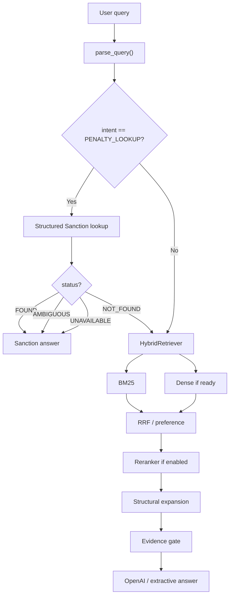
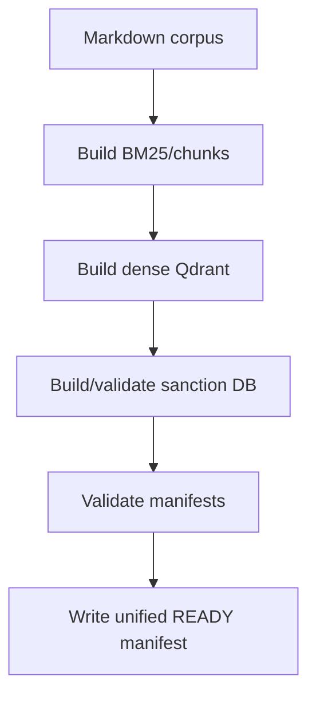
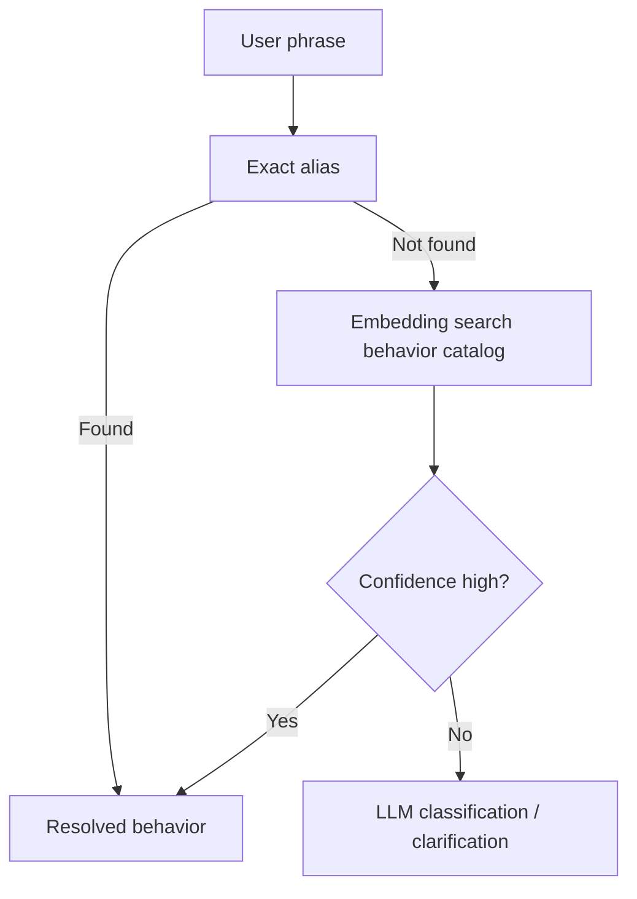
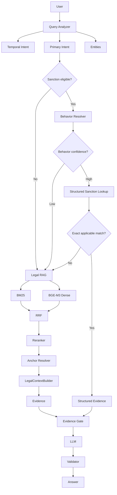

# AUDIT REGRESSION VÀ KẾ HOẠCH SỬA HỆ THỐNG RAG CHATBOT LUẬT GIAO THÔNG

> Repository: `lemanhcuong6904/RAG-Chatbot-Luat-giao-thong-duong-bo`  
> Nhánh được rà soát: `main`  
> Thời điểm rà soát: 11/08/2026  
> Mục tiêu: tìm nguyên nhân vì sao phiên bản hiện tại có nhiều kỹ thuật hơn nhưng chất lượng câu trả lời thực tế lại kém hơn bản RAG ban đầu, sau đó đưa ra kế hoạch sửa theo thứ tự ưu tiên và cách kiểm chứng từng thay đổi.

---

# 1. Kết luận ngắn gọn

Phiên bản hiện tại không kém đi vì BGE-M3, Qdrant, hierarchy hay Structured Sanction Layer là các kỹ thuật sai.

Vấn đề chính là:

> **Hệ thống đã thêm nhiều layer trước khi có evaluation và trước khi các layer được nối kín với nhau.**

Kết quả là nhiều kỹ thuật tốt ở mức ý tưởng đang tạo ra **regression ở runtime**.

Các nguyên nhân quan trọng nhất tôi tìm thấy:

1. **Structured Sanction Layer chặn RAG quá sớm.**
2. **Sanction behavior resolver hiện gần như chỉ hiểu “đèn đỏ”, nhưng router lại áp dụng cho mọi câu hỏi mức phạt.**
3. **Nếu làm theo README, dense retrieval rất dễ không chạy dù `.env` bật dense.**
4. **Reranker mặc định đang tắt.**
5. **EXHAUSTIVE structural expansion lấy đủ children nhưng LLM chỉ nhận `results[:6]`.**
6. **UI luôn gửi `event_date=today`, khiến temporal filter được áp dụng cả cho câu hỏi chỉ muốn tra nội dung văn bản.**
7. **Query expansion được dùng chung cho BM25 và dense embedding, đồng thời bị duplicate synonym/token.**
8. **Khi bật reranker, code đang trộn CrossEncoder score với score cũ từ RRF/BM25.**
9. **Parent expansion làm parent chiếm slot trong `top_k`, giảm diversity của evidence.**
10. **Evidence gate dùng heuristic quá thô, có cả false positive và false negative.**
11. **Structured Sanction DB chưa có cơ chế version/hash đồng bộ với corpus RAG hiện tại.**
12. **Builder của Structured Sanction Layer đang hard-code đường dẫn `/mnt/data`, khó tái tạo đúng trên máy local.**
13. **Temporal resolver generic vẫn chưa xử lý inheritance Điều → Khoản → Điểm đúng hoàn toàn.**
14. **Test suite chỉ có một smoke test đúng vào trường hợp “xe máy vượt đèn đỏ” — chính là case được code hỗ trợ mạnh nhất.**
15. **Không có ablation test nên không biết kỹ thuật nào đang thực sự tăng hoặc giảm accuracy.**

Vì vậy, hướng sửa đúng lúc này **không phải thêm GraphRAG, multi-vector hay thêm prompt phức tạp hơn**.

Hướng đúng là:

```text
Đơn giản hóa runtime
        ↓
Khôi phục baseline ổn định
        ↓
Tạo golden test
        ↓
Bật từng kỹ thuật một
        ↓
Đo delta accuracy
        ↓
Chỉ giữ kỹ thuật thật sự giúp
```

---

# 2. Các file đã rà soát

Các phần quan trọng của runtime hiện tại:

```text
rag_luat_gt/
├── service.py
├── config.py
├── schemas.py
├── text.py
├── legal_notes.py
│
├── ingestion/
│   ├── legal_parser.py
│   ├── normalizer.py
│   ├── build_index.py
│   └── build_dense_index.py
│
├── retrieval/
│   ├── bm25.py
│   ├── dense.py
│   ├── hybrid.py
│   ├── reranker.py
│   └── qdrant_store.py
│
├── generation/
│   ├── answerer.py
│   ├── openai_provider.py
│   └── sanction_answerer.py
│
└── sanction/
    ├── repository.py
    └── schemas.py

structured_sanction_layer/
└── structured_sanction_layer/
    ├── build_sanction_layer.py
    ├── sanctions.sqlite
    ├── QA_REPORT.md
    └── README.md

ui/
└── streamlit_app.py

tests/
└── test_smoke.py
```

---

# 3. Luồng runtime hiện tại

Theo code hiện tại, request đi như sau:



Nhìn sơ đồ có vẻ hợp lý.

Nhưng regression xảy ra ở các nhánh nhỏ bên trong.

---

# 4. P0 — Structured Sanction Layer đang chặn RAG quá sớm

## 4.1. Code hiện tại

Trong `rag_luat_gt/service.py`, logic là:

```python
if SANCTION_ENABLED and parsed.intent == "PENALTY_LOOKUP":
    lookup = self.sanctions.lookup(...)

    if lookup.status in {"FOUND", "AMBIGUOUS", "UNAVAILABLE"}:
        return build_sanction_response(...)
```

Điều này có nghĩa:

```text
PENALTY_LOOKUP
    ↓
Sanction layer
    ↓
FOUND      → dừng
AMBIGUOUS  → dừng
UNAVAILABLE→ dừng
NOT_FOUND  → mới xuống RAG
```

Đây là một quyết định routing quá mạnh.

---

## 4.2. Vì sao làm hệ thống tệ hơn baseline?

Giả sử câu hỏi:

```text
Vượt đèn đỏ bị phạt bao nhiêu?
```

Behavior có thể nhận diện được.

Nhưng người dùng không nói loại xe.

`SanctionRepository.lookup()` trả:

```text
AMBIGUOUS
missing_fields = ["vehicle_code"]
```

`RAGService` lập tức return.

Trong bản RAG cũ, hệ thống vẫn có thể retrieve các quy định liên quan và trả lời:

```text
Mức phạt phụ thuộc loại phương tiện:
- ô tô: ...
- xe máy: ...
...
```

Hoặc ít nhất retrieval vẫn tìm được căn cứ.

Phiên bản mới lại chặn pipeline ở router.

Do đó:

> **Một layer được thêm để tăng accuracy lại làm giảm answer coverage.**

---

# 5. P0 — Behavior resolver chỉ hỗ trợ gần như một hành vi

Trong `query_parser.py`:

```python
def _detect_behavior_code(query):
    ...
    if query chứa:
        "đèn đỏ"
        "đèn tín hiệu"
        "vượt đèn"
        ...
        return TRAFFIC_SIGNAL_NONCOMPLIANCE

    return None
```

Tức hiện tại Structured Sanction runtime hiểu tốt:

```text
vượt đèn đỏ
```

nhưng chưa hiểu đầy đủ:

```text
đi sai làn
đi ngược chiều
không đội mũ bảo hiểm
dùng điện thoại
chạy quá tốc độ
có nồng độ cồn
không có GPLX
không chấp hành biển báo
dừng đỗ sai quy định
...
```

Trong khi router lại route **mọi PENALTY_LOOKUP** vào sanction layer.

Đây là mismatch kiến trúc:

```text
Router coverage: rất rộng
Behavior resolver coverage: rất hẹp
```

---

# 6. P0 — Nếu behavior không hiểu, repository có thể lookup gần như chỉ theo vehicle

Trong `SanctionRepository.lookup()`:

```python
if behavior_code:
    WHERE behavior_code = ?
elif behavior_contains:
    WHERE behavior_text LIKE ?
```

Nhưng nếu:

```text
behavior_code = None
behavior_contains = None
```

không có điều kiện behavior nào được thêm.

Query còn lại gần như:

```sql
WHERE valid_date
AND validation_status = 'PASS'
AND vehicle_codes_json LIKE '%MOTORCYCLE%'
LIMIT 20
```

Ví dụ:

```text
Xe máy đi sai làn bị phạt bao nhiêu?
```

Parser:

```text
intent = PENALTY_LOOKUP
vehicle = MOTORCYCLE
behavior_code = None
behavior_contains = None
```

Repository có thể trả 20 sanction rule về xe máy, không nhất thiết liên quan “sai làn”.

Vì status trở thành:

```text
FOUND
```

`RAGService` dừng tại Structured Sanction Layer.

Đây là một failure mode nghiêm trọng hơn RAG baseline.

---

# 7. Cách sửa routing Structured Sanction

## 7.1. Nguyên tắc mới

Structured Sanction chỉ được short-circuit RAG khi:

```text
behavior đã resolve đủ tin cậy
+
applicability đủ
+
temporal status hợp lệ
+
rule match đủ mạnh
```

Không phải cứ `PENALTY_LOOKUP` là short-circuit.

---

## 7.2. Status nên đổi thành

```text
FOUND_EXACT
FOUND_MULTIPLE_VALID
NEEDS_CLARIFICATION
NOT_MAPPED
NOT_FOUND
STALE_INDEX
UNAVAILABLE
TEMPORAL_UNRESOLVED
```

---

## 7.3. Routing đề xuất

```python
lookup = sanction_resolver.resolve(parsed)

if lookup.status == "FOUND_EXACT":
    return build_sanction_response(...)

if lookup.status == "FOUND_MULTIPLE_VALID":
    # Có thể trả danh sách theo loại phương tiện hoặc điều kiện.
    return build_sanction_response(...)

if lookup.status == "NEEDS_CLARIFICATION":
    # Chỉ hỏi lại khi thực sự cần.
    return build_clarification_response(...)

# NOT_MAPPED / NOT_FOUND / UNAVAILABLE / STALE_INDEX
# => fallback về Legal RAG.
results = self.retriever.search(...)
return build_answer(...)
```

---

# 8. P0 — Structured Sanction cần behavior constraint bắt buộc

Sửa repository:

```python
if not behavior_code and not behavior_contains:
    return SanctionLookup(
        status="NOT_MAPPED",
        missing_fields=["behavior"],
        warnings=["Chưa ánh xạ được hành vi sang Structured Sanction Layer."],
    )
```

Không được query chỉ bằng vehicle.

---

# 9. P0 — `document_number` đang bị Structured Sanction bỏ qua

`ParsedQuery` đã có:

```text
document_number
article
clause
point
```

Nhưng `service.py` không truyền `document_number` vào sanction lookup.

Repository cũng chưa filter field này.

Ví dụ:

```text
Theo Nghị định 168/2024/NĐ-CP, ...
```

Structured layer vẫn có thể trả rule mà không respect explicit document reference.

Sửa:

```python
lookup(
    document_number=parsed.document_number,
    ...
)
```

SQL:

```sql
AND document_number = ?
```

Nếu user chỉ rõ văn bản:

```text
strict reference phải được bảo toàn
```

---

# 10. P0 — Hệ thống rất dễ không chạy dense retrieval dù tưởng đang chạy

Đây là một nguyên nhân vận hành rất quan trọng.

`.env.example`:

```text
RAG_DENSE_ENABLED=true
```

nhưng README chỉ hướng dẫn:

```bash
python -m rag_luat_gt.ingestion.build_index
```

Trong khi dense index phải build bằng module riêng:

```bash
python -m rag_luat_gt.ingestion.build_dense_index
```

Quan trọng hơn, cuối `build_index.py`:

```python
if QDRANT_READY_FILE.exists():
    QDRANT_READY_FILE.unlink()
```

Tức:

```text
build BM25
    ↓
xóa dense ready marker
```

Sau đó `HybridRetriever` chỉ load dense khi:

```text
dense ready marker
+
manifest match
```

Do đó nếu chạy theo README:

```text
RAG_DENSE_ENABLED=true
```

nhưng runtime thực tế có thể là:

```text
dense = None
```

---

# 11. P0 — Reranker mặc định đang tắt

`.env.example`:

```text
RAG_RERANKER_ENABLED=false
```

Vì vậy pipeline kỳ vọng:

```text
BM25
+
BGE-M3
+
RRF
+
bge-reranker
```

có thể thực tế chỉ là:

```text
BM25
+
rule heuristics
+
structural expansion
```

Sau rất nhiều thay đổi code, chất lượng retrieval không những không mạnh hơn baseline mà còn có nhiều routing/filter mới.

---

# 12. Cách sửa build pipeline

Tạo một command duy nhất:

```text
python scripts/build_all_indexes.py
```

Luồng:



Pseudo-code:

```python
def main():
    bm25_manifest = build_index(...)
    dense_manifest = build_dense_index()
    sanction_manifest = build_sanction_index()

    assert bm25_manifest["corpus_hash"] == dense_manifest["corpus_hash"]

    write_runtime_manifest(...)
```

---

# 13. Unified runtime manifest

Nên có:

```json
{
  "corpus_hash": "...",
  "chunking_version": "...",

  "bm25": {
    "ready": true,
    "chunks": 12345
  },

  "dense": {
    "ready": true,
    "embedding_model": "BAAI/bge-m3",
    "corpus_hash": "..."
  },

  "sanction": {
    "ready": true,
    "source_hash": "...",
    "rule_count": 818,
    "behavior_catalog_version": "v1"
  }
}
```

Nếu mismatch:

```text
disable layer
+
log warning
```

không âm thầm sử dụng index cũ.

---

# 14. P0 — Structured Sanction DB có nguy cơ stale

RAG BM25/dense được build từ:

```text
data/markdown/
```

Trong khi Structured Sanction build script hiện hard-code nguồn:

```python
Path('/mnt/data/35-2024...')
Path('/mnt/data/168-2024...')
...
```

Đây không phải pipeline reproducible trên máy Windows/local của repo.

Nếu bạn sửa Markdown:

```text
data/markdown/...
```

rồi build lại RAG:

```text
BM25 = mới
Dense = có thể mới
Sanction DB = cũ
```

Nhưng service vẫn ưu tiên sanction DB.

Đây là recipe rất dễ tạo câu trả lời “lạ”.

---

# 15. Cách sửa builder Structured Sanction

Không hard-code:

```python
OUT = Path("/mnt/data/...")
SOURCES = {...}
```

Nên:

```python
ROOT_DIR = config.ROOT_DIR
MARKDOWN_DIR = config.MARKDOWN_DIR
SANCTION_OUTPUT_DIR = ROOT_DIR / "data" / "sanction"
```

Source registry nên dựa trên metadata:

```text
so_ky_hieu == 168/2024/NĐ-CP
so_ky_hieu == 238/2026/NĐ-CP
```

không dựa vào tên file cứng.

---

# 16. P0 — Structural expansion đúng nhưng bị cắt trước LLM

Đây là regression trực tiếp với câu hỏi:

> Cơ sở dữ liệu về trật tự, an toàn giao thông đường bộ bao gồm những gì?

Retriever đã có:

```text
EXHAUSTIVE
→ anchor
→ children_ids
→ lấy toàn bộ Điểm
```

Nhưng `answerer.py`:

```python
answer = generate_with_openai(
    parsed,
    results[:6],
    notes,
)
```

Nghĩa là:

```text
retriever lấy 11 chunk
       ↓
generator chỉ thấy 6
```

Kỹ thuật structural expansion bị mất tác dụng ở bước cuối.

---

# 17. Không nên sửa bằng `results[:30]`

Sửa đúng là tạo `LegalContextBuilder`.

```text
FACTOID
→ 4-6 evidence groups

ENUMERATION
→ toàn bộ children của anchor

PENALTY
→ sanction evidence group

COMPARISON
→ evidence từ cả hai phía
```

---

# 18. Context group cho enumeration

Ví dụ Điều 7:

```text
[EVIDENCE GROUP]

document: 36/2024/QH15
article: 7
clause: 1

expansion_status: COMPLETE
expected_children: 10
actual_children: 10

1. Cơ sở dữ liệu ... bao gồm:

a) ...
b) ...
c) ...
d) ...
đ) ...
e) ...
g) ...
h) ...
i) ...
k) ...
```

Sau đó gửi group này như một đơn vị context.

---

# 19. P0 — UI luôn gửi `event_date=today`

Trong `streamlit_app.py`:

```python
event_date = st.date_input(
    "Ngày áp dụng",
    value=date.today()
)
```

Sau đó:

```python
payload = {
    "event_date": event_date.isoformat(),
}
```

Tức mọi câu hỏi đều bị coi là:

```text
user đang hỏi rule áp dụng tại ngày hôm nay
```

Ngay cả khi user hỏi:

```text
Nghị định 238/2026/NĐ-CP sửa những gì?
```

Vào ngày 11/08/2026, NĐ 238 có hiệu lực từ 15/08/2026.

BM25:

```python
if not _effective_at(chunk, parsed.legal_effective_date):
    continue
```

Explicit document lookup cũng lọc temporal.

Kết quả:

```text
User muốn tra nội dung văn bản tương lai
        ↓
temporal filter loại chính văn bản đó
        ↓
không tìm thấy
```

Đây là regression quan trọng so với RAG content retrieval đơn giản.

---

# 20. Phải tách `temporal intent`

Không phải query nào cũng dùng temporal filtering giống nhau.

Nên có:

```text
APPLICABLE_RULE
DOCUMENT_CONTENT
EFFECTIVE_DATE_LOOKUP
AMENDMENT_COMPARE
HISTORICAL_RULE
FUTURE_RULE
```

---

## 20.1. APPLICABLE_RULE

Ví dụ:

```text
Hiện nay xe máy vượt đèn đỏ bị phạt bao nhiêu?
```

→ filter theo event/current date.

---

## 20.2. DOCUMENT_CONTENT

Ví dụ:

```text
Nghị định 238/2026/NĐ-CP sửa những nội dung gì?
```

→ **không loại văn bản vì chưa có hiệu lực**.

Retrieve nội dung, sau đó annotate:

```text
Văn bản sẽ có hiệu lực từ 15/08/2026.
```

---

## 20.3. UI nên cho ngày là optional

Thay:

```python
event_date = date.today()
```

bằng:

```text
[ ] Áp dụng theo một ngày cụ thể

Nếu bật:
    date input
Nếu không:
    event_date = null
```

Query analyzer tự chọn current date khi intent thực sự là `APPLICABLE_RULE`.

---

# 21. P1 — Query expansion đang làm query bị lặp mạnh

`SYNONYMS` hiện có cả:

```text
den do
đèn đỏ

vuot den do
vượt đèn đỏ

xe may
xe máy
```

`expand_query()` kiểm tra:

```python
key in normalized
OR
strip_accents(key) in no_accents
```

Vì vậy cùng một semantic expansion có thể được append nhiều lần.

---

# 22. P1 — Tokenizer cũng duplicate token

`tokenize()`:

```python
tokens = TOKEN_RE.findall(normalized)
tokens.extend(TOKEN_RE.findall(no_accents))
```

Token vốn không dấu:

```text
gplx
2026
168/2024/NĐ-CP
```

có thể bị lặp.

Trong BM25, query term lặp sẽ tăng trọng số.

Tức query có thể vô tình trở thành:

```text
xe máy
xe máy
mô tô
gắn máy
xe máy
mô tô
gắn máy
...
```

Điều này làm ranking bias mạnh.

---

# 23. Cách sửa tokenizer

```python
def tokenize(text: str) -> list[str]:
    normalized = normalize_text(text)

    original = TOKEN_RE.findall(normalized)
    ascii_tokens = TOKEN_RE.findall(strip_accents(normalized))

    seen = set()
    output = []

    for token in [*original, *ascii_tokens]:
        if token not in seen:
            output.append(token)
            seen.add(token)

    return output
```

Tuy nhiên với BM25 document token, có thể không nên deduplicate hoàn toàn document term frequency.

Tốt hơn tách:

```text
tokenize_document()
tokenize_query()
```

Query deduplicate.

Document giữ term frequency.

---

# 24. P1 — Không nên dùng query expansion giống nhau cho BM25 và dense

Hiện:

```text
parsed.normalized_query = expand_query(query)
```

Sau đó:

```text
BM25 → normalized_query
Dense → normalized_query
```

Manual synonym expansion hợp lý hơn với keyword retrieval.

Nhưng dense model như BGE-M3 thường hiểu tốt câu tự nhiên.

Ví dụ dense đang nhận một chuỗi kiểu:

```text
xe máy vượt đèn đỏ bị phạt bao nhiêu
không chấp hành hiệu lệnh của đèn tín hiệu giao thông vượt đèn đỏ
không chấp hành hiệu lệnh...
xe máy mô tô gắn máy
xe máy mô tô gắn máy
...
```

Đây là query dài, lặp và kém tự nhiên hơn original query.

Có thể làm embedding tệ hơn.

---

# 25. Tách query representation

ParsedQuery nên có:

```python
original_query
bm25_query
dense_query
rerank_query
evidence_query
```

Ví dụ:

```text
original_query:
"Xe máy vượt đèn đỏ bị phạt bao nhiêu?"

bm25_query:
original + canonical aliases

dense_query:
original query

rerank_query:
original query

evidence_query:
original query + parsed entities
```

---

# 26. P1 — Reranker đang trộn hai thang điểm

Trong `reranker.py`:

```python
rescored = cross_encoder(results[:top_n])

if len(results) > top_n:
    rescored.extend(results[top_n:])

return sorted(rescored, key=score)
```

Nhóm đầu dùng:

```text
CrossEncoder score
```

Nhóm sau dùng:

```text
RRF/BM25 score
```

Hai score không cùng scale.

Không được sort chung trực tiếp.

---

# 27. Cách sửa reranker

```python
def rerank(parsed, results, top_n, final_k):
    candidates = results[:top_n]

    pairs = [
        (parsed.query, chunk.retrieval_text)
        for chunk, _ in candidates
    ]

    scores = model.predict(pairs)

    reranked = [
        (chunk, float(score))
        for (chunk, _), score in zip(candidates, scores)
    ]

    return sorted(
        reranked,
        key=lambda item: item[1],
        reverse=True
    )[:final_k]
```

Không append candidate chưa rerank vào cùng score space.

---

# 28. P1 — Reranker hiện mặc định tắt nên chưa giúp được gì

Trước khi bật:

```text
RAG_RERANKER_ENABLED=true
```

phải sửa score mixing và có evaluation.

Không bật chỉ vì “reranker thường tốt hơn”.

---

# 29. P1 — Parent expansion làm giảm diversity

Hiện với Point:

```text
Point b
→ append parent
→ append Point b
```

Parent và child đều chiếm slot.

Top K = 8 có thể thành:

```text
Parent A
Point A

Parent B
Point B

Parent C
Point C

Parent D
Point D
```

Thực tế chỉ có 4 leaf evidence.

Baseline trước đó có thể có 8 evidence độc lập.

---

# 30. Cách sửa parent context

Không trả parent như một ranked result riêng.

Nên:

```python
class RetrievalEvidence:
    leaf: Chunk
    score: float
    parent_context: Chunk | None
```

Rerank leaf.

Attach parent sau.

---

# 31. P1 — EXHAUSTIVE expansion có thể expand sai anchor

Hiện code:

```text
duyệt ranked results
    ↓
lấy result đầu
    ↓
tìm anchor
    ↓
expand children
    ↓
nếu đủ số lượng thì break
```

Nếu top-1 hơi sai nhưng có nhiều children:

```text
wrong anchor
    ↓
expand 15 child
    ↓
break
```

Top-2 đúng không được dùng.

Nên:

```text
retrieve/rerank anchor candidates
        ↓
anchor classifier/resolver
        ↓
chọn 1-2 anchor có score cao
        ↓
expand
```

---

# 32. P1 — Sorting EXHAUSTIVE đang ưu tiên `order` trước score

Cuối expansion:

```python
sorted(
    expanded,
    key=lambda item: (item[0].order, item[1])
)
```

`order` là thứ tự chunk trong corpus/document.

Nếu có candidate từ nhiều anchor/document:

```text
thứ tự file/chunk
```

có thể thắng:

```text
relevance score
```

Đây không phải ranking đúng.

Nên grouping theo anchor:

```text
Anchor 1 score
    ├── children sorted by legal order

Anchor 2 score
    ├── children sorted by legal order
```

Không sort tất cả chunk toàn cục theo `order`.

---

# 33. P1 — Evidence Gate quá heuristic

Evidence gate hiện dùng:

```text
lexical overlap
top 5 chunks
có từ "đồng"
coverage weak
```

Các vấn đề:

### False negative

Query đã expand synonym rất dài.

Denominator token lớn.

Correct evidence có thể overlap thấp.

### False positive

Chỉ cần một chunk top-5 có:

```text
"đồng"
```

thì penalty amount gate có thể pass dù đó không phải mức phạt đúng hành vi.

### Coverage false reject

Nếu query hỏi bảng/phụ lục và top-5 có:

```text
1 source COMPLETE
+
1 source PARTIAL không quan trọng
```

gate vẫn có thể reject cả answer.

---

# 34. Evidence Gate mới nên kiểm tra evidence được chọn, không kiểm tra top-5 thô

Sau `LegalContextBuilder`, evidence đã có group.

Gate kiểm tra:

```text
reference match
entity match
vehicle match
behavior match
temporal match
coverage của source được dùng
completeness nếu enumeration
sanction applicability
```

Không dùng top-5 toàn cục.

---

# 35. P1 — Temporal inheritance generic chưa đúng

Trong `legal_parser.py`:

```python
if state.article and "dieu X" not in note:
    return False

if state.clause and "khoan Y" not in note:
    return False

if state.point and "diem Z" not in note:
    return False
```

Ví dụ metadata:

```text
Điều 43 có hiệu lực từ 01/01/2027
```

Chunk:

```text
Điều 43
```

match.

Nhưng:

```text
Khoản 1 Điều 43
```

không match vì note không chứa "Khoản 1".

Đúng ra child phải inherit effective date của Article.

---

# 36. Temporal resolver đúng

```text
Document default
    ↓
Article override
    ↓
Clause override
    ↓
Point override
```

Specific nhất thắng.

Pseudo:

```python
effective = document_default

if article_override:
    effective = article_override

if clause_override:
    effective = clause_override

if point_override:
    effective = point_override
```

---

# 37. P1 — Inclusive/exclusive boundary còn chưa chuẩn

Parser gộp:

```text
hết hiệu lực
đến hết ngày
trước ngày
```

thành cùng:

```text
valid_to = date
```

Retriever hiểu:

```python
target >= valid_to
→ inactive
```

tức `valid_to` exclusive.

Nhưng:

```text
đến hết ngày 15/08
```

phải thành:

```text
valid_to_exclusive = 16/08
```

không phải `15/08`.

---

# 38. P1 — Structured Sanction temporal warning chưa đủ mạnh

Nếu rule có:

```text
deferred_effective_from
deferred_scope_text
```

repository chỉ tạo warning.

`sanction_answerer` vẫn:

```text
answerable = True
```

Nếu applicability chưa resolve chắc chắn:

```text
không nên đưa mức phạt như kết luận chắc chắn
```

Nên có:

```text
ACTIVE
INACTIVE
CONDITIONAL
UNRESOLVED
```

`CONDITIONAL/UNRESOLVED`:

```text
answerable = false
```

hoặc chỉ trả nội dung quy định kèm cảnh báo rõ ràng, không kết luận áp dụng.

---

# 39. P1 — Structured Sanction runtime làm mất `liable_entity_type`

Builder có logic:

```text
INDIVIDUAL
ORGANIZATION
UNSPECIFIED
```

Nhưng runtime schema hiện chưa expose đầy đủ `liable_entity_type`.

Điều này nguy hiểm với:

```text
cá nhân ≠ tổ chức
```

Nên thêm:

```python
liable_entity_type: str | None
```

và filter theo entity khi query chứa thông tin đó.

---

# 40. P1 — Conditions được lưu nhưng chưa dùng đủ trong applicability

Structured rule đã có:

```text
conditions
```

ví dụ:

```text
CAUSES_TRAFFIC_ACCIDENT
ALCOHOL
SPEED
HIGHWAY
CHILD
...
```

Nhưng lookup hiện chủ yếu filter:

```text
date
vehicle
behavior
article/clause/point
```

Không match condition đầy đủ.

Ví dụ:

```text
A
```

và:

```text
A + gây tai nạn
```

có thể là hai mức khác nhau.

Phải có applicability resolver.

---

# 41. Behavior Catalog là bắt buộc trước khi mở sanction routing rộng

Structured Sanction README cũng nêu behavior code được sinh từ wording pháp lý, chưa phải semantic ontology.

Nên tạo:

```text
behavior_catalog.json
```

Ví dụ:

```json
{
  "WRONG_LANE": {
    "aliases": [
      "đi sai làn",
      "lấn làn",
      "chạy sai làn",
      "không đi đúng làn"
    ],
    "rule_behavior_codes": [
      "..."
    ]
  }
}
```

---

# 42. Behavior resolver nhiều tầng



Không semantic-search toàn bộ legal corpus chỉ để map behavior.

---

# 43. P1 — Citation của sanction đang hard-code coverage COMPLETE

Trong sanction answerer:

```python
coverage_status="COMPLETE"
```

Điều này không nên hard-code.

Structured source chỉ là subset 6 file và có review cases.

Citation phải inherit:

```text
source coverage
source quality
validation status
temporal status
```

---

# 44. P1 — Structured layer chỉ build từ một subset corpus

QA report cho biết:

```text
6 Markdown source files
5 logical documents
```

Trong khi RAG corpus rộng hơn.

Do đó Structured Sanction Layer phải được coi là:

```text
specialized acceleration layer
```

không phải universal authority cho mọi `PENALTY_LOOKUP`.

Router phải biết `sanction_scope`.

---

# 45. P1 — OpenAI max tokens cố định 1200

`RAG_OPENAI_MAX_TOKENS=1200`.

Factoid:

```text
1200 đủ
```

Enumeration 20-30 mục:

```text
có thể không đủ
```

Comparison dài:

```text
có thể không đủ
```

Nên dynamic:

```python
if answer_mode == "FACTOID":
    max_tokens = 800

elif answer_mode == "ENUMERATION":
    max_tokens = 2000

elif answer_mode == "COMPARISON":
    max_tokens = 1800
```

---

# 46. P1 — Prompt không phải nguyên nhân lớn nhất

System prompt hiện tại nhìn chung không phải điểm làm hệ thống tệ hơn nhiều nhất.

Nó đã có:

```text
chỉ dùng context
không bịa
thiếu căn cứ thì nói thiếu
enumeration không suy đoán
```

Vấn đề nằm **trước prompt**:

```text
router chọn sai layer
retriever không thực sự hybrid
context bị truncate
temporal filter sai intent
```

Do đó không nên tiếp tục kéo dài system prompt trước khi sửa runtime.

---

# 47. Prompt chỉ nên sửa sau khi context builder ổn

Prompt nên nhận structured metadata:

```text
PRIMARY_INTENT:
ANSWER_MODE:
TEMPORAL_INTENT:

VEHICLE:
BEHAVIOR:
ACTOR:
CONDITIONS:

EXPANSION_STATUS:
EXPECTED_CHILDREN:
ACTUAL_CHILDREN:

TEMPORAL_STATUS:
COVERAGE_STATUS:
```

Không cần gửi:

```text
BM25 score
RRF score
CrossEncoder score
```

cho LLM.

---

# 48. P0/P1 — Service/UI cache khiến index mới có thể chưa được dùng

Streamlit:

```python
@st.cache_resource
def get_service():
    service = RAGService()
    ...
```

`BM25Retriever` load chunks/index khi tạo service.

Nếu bạn:

```text
1. chạy UI
2. sửa Markdown
3. build lại index
4. hỏi lại nhưng không restart UI
```

service cache vẫn có thể giữ index cũ trong RAM.

Điều này dễ gây cảm giác:

```text
"tôi đã sửa dữ liệu nhưng chatbot vẫn trả kỳ lạ"
```

---

# 49. Cách sửa cache/index reload

Sau build:

```text
restart Streamlit/FastAPI
```

Hoặc service kiểm tra manifest hash:

```python
if current_manifest_hash != loaded_manifest_hash:
    self.reload()
```

UI debug nên có button:

```text
Reload indexes
```

---

# 50. Health endpoint hiện chưa đủ để biết pipeline nào đang chạy

Health hiện mới chủ yếu báo:

```text
manifest
sanction enabled
sanction DB exists
```

Nên báo:

```json
{
  "bm25_ready": true,

  "dense_configured": true,
  "dense_active": true,
  "dense_error": null,

  "reranker_configured": true,
  "reranker_active": true,
  "reranker_error": null,

  "sanction_configured": true,
  "sanction_active": true,
  "sanction_manifest_match": true,

  "corpus_hash": "...",
  "service_loaded_corpus_hash": "..."
}
```

Đây là cách đầu tiên để biết hệ thống thực sự chạy kỹ thuật nào.

---

# 51. P0 — README đang làm người chạy hiểu sai trạng thái hệ thống

README hiện vẫn mô tả MVP kiểu:

```text
Chưa có BGE-M3
Chưa có Qdrant
Chưa có reranker
```

trong khi code đã có.

Đồng thời README không hướng dẫn build dense.

Do đó setup runtime không deterministic.

Cần viết lại README theo:

```text
Mode A — Baseline
Mode B — Hybrid
Mode C — Hybrid + Reranker
Mode D — Full + Structured Sanction
```

---

# 52. Nguyên nhân sâu hơn: chưa có evaluation trước khi tối ưu

Test hiện chỉ:

```python
query = "Xe máy vượt đèn đỏ bị phạt bao nhiêu?"
assert citations
assert answerable
```

Đây là test quá yếu.

Tệ hơn nữa, chính câu:

```text
xe máy vượt đèn đỏ
```

là trường hợp được:

```text
synonym hard-code
behavior hard-code
article heuristic
structured sanction golden check
```

hỗ trợ mạnh nhất.

Do đó smoke test rất dễ pass trong khi hệ thống tổng quát đã regression.

---

# 53. Một câu trả lời sai vẫn pass test hiện tại

Ví dụ chatbot trả:

```text
Xe máy vượt đèn đỏ phạt 100.000 đồng.
```

miễn:

```text
response.citations != []
response.answerable == True
```

test vẫn pass.

Đây là lý do kỹ thuật mới có thể làm accuracy giảm mà CI không phát hiện.

---

# 54. Việc cần làm đầu tiên: tạo baseline mode

Thêm feature flags:

```text
RAG_USE_DENSE
RAG_USE_RERANKER
RAG_USE_STRUCTURAL_EXPANSION
RAG_USE_EVIDENCE_GATE
RAG_USE_SANCTION
```

Tạo mode:

```text
BASELINE
HYBRID
HYBRID_RERANK
FULL
```

---

# 55. Baseline nên thật đơn giản

```text
Query
  ↓
Query normalization tối thiểu
  ↓
BM25
  ↓
Top K leaf chunks
  ↓
LLM
```

Đây là control group.

Không sanction.

Không reranker.

Không structural expansion.

Không evidence gate phức tạp.

Chỉ temporal filter khi user thực sự hỏi rule áp dụng.

---

# 56. Sau đó chạy ablation

```text
Experiment 0:
Baseline

Experiment 1:
Baseline + Dense

Experiment 2:
Baseline + Dense + RRF

Experiment 3:
+ Reranker

Experiment 4:
+ Hierarchical Context Builder

Experiment 5:
+ Enumeration Expansion

Experiment 6:
+ Evidence Gate

Experiment 7:
+ Structured Sanction
```

Mỗi bước:

```text
accuracy tăng?
citation tăng?
abstention tăng đúng hay sai?
latency?
```

Nếu giảm:

```text
rollback layer đó
```

---

# 57. Golden dataset tối thiểu cần làm ngay

Trước mắt không cần 500 câu.

Tạo:

```text
50 câu
```

chia đều.

---

## 57.1. 10 câu exact legal lookup

Ví dụ:

```text
Điều 7 Luật 36/2024/QH15 quy định gì?
Khoản 1 Điều 7 gồm những gì?
Điểm h Khoản 1 Điều 7 quy định gì?
...
```

---

## 57.2. 10 câu enumeration

Ví dụ:

```text
Cơ sở dữ liệu về TTATGT bao gồm những gì?
Các hạng GPLX gồm những hạng nào?
Các trường hợp phải giảm tốc độ gồm những gì?
...
```

Metric:

```text
Enumeration Completeness
```

---

## 57.3. 10 câu penalty

```text
Xe máy vượt đèn đỏ bị phạt bao nhiêu?
Xe máy đi sai làn bị phạt bao nhiêu?
Ô tô đi ngược chiều bị phạt bao nhiêu?
...
```

Kiểm tra:

```text
vehicle
behavior
fine
points
reference
```

---

## 57.4. 10 câu temporal

```text
Mức phạt trước 15/08/2026?
Mức phạt từ 15/08/2026?
NĐ 238 sửa gì?
NĐ 238 ngày 11/08/2026 đã áp dụng chưa?
...
```

---

## 57.5. 10 câu hard-negative/insufficient

```text
Khoản 99 Điều 6 quy định gì?
Phụ lục không có trong corpus...
Câu hỏi ngoài domain...
...
```

---

# 58. Ground truth schema

```json
{
  "id": "QA_001",
  "query": "...",

  "expected_answerable": true,

  "expected_document_numbers": [
    "36/2024/QH15"
  ],

  "expected_provisions": [
    {
      "article": "7",
      "clause": "1",
      "point": null
    }
  ],

  "expected_items": [
    "a",
    "b",
    "c",
    "d",
    "đ",
    "e",
    "g",
    "h",
    "i",
    "k"
  ],

  "expected_fine_min": null,
  "expected_fine_max": null,
  "expected_points": null,

  "event_date": null
}
```

---

# 59. Metrics cần dùng

## Retrieval

```text
Recall@1
Recall@3
Recall@5
Recall@10
MRR
nDCG
Provision Recall
```

## Generation

```text
Answer Exactness
Citation Correctness
Citation Completeness
Enumeration Completeness
Numeric Exact Match
Temporal Accuracy
Abstention Accuracy
```

## Structured Sanction

```text
Behavior Mapping Accuracy
Vehicle Mapping Accuracy
Condition Mapping Accuracy
Rule Selection Accuracy
Version Selection Accuracy
Fine Exact Match
Points Exact Match
```

---

# 60. Kế hoạch sửa theo thứ tự ưu tiên

## P0.1 — Tắt short-circuit sanction không an toàn

Sửa service để chỉ short-circuit khi:

```text
FOUND_EXACT
```

Các status còn lại fallback RAG hoặc clarify.

---

## P0.2 — Không lookup sanction nếu chưa resolve behavior

```text
behavior missing
→ NOT_MAPPED
→ RAG
```

---

## P0.3 — Thêm document_number vào sanction lookup

Strict reference phải thống nhất giữa RAG và structured layer.

---

## P0.4 — Tạo `build_all_indexes.py`

Một command build:

```text
BM25
Dense
Sanction
Manifest
```

---

## P0.5 — Bổ sung health endpoint

Phải nhìn được:

```text
dense active?
reranker active?
sanction current?
```

---

## P0.6 — Bỏ `results[:6]` với EXHAUSTIVE

Dùng LegalContextBuilder.

---

## P0.7 — Sửa UI event date optional

Không ép temporal filter lên mọi query.

---

## P0.8 — Restart/reload service sau index rebuild

Tránh cache stale.

---

# 61. P1 — Sửa query representation

Tách:

```text
bm25_query
dense_query
rerank_query
evidence_query
```

---

# 62. P1 — Sửa synonym duplication

Canonical alias dictionary.

Ví dụ:

```python
SYNONYM_GROUPS = {
    "traffic_signal_violation": {
        "aliases": [
            "đèn đỏ",
            "vượt đèn đỏ",
            "không chấp hành đèn tín hiệu"
        ],
        "bm25_expansion": "không chấp hành hiệu lệnh của đèn tín hiệu giao thông"
    }
}
```

---

# 63. P1 — Sửa reranker

Không trộn score space.

---

# 64. P1 — Parent context không chiếm top-k

Leaf retrieval + attached parent.

---

# 65. P1 — AnchorResolver trước exhaustive expansion

Không expand top result một cách mù quáng.

---

# 66. P1 — CompletenessChecker

Đặc biệt cho:

```text
bao gồm những gì
các trường hợp nào
liệt kê
```

---

# 67. P1 — Behavior Catalog

Structured Sanction chỉ nên bật rộng khi behavior coverage đủ cao.

Mốc đề xuất:

```text
Behavior mapping accuracy >= 95%
trên penalty golden set
```

---

# 68. P1 — Structured Sanction manifest/hash

Không dùng DB nếu source hash mismatch.

---

# 69. P1 — Temporal intent

Phân biệt:

```text
apply law
inspect document
compare amendment
future rule
historical rule
```

---

# 70. P1 — Temporal inheritance

Article → Clause → Point.

---

# 71. P1 — Applicability resolver

Match:

```text
actor
liable entity
vehicle
behavior
conditions
date
```

---

# 72. P2 — Evidence Gate v2

Chỉ sau khi các phần trên ổn.

---

# 73. P2 — Post-generation verifier

Kiểm tra:

```text
money
points
provision
citation
temporal
```

---

# 74. P2 — BGE-M3 sparse/multi-vector

Chưa nên làm ngay.

Dense hiện còn chưa chắc đã active ổn định.

Tối ưu thêm retrieval mode trước evaluation sẽ làm hệ thống khó debug hơn.

---

# 75. P2 — Graph relation

Chỉ thêm sau khi:

```text
baseline
hybrid
rerank
hierarchy
sanction
```

đã có benchmark.

---

# 76. Kiến trúc runtime đơn giản hóa đề xuất



Điểm quan trọng:

> Structured Sanction là **fast/high-precision path**, không phải một router bắt buộc cho mọi câu hỏi mức phạt.

---

# 77. Config đề xuất trong giai đoạn debug

Trước khi sửa hết, tôi khuyên chạy tạm:

```env
SANCTION_ENABLED=false

RAG_DENSE_ENABLED=true

RAG_RERANKER_ENABLED=false

RAG_LLM_PROVIDER=openai
```

Sau đó build đúng:

```bash
python -m rag_luat_gt.ingestion.build_index
python -m rag_luat_gt.ingestion.build_dense_index
```

Restart Streamlit.

Đây là cấu hình để kiểm tra:

```text
BM25 + BGE-M3 + RRF
```

mà không bị sanction layer gây nhiễu.

---

# 78. Sau khi sửa reranker

Bật:

```env
RAG_RERANKER_ENABLED=true
```

Chạy golden set.

So sánh:

```text
Hybrid
vs
Hybrid + reranker
```

Không cảm tính.

---

# 79. Chỉ bật Structured Sanction sau khi đạt các điều kiện

```text
Behavior resolver coverage đủ
DB manifest match
document filter có
condition matcher có
temporal applicability có
regression test pass
```

---

# 80. Bộ test bắt buộc trước khi bật sanction

```text
1. Xe máy vượt đèn đỏ
2. Ô tô vượt đèn đỏ
3. Xe máy đi sai làn
4. Ô tô đi ngược chiều
5. Xe máy không đội mũ
6. Có nồng độ cồn
7. Chạy quá tốc độ
8. Không có GPLX
9. Có gây tai nạn
10. Không nêu loại xe
11. Nêu explicit NĐ 168
12. Nêu ngày trước amendment
13. Nêu ngày sau amendment
14. Rule deferred
15. Hành vi chưa có trong catalog
```

Mỗi case phải kiểm:

```text
router status
behavior code
vehicle code
candidate rules
chosen rule
money
points
citation
```

---

# 81. Test cho Điều 7 enumeration

Input:

```text
Cơ sở dữ liệu về trật tự, an toàn giao thông đường bộ bao gồm những gì?
```

Expected anchor:

```text
36/2024/QH15
Điều 7
Khoản 1
```

Expected children:

```text
a
b
c
d
đ
e
g
h
i
k
```

Assert:

```python
assert expansion_status == "COMPLETE"
assert actual_child_count == 10
assert set(points) == {
    "a","b","c","d","đ","e","g","h","i","k"
}
```

Không chỉ assert `answerable`.

---

# 82. Test future document content

Ngày hệ thống:

```text
11/08/2026
```

Input:

```text
Nghị định 238/2026/NĐ-CP sửa đổi những gì?
```

Expected:

```text
retrieval phải tìm được NĐ 238
```

dù văn bản có hiệu lực:

```text
15/08/2026
```

Answer phải nói:

```text
nội dung sửa đổi...
văn bản có hiệu lực từ 15/08/2026
```

Không được:

```text
không tìm thấy vì chưa có hiệu lực
```

---

# 83. Test applicable-current-rule

Input:

```text
Hiện nay quy định nào đang áp dụng?
```

Ngày:

```text
11/08/2026
```

Expected:

```text
không áp dụng amendment bắt đầu 15/08/2026
```

Đây mới là query cần temporal filter mạnh.

---

# 84. Test index activation

Thêm integration test:

```python
service = RAGService()

assert service.retriever.dense is not None
```

khi `RAG_DENSE_ENABLED=true`.

Health phải report:

```text
dense_active=true
```

Nếu không:

```text
test fail
```

---

# 85. Test sanction behavior missing

Input:

```text
Xe máy đi sai làn bị phạt bao nhiêu?
```

Nếu behavior catalog chưa có:

```text
sanction status = NOT_MAPPED
```

Sau đó:

```text
fallback RAG
```

Không được:

```text
FOUND 20 rule xe máy
```

---

# 86. Test missing vehicle

Input:

```text
Vượt đèn đỏ bị phạt bao nhiêu?
```

Hệ thống có 2 lựa chọn đúng:

### Option A

Trả bảng theo vehicle:

```text
Ô tô...
Xe máy...
...
```

### Option B

Hỏi:

```text
Bạn đang hỏi xe máy hay ô tô?
```

Không được:

```text
tự chọn MOTORCYCLE
```

và cũng không nên chỉ trả generic “không đủ căn cứ” nếu structured DB thực tế có đủ các nhóm để trình bày.

---

# 87. Đề xuất Strategy: precision-first nhưng không sacrifice coverage

Legal chatbot cần precision cao.

Nhưng `fail-closed` không có nghĩa:

```text
cứ thiếu một field là trả "không biết"
```

Nên:

```text
nếu có thể trả nhiều scenario rõ ràng
→ trả scenario

nếu scenario quá nhiều/mơ hồ
→ hỏi clarification

nếu evidence không có
→ abstain
```

---

# 88. Lộ trình 3 giai đoạn

## Giai đoạn 1 — Khôi phục chất lượng baseline

Làm ngay:

```text
disable sanction
build dense đúng
fix EXHAUSTIVE context
event_date optional
restart cache
50 golden QA
```

Mục tiêu:

```text
bản mới >= bản cũ
```

---

## Giai đoạn 2 — Bật retrieval nâng cao từng bước

```text
Hybrid
→ Reranker
→ Context Builder
→ Enumeration expansion
```

Mỗi bước phải có A/B score.

---

## Giai đoạn 3 — Bật Structured Sanction đúng cách

```text
Behavior Catalog
→ Applicability Resolver
→ Temporal Resolver
→ DB manifest
→ exact routing
```

Sau đó mới bật:

```env
SANCTION_ENABLED=true
```

production/default.

---

# 89. Các kỹ thuật KHÔNG nên thêm lúc này

Chưa nên thêm:

```text
GraphRAG toàn corpus
BGE-M3 sparse + dense + ColBERT cùng lúc
query decomposition LLM mọi câu
multi-agent
self-reflection nhiều vòng
web fallback tự động
```

Lý do:

```text
pipeline hiện chưa observable/evaluable đủ
```

Thêm kỹ thuật sẽ tăng:

```text
latency
complexity
failure surface
debug difficulty
```

---

# 90. Thứ tự code patch đề xuất

```text
PATCH 01
service.py
- sanction chỉ short-circuit FOUND_EXACT

PATCH 02
sanction/repository.py
- require behavior constraint
- add document_number

PATCH 03
ui/streamlit_app.py
- event_date optional

PATCH 04
generation/answerer.py
- remove results[:6] for EXHAUSTIVE
- call LegalContextBuilder

PATCH 05
scripts/build_all_indexes.py
- BM25 + dense + sanction manifest

PATCH 06
api/health
- expose active pipeline

PATCH 07
text.py
- separate BM25 query expansion from dense query
- fix duplicate aliases/tokens

PATCH 08
retrieval/reranker.py
- one score space

PATCH 09
retrieval/hybrid.py
- AnchorResolver
- parent attachment instead of parent ranking slot

PATCH 10
temporal resolver
- temporal intent
- hierarchical inheritance

PATCH 11
behavior catalog
- alias + embedding resolver

PATCH 12
evaluation/
- golden dataset + metrics
```

---

# 91. Cấu trúc module đề xuất sau refactor

```text
rag_luat_gt/
├── query/
│   ├── analyzer.py
│   ├── behavior_resolver.py
│   ├── temporal_intent.py
│   └── schemas.py
│
├── retrieval/
│   ├── bm25.py
│   ├── dense.py
│   ├── hybrid.py
│   ├── reranker.py
│   ├── anchor_resolver.py
│   └── context_builder.py
│
├── temporal/
│   ├── resolver.py
│   └── intervals.py
│
├── sanction/
│   ├── repository.py
│   ├── resolver.py
│   ├── applicability.py
│   ├── behavior_catalog.py
│   └── schemas.py
│
├── generation/
│   ├── answerer.py
│   ├── evidence_gate.py
│   ├── validator.py
│   └── openai_provider.py
│
└── evaluation/
    ├── golden.jsonl
    ├── retrieval_eval.py
    ├── generation_eval.py
    └── sanction_eval.py
```

---

# 92. Debug payload nên hiển thị toàn bộ routing

Khi `debug=True`, nên trả:

```json
{
  "query_analysis": {
    "primary_intent": "...",
    "answer_mode": "...",
    "temporal_intent": "...",
    "vehicle_code": "...",
    "behavior_code": "..."
  },

  "routing": {
    "sanction_attempted": true,
    "sanction_status": "NOT_MAPPED",
    "fallback_to_rag": true
  },

  "retrieval": {
    "bm25_active": true,
    "dense_active": true,
    "reranker_active": false,
    "bm25_candidates": 32,
    "dense_candidates": 32,
    "final_candidates": 8
  },

  "context": {
    "mode": "ENUMERATION",
    "anchor": "...",
    "expected_children": 10,
    "actual_children": 10
  },

  "manifest": {
    "corpus_hash": "...",
    "dense_hash_match": true,
    "sanction_hash_match": true
  }
}
```

Nếu có payload này, regression sẽ dễ tìm hơn rất nhiều.

---

# 93. Nguyên tắc thiết kế mới

## Rule 1

```text
Không layer nào được short-circuit pipeline
nếu confidence/applicability chưa đủ.
```

## Rule 2

```text
Không dùng cùng một query representation
cho BM25, dense, reranker và evidence validation.
```

## Rule 3

```text
Retrieval rank
≠
Legal completeness.
```

## Rule 4

```text
Temporal applicability
≠
Document retrievability.
```

## Rule 5

```text
Structured layer
phải có version/hash đồng bộ với source.
```

## Rule 6

```text
Mỗi kỹ thuật mới phải chứng minh tăng score
trên golden set trước khi bật mặc định.
```

---

# 94. Vì sao bản đơn giản có thể trả lời tốt hơn?

Bản ban đầu có ít decision point hơn:

```text
Query
→ BM25
→ vài chunk gần nhất
→ LLM
```

Nó có hạn chế nhưng có ít chỗ để thất bại.

Bản hiện tại:

```text
Query parser
→ intent router
→ temporal filter
→ sanction routing
→ behavior mapping
→ BM25
→ dense readiness
→ RRF
→ heuristic preference
→ reranker
→ hierarchy expansion
→ evidence gate
→ LLM truncation
```

Mỗi layer chỉ cần sai nhẹ một chút là evidence đúng có thể bị loại.

Đây là hiện tượng rất phổ biến:

> **More sophisticated does not automatically mean more accurate.**

Đối với Legal RAG, architecture nên phức tạp **chỉ ở nơi có benchmark chứng minh cần thiết**.

---

# 95. Cấu hình tôi khuyên dùng ngay để debug

Tạm thời:

```env
OPENAI_MODEL=gpt-4o-mini
RAG_LLM_PROVIDER=openai

RAG_DENSE_ENABLED=true

RAG_RERANKER_ENABLED=false

SANCTION_ENABLED=false
```

Build:

```bash
python -m rag_luat_gt.ingestion.build_index
python -m rag_luat_gt.ingestion.build_dense_index
```

Sau đó **restart UI/API hoàn toàn**.

Test 50 câu.

Ghi baseline score.

---

# 96. Sau đó bật reranker

Sau khi sửa code reranker:

```env
RAG_RERANKER_ENABLED=true
```

Test lại cùng 50 câu.

Nếu:

```text
Recall / answer correctness tăng
```

giữ.

Nếu giảm:

```text
điều chỉnh top_n/model/query representation
```

---

# 97. Cuối cùng mới bật sanction

Sau khi hoàn thiện:

```text
Behavior Catalog
document filter
condition matcher
temporal status
manifest hash
routing fallback
```

mới:

```env
SANCTION_ENABLED=true
```

---

# 98. Acceptance criteria trước khi gọi hệ thống “tốt hơn baseline”

Tôi đề xuất:

```text
Provision Recall@5 >= baseline + 5%
Answer correctness >= baseline
Numeric exact match >= 98% trên penalty subset
Temporal accuracy >= 98%
Enumeration completeness >= 95%
Citation correctness >= 98%
False abstention <= baseline
```

Structured sanction:

```text
Behavior mapping >= 95%
Rule selection >= 98% trên mapped behavior
No vehicle-only blind lookup
No stale DB use
```

---

# 99. Checklist sửa nhanh

## Routing

- [ ] Sanction không short-circuit `AMBIGUOUS`.
- [ ] Sanction không short-circuit `UNAVAILABLE`.
- [ ] Behavior bắt buộc trước structured lookup.
- [ ] Có `document_number`.
- [ ] Có condition/applicability checking.

## Runtime

- [ ] Build dense sau BM25.
- [ ] Health báo dense active.
- [ ] Reranker status hiển thị.
- [ ] Restart/reload service sau rebuild.
- [ ] Sanction manifest match corpus.

## Query

- [ ] `event_date` optional.
- [ ] Có temporal intent.
- [ ] BM25 query tách dense query.
- [ ] Query synonym không duplicate.

## Retrieval

- [ ] Reranker không trộn score.
- [ ] Parent không chiếm top-k.
- [ ] Anchor chọn trước expansion.
- [ ] EXHAUSTIVE không sort sai theo global order.

## Context

- [ ] Không `results[:6]` cho enumeration.
- [ ] Có EvidenceGroup.
- [ ] Có completeness status.

## Temporal

- [ ] Document content không bị loại chỉ vì future.
- [ ] Article → Clause → Point inheritance.
- [ ] valid_to exclusive chuẩn.

## Evaluation

- [ ] Có 50 golden QA trước.
- [ ] Smoke test kiểm actual answer.
- [ ] Test sai làn.
- [ ] Test red light.
- [ ] Test future NĐ 238.
- [ ] Test Điều 7 enumeration.
- [ ] Test invalid reference.
- [ ] Test stale index.

---

# 100. Kết luận cuối

Nguyên nhân phiên bản hiện tại trả lời tệ hơn không phải do bạn “tối ưu sai hướng hoàn toàn”.

Các hướng:

```text
Hybrid retrieval
hierarchical retrieval
temporal legal RAG
Structured Sanction Layer
evidence gate
reranker
```

đều có lý do để tồn tại.

Nhưng hiện tại chúng đang gặp vấn đề:

```text
coverage mismatch
routing mismatch
index lifecycle mismatch
temporal intent mismatch
context assembly mismatch
evaluation gap
```

Ba lỗi cần sửa đầu tiên là:

1. **Structured Sanction không được chặn mọi penalty query khi behavior chưa resolve chính xác.**
2. **Đảm bảo hệ thống thực sự chạy dense/hybrid, thay vì chỉ cấu hình `true` nhưng index chưa ready.**
3. **Structural expansion phải được giữ tới LLM; không được lấy đủ children rồi cắt còn 6 chunk.**

Sau đó sửa:

4. `event_date`/temporal intent.
5. reranker score.
6. query expansion.
7. LegalContextBuilder.
8. golden evaluation.

Chiến lược tốt nhất lúc này là:

```text
Simplify
→ Measure
→ Add one layer
→ Measure again
```

thay vì tiếp tục thêm kỹ thuật mới.

Nếu thực hiện đúng lộ trình trên, bạn sẽ biết chính xác:

```text
BGE-M3 giúp bao nhiêu?
reranker giúp bao nhiêu?
hierarchy giúp câu nào?
sanction giúp câu nào?
evidence gate đang chặn đúng hay sai?
```

và hệ thống sẽ chuyển từ một pipeline nhiều heuristic khó debug thành một **Legal RAG có thể đo lường, kiểm chứng và cải tiến có kiểm soát**.
