# GUIDE — Xây dựng RAG Chatbot hỏi đáp Luật Giao thông đường bộ

> **Repository:** `lemanhcuong6904/RAG-Chatbot-Luat-giao-thong-duong-bo`  
> **Data root local:** `D:\RAG_luat_giao_thong\data`  
> **Phạm vi:** Luật giao thông đường bộ Việt Nam  
> **Ngày thiết kế:** 10/08/2026  
> **Mục tiêu:** Xây dựng một Legal RAG có khả năng trả lời câu hỏi bằng tiếng Việt, truy xuất đúng văn bản/Điều/Khoản/Điểm, xử lý hiệu lực và văn bản sửa đổi, đồng thời luôn kèm căn cứ pháp lý có thể kiểm chứng.

---

# 1. Kết luận sau khi rà soát repo hiện tại

Repository hiện mới ở **giai đoạn chuẩn bị dữ liệu**.

Những phần đã có:

```text
RAG-Chatbot-Luat-giao-thong-duong-bo/
├── data/
│   └── markdown_metadata.json
├── scripts/
│   └── extract_markdown_metadata.py
└── .gitignore
```

Trong `.gitignore`:

```text
data/markdown/
data/raw/
```

Do đó corpus `raw/` và `markdown/` đang tồn tại local nhưng không được commit lên GitHub.

Script hiện có:

```text
scripts/extract_markdown_metadata.py
```

đang thực hiện:

```text
Markdown
    ↓
đọc YAML Front Matter
    ↓
parse metadata
    ↓
data/markdown_metadata.json
```

Đây là bước tốt để bắt đầu, nhưng repo **chưa có**:

- validation schema;
- legal document registry chuẩn hóa;
- parser Chương/Mục/Điều/Khoản/Điểm;
- xử lý bảng;
- xử lý phụ lục;
- xử lý văn bản sửa đổi/bổ sung/thay thế;
- legal-aware chunking;
- embedding;
- vector database;
- BM25/sparse retrieval;
- hybrid retrieval;
- reranker;
- query parser;
- temporal resolver;
- context builder;
- LLM generation;
- citation verifier;
- API;
- giao diện;
- evaluation;
- Docker;
- test suite;
- README hướng dẫn chạy.

Vì vậy đây là thời điểm phù hợp để thiết kế pipeline đúng ngay từ đầu.

---

# 2. Những điểm rất quan trọng trong chính dataset hiện tại

Dataset đã được làm khá kỹ về metadata. Tuy nhiên có một số vấn đề cần giải quyết **trước khi embedding**.

## 2.1. Văn bản có ngày hiệu lực trong tương lai

Ví dụ:

```text
238/2026/NĐ-CP
Ngày ban hành: 26/06/2026
Ngày có hiệu lực: 15/08/2026
```

Ngày thiết kế hệ thống là:

```text
10/08/2026
```

Như vậy tại ngày 10/08/2026:

```text
168/2024/NĐ-CP
    ↓
vẫn phải được áp dụng theo nội dung hiện hành trước 238/2026
```

và:

```text
238/2026/NĐ-CP
```

**chưa được áp dụng mặc định** cho câu hỏi:

> “Hiện nay vượt đèn đỏ bị phạt bao nhiêu?”

Đây phải là một test bắt buộc của hệ thống.

---

## 2.2. Một văn bản có nhiều mốc hiệu lực khác nhau

Ví dụ metadata của `105/2026/TT-BCA` có:

```text
Hiệu lực chung: 01/07/2026
```

nhưng một số nội dung sửa đổi chỉ áp dụng:

```text
01/07/2027
```

Tương tự, `108/2026/TT-BCA` có các mốc:

```text
01/07/2026
01/01/2027
01/03/2027
01/07/2027
01/01/2028
```

Vì vậy chỉ lưu:

```yaml
ngay_co_hieu_luc: 2026-07-01
```

ở cấp document là **chưa đủ**.

Cần có hiệu lực ở cấp:

```text
Document
→ Article
→ Clause
→ Point
→ Provision
```

---

## 2.3. Có nhiều loại quan hệ pháp lý nhưng metadata chưa thống nhất schema

Trong corpus hiện tại xuất hiện các field dạng:

```text
van_ban_duoc_sua_doi
van_ban_bi_sua_doi
van_ban_bi_thay_the
van_ban_bi_bai_bo
van_ban_bi_bai_bo_mot_phan
van_ban_duoc_huong_dan
van_ban_lien_quan
van_ban_can_cu_chinh
```

Các field này chứa thông tin rất giá trị nhưng cần normalize về một schema duy nhất:

```json
{
  "source_document_id": "...",
  "relation_type": "AMENDS",
  "target_document_id": "...",
  "effective_from": "...",
  "affected_provisions": []
}
```

---

## 2.4. Luật 36/2024/QH15 đang chia thành hai file

Hiện có:

```text
36-2024-QH15_Phan-1_Dieu-1-23.md
36-2024-QH15_Phan-2_Dieu-24-89.md
```

Nhưng đây là **một văn bản pháp luật**.

Không được tạo hai `document_id`.

Nên dùng:

```text
document_id = LUAT_36_2024_QH15
```

và:

```text
part_id = PART_01
part_id = PART_02
```

Khi parser chạy, hai part phải được merge logic thành:

```text
Luật 36/2024/QH15
├── Điều 1
├── ...
└── Điều 89
```

---

## 2.5. Một số phụ lục chưa có đầy đủ

Metadata đã ghi nhận nhiều trường hợp:

```text
phu_luc_co_trong_file
phu_luc_khong_co_trong_file
phu_luc_trong_file: false
```

Ví dụ có tài liệu viện dẫn phụ lục nhưng nguồn Markdown hiện không chứa đầy đủ phụ lục.

Do đó cần thêm:

```text
source_completeness
coverage_status
missing_sections
```

Nếu người dùng hỏi đúng nội dung của phụ lục bị thiếu, chatbot phải trả:

> Bộ dữ liệu hiện tại chưa chứa đầy đủ phụ lục cần thiết để kết luận chính xác.

thay vì để LLM tự đoán.

---

## 2.6. Thông tư 53/2024/TT-BGTVT có nhiều file phụ lục raw

Raw:

```text
53-bgtvt.pdf
pl1...
pl2...
...
pl11...
```

Cần bảo đảm các phụ lục này:

```text
đã được convert
→ parse
→ liên kết cùng document
→ index
```

Nếu không, các câu hỏi về phân loại phương tiện có thể retrieve thiếu dữ liệu.

---

## 2.7. Thông tư 73/2024/TT-BCA có hai PDF

```text
73-bca.pdf
73bca.pdf
```

Cần hash để xác định:

```text
duplicate
hay
hai tài liệu khác nhau
```

Không index duplicate vì duplicate chunks làm sai ranking.

---

## 2.8. Thông tư 81/2024/TT-BCA

Raw có:

```text
2024_1343 + 1344_81-2024-TT-BCA.doc
~$24_1343 + 1344_81-2024-TT-BCA.doc
```

File bắt đầu bằng:

```text
~$
```

là file tạm Word và phải bỏ qua.

Trong danh sách Markdown hiện tại chưa thấy Markdown cho `81/2024/TT-BCA`.

Cần xác định:

1. văn bản có thuộc phạm vi project hay không;
2. nếu có thì convert;
3. nếu không thì ghi rõ excluded reason.

---

# 3. Mục tiêu chức năng của chatbot

Hệ thống cần trả lời được ít nhất các nhóm sau.

## 3.1. Tra cứu quy định

Ví dụ:

> Điều 10 Luật 36/2024/QH15 quy định gì?

---

## 3.2. Tra cứu xử phạt

Ví dụ:

> Xe máy vượt đèn đỏ bị phạt bao nhiêu?

> Ô tô chạy quá tốc độ 15 km/h bị xử phạt thế nào?

---

## 3.3. Trừ và phục hồi điểm GPLX

Ví dụ:

> Vượt đèn đỏ bị trừ bao nhiêu điểm GPLX?

> Khi nào được phục hồi điểm GPLX?

---

## 3.4. Sát hạch và cấp GPLX

Ví dụ:

> Điều kiện cấp lại GPLX là gì?

> GPLX quốc tế IDP được sử dụng thế nào?

---

## 3.5. Đăng ký xe và biển số

Ví dụ:

> Thủ tục đăng ký xe gồm những gì?

---

## 3.6. Tốc độ và khoảng cách an toàn

Ví dụ:

> Xe con trong khu vực đông dân cư được chạy tối đa bao nhiêu?

---

## 3.7. Tải trọng, khổ giới hạn

Ví dụ:

> Xe quá tải cần giấy phép lưu hành trong trường hợp nào?

---

## 3.8. Phí và lệ phí

Ví dụ:

> Phí sát hạch lái xe hiện nay là bao nhiêu?

---

## 3.9. Kiểm định và niên hạn

Ví dụ:

> Niên hạn sử dụng của loại xe X được quy định thế nào?

---

## 3.10. Câu hỏi theo thời điểm

Ví dụ:

> Ngày 10/08/2026 vượt đèn đỏ áp dụng Nghị định nào?

> Sau ngày 15/08/2026 quy định này thay đổi thế nào?

Đây là nhóm query rất quan trọng với Legal RAG.

---

# 4. Nguyên tắc thiết kế

Không xây chatbot theo pipeline đơn giản:

```text
Markdown
→ chunk 1000 ký tự
→ embedding
→ vector search
→ LLM
```

Với dữ liệu luật, pipeline này dễ sai vì:

- cắt ngang Điều/Khoản/Điểm;
- lấy nhầm loại phương tiện;
- lấy nhầm văn bản đã hết hiệu lực;
- lấy văn bản chưa có hiệu lực;
- không nhận biết văn bản sửa đổi;
- trộn quy định cũ và mới;
- hallucination số Điều;
- hallucination mức phạt.

Kiến trúc nên là:

```text
Legal data
→ Normalize
→ Parse legal structure
→ Legal-aware chunking
→ Hybrid retrieval
→ Reranking
→ Temporal & amendment resolution
→ Context building
→ LLM
→ Citation verification
```

---

# 5. Kiến trúc tổng thể đề xuất

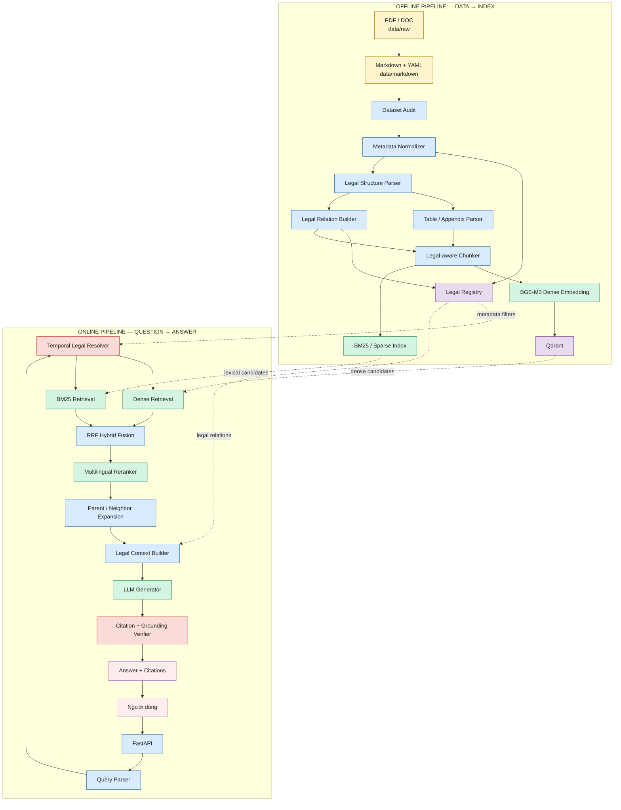

---

# 6. Luồng online khi người dùng đặt câu hỏi

Ví dụ:

> “Ngày 10/08/2026 ô tô vượt đèn đỏ bị phạt thế nào?”

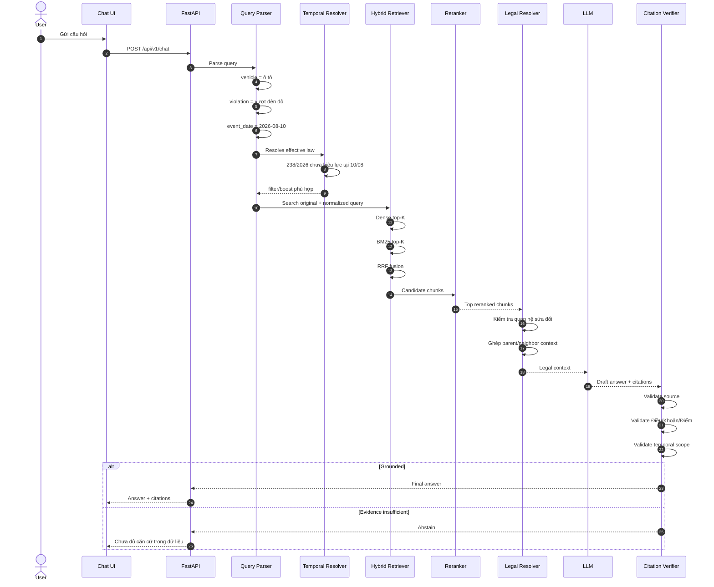

---

# 7. Hai khái niệm thời gian cần tách riêng

Đây là phần rất quan trọng.

## 7.1. `as_of_date`

Thời điểm người dùng muốn biết tình trạng pháp luật.

Ví dụ:

> Quy định đang có hiệu lực vào ngày 01/09/2026 là gì?

---

## 7.2. `event_date`

Ngày hành vi xảy ra.

Ví dụ:

> Tôi vượt đèn đỏ ngày 10/08/2026 nhưng tháng 9 mới nhận thông báo phạt.

Đối với xử phạt, **ngày xảy ra hành vi** có thể quyết định văn bản áp dụng.

Query schema nên có:

```json
{
  "query": "...",
  "as_of_date": null,
  "event_date": "2026-08-10"
}
```

Nếu người dùng không nói ngày:

```text
event_date = current date
```

chỉ khi intent là hỏi quy định hiện hành.

---

# 8. Tech stack đề xuất

## 8.1. Stack MVP

| Thành phần | Công nghệ | Lý do |
|---|---|---|
| Language | Python 3.11+ | Phù hợp NLP/RAG, repo hiện đã dùng Python |
| Config | pydantic-settings | Typed environment configuration |
| Validation | Pydantic | Chuẩn hóa document/chunk/query schema |
| YAML | PyYAML | Đọc front matter |
| API | FastAPI | API async, dễ test và deploy |
| Server | Uvicorn | Chạy FastAPI |
| Dense embedding | BAAI/BGE-M3 | Multilingual, phù hợp tiếng Việt |
| Dense store | Qdrant | Metadata filter, vector search |
| Lexical search | BM25 | Bắt exact legal terms, số văn bản, số điều |
| Fusion | RRF | Gộp dense + lexical |
| Reranker | BGE reranker multilingual | Tăng precision Top-K |
| Legal registry | JSONL + SQLite | Đủ nhẹ với corpus hiện tại |
| LLM | Provider Adapter | Dễ đổi OpenAI/Gemini/Claude/local |
| UI demo | Streamlit | Nhanh, đủ tốt cho MVP |
| Testing | pytest | Unit/integration/regression |
| Container | Docker Compose | API + Qdrant + UI |
| Logging | structlog/logging | Debug retrieval |
| Evaluation | custom Python + pandas | Golden set và metrics |

---

## 8.2. Chưa cần ở MVP

Chưa cần:

```text
PostgreSQL
Redis
Kafka
Kubernetes
GraphRAG
Neo4j
Multi-Agent
Fine-tune LLM
Fine-tune embedding
```

Corpus hiện tại nhỏ.

Tập trung vào:

```text
legal correctness
retrieval correctness
temporal correctness
citation correctness
```

quan trọng hơn scale.

---

# 9. Vì sao chọn BGE-M3?

BGE-M3 phù hợp vì:

```text
multilingual
+
dense representation
+
sparse representation
+
long-context embedding
```

Tiếng Việt được hưởng lợi từ multilingual embedding.

Tuy nhiên:

> Không nên dùng khả năng context dài để embed cả một Điều rất dài hoặc cả văn bản.

Vẫn phải chunk theo cấu trúc pháp luật.

---

# 10. Vì sao phải có BM25?

Query luật thường chứa identifier rất chính xác:

```text
168/2024/NĐ-CP
238/2026/NĐ-CP
Điều 6
Khoản 9
QCVN 41:2024/BGTVT
GPLX
IDP
```

Dense search đôi khi không ưu tiên exact token.

BM25 mạnh với các trường hợp này.

Do đó dùng:

```text
Dense retrieval
+
BM25 retrieval
```

---

# 11. Vì sao phải có reranker?

Retriever dùng để lấy rộng.

Ví dụ query:

> Xe máy vượt đèn đỏ bị phạt bao nhiêu?

Dense/BM25 có thể lấy:

```text
chunk ô tô
chunk xe máy
chunk người đi bộ
chunk trừ điểm GPLX
chunk đèn tín hiệu
```

Reranker đọc:

```text
Query + Candidate
```

để xếp chính xác hơn.

Pipeline:

```text
Dense top 30
BM25 top 30
      ↓
RRF
      ↓
Top 20
      ↓
Reranker
      ↓
Top 6-8
```

---

# 12. Cấu trúc project nên phát triển từ repo hiện tại

```text
RAG-Chatbot-Luat-giao-thong-duong-bo/
│
├── src/
│   └── traffic_law_rag/
│       │
│       ├── config/
│       │   ├── settings.py
│       │   └── logging.py
│       │
│       ├── schemas/
│       │   ├── document.py
│       │   ├── provision.py
│       │   ├── chunk.py
│       │   ├── query.py
│       │   └── answer.py
│       │
│       ├── ingestion/
│       │   ├── markdown_loader.py
│       │   ├── metadata_normalizer.py
│       │   ├── validator.py
│       │   ├── duplicate_detector.py
│       │   └── corpus_audit.py
│       │
│       ├── parsing/
│       │   ├── legal_parser.py
│       │   ├── heading_parser.py
│       │   ├── table_parser.py
│       │   └── appendix_parser.py
│       │
│       ├── legal/
│       │   ├── registry.py
│       │   ├── relation_builder.py
│       │   ├── temporal_resolver.py
│       │   ├── amendment_resolver.py
│       │   └── citation.py
│       │
│       ├── chunking/
│       │   ├── legal_chunker.py
│       │   └── context_header.py
│       │
│       ├── indexing/
│       │   ├── dense_embedder.py
│       │   ├── bm25_index.py
│       │   ├── qdrant_store.py
│       │   └── index_builder.py
│       │
│       ├── retrieval/
│       │   ├── query_parser.py
│       │   ├── query_normalizer.py
│       │   ├── dense.py
│       │   ├── sparse.py
│       │   ├── fusion.py
│       │   ├── reranker.py
│       │   └── context_builder.py
│       │
│       ├── generation/
│       │   ├── provider.py
│       │   ├── prompts.py
│       │   ├── generator.py
│       │   └── verifier.py
│       │
│       ├── service/
│       │   └── rag_service.py
│       │
│       └── api/
│           ├── main.py
│           ├── dependencies.py
│           └── routes/
│               ├── chat.py
│               ├── documents.py
│               └── health.py
│
├── ui/
│   └── streamlit_app.py
│
├── data/
│   ├── raw/                    # local, gitignored
│   ├── markdown/               # local, gitignored
│   ├── markdown_metadata.json
│   │
│   ├── processed/
│   │   ├── documents.jsonl
│   │   ├── provisions.jsonl
│   │   ├── legal_relations.jsonl
│   │   ├── chunks.jsonl
│   │   ├── tables.jsonl
│   │   └── audit_report.json
│   │
│   └── eval/
│       ├── questions.jsonl
│       ├── golden_sources.jsonl
│       └── regression.jsonl
│
├── indexes/
│   ├── bm25/
│   └── manifests/
│
├── scripts/
│   ├── extract_markdown_metadata.py
│   ├── audit_corpus.py
│   ├── normalize_metadata.py
│   ├── parse_legal_documents.py
│   ├── build_chunks.py
│   ├── build_indexes.py
│   ├── evaluate_retrieval.py
│   └── evaluate_rag.py
│
├── tests/
│   ├── unit/
│   ├── integration/
│   └── regression/
│
├── .env.example
├── .gitignore
├── docker-compose.yml
├── Dockerfile
├── pyproject.toml
├── README.md
└── GUIDE.md
```

---

# 13. Data model chuẩn hóa

## 13.1. `Document`

```json
{
  "document_id": "ND_168_2024",
  "document_number": "168/2024/NĐ-CP",
  "title": "Nghị định số 168/2024/NĐ-CP",
  "document_type": "Nghị định",
  "issuing_authority": "Chính phủ",

  "issue_date": "2024-12-26",
  "effective_from": "2025-01-01",
  "effective_to": null,

  "status": "AMENDED",

  "source_markdown": "data/markdown/168-2024-ND-CP_....md",
  "source_original": "...pdf",

  "coverage_status": "COMPLETE",

  "keywords": []
}
```

---

## 13.2. `LegalRelation`

Không giữ quan hệ dưới nhiều tên field khác nhau khi chạy RAG.

Chuẩn hóa:

```json
{
  "relation_id": "REL_0001",

  "source_document_id": "ND_238_2026",
  "target_document_id": "ND_168_2024",

  "relation_type": "AMENDS",

  "effective_from": "2026-08-15",

  "affected_provisions": [
    {
      "target_article": "6",
      "target_clause": null,
      "target_point": null
    }
  ]
}
```

Enum:

```text
AMENDS
SUPPLEMENTS
REPLACES
REPEALS
PARTIALLY_REPEALS
GUIDES
REFERENCES
BASED_ON
```

---

## 13.3. `Provision`

`Provision` là đơn vị pháp lý nhỏ nhất có ý nghĩa.

```json
{
  "provision_id": "ND_168_2024__DIEU_6__KHOAN_9__DIEM_A",

  "document_id": "ND_168_2024",

  "chapter": "II",
  "section": null,
  "article": "6",
  "clause": "9",
  "point": "a",

  "article_title": "...",

  "text": "...",

  "valid_from": "2025-01-01",
  "valid_to": null,

  "status": "ACTIVE"
}
```

---

# 14. Hiệu lực phải nằm ở cấp provision

Ví dụ một văn bản:

```text
effective_from document = 01/07/2026
```

nhưng khoản X:

```text
valid_from = 01/07/2027
```

Khi query ngày:

```text
10/08/2026
```

thì:

```text
Document = effective
Provision X = NOT YET EFFECTIVE
```

Do đó filter:

```python
valid_from <= event_date
and (
    valid_to is None
    or event_date < valid_to
)
```

---

# 15. Legal structure parser

Parser cần nhận biết:

```text
PHẦN
CHƯƠNG
MỤC
TIỂU MỤC
ĐIỀU
KHOẢN
ĐIỂM
PHỤ LỤC
BẢNG
```

Ví dụ:

```markdown
## Điều 6. Xử phạt người điều khiển xe ô tô ...

1. ...

2. ...

9. ...

a) ...

b) ...
```

Parser output:

```text
Document
└── Chapter
    └── Article
        ├── Clause 1
        ├── Clause 2
        └── Clause 9
            ├── Point a
            └── Point b
```

---

# 16. Regex ban đầu

Không cần NLP phức tạp để parse cấu trúc luật.

Có thể bắt đầu bằng deterministic regex.

Ví dụ:

```python
CHAPTER_RE = r"^(?:#+\s*)?CHƯƠNG\s+([IVXLCDM\d]+)"
SECTION_RE = r"^(?:#+\s*)?MỤC\s+(\d+)"
ARTICLE_RE = r"^(?:#+\s*)?Điều\s+(\d+[a-zA-Z]?)\."
CLAUSE_RE = r"^\s*(\d+)\.\s+"
POINT_RE = r"^\s*([a-zđ])\)\s+"
```

Sau đó viết test cho từng văn bản.

---

# 17. Không phụ thuộc hoàn toàn vào Markdown heading

Markdown do convert từ nhiều nguồn nên có thể không đồng nhất.

Parser nên dùng đồng thời:

```text
Markdown heading
+
text pattern
```

Ví dụ cả hai đều nhận:

```markdown
## Điều 6. ...
```

và:

```text
Điều 6. ...
```

---

# 18. Legal-aware chunking

Không chunk cố định:

```text
1000 chars
overlap 200
```

một cách mù quáng.

---

## 18.1. Quy tắc ưu tiên

```text
Điểm
→ Khoản
→ Điều
```

Chunk phải giữ trọn nghĩa pháp lý.

---

## 18.2. Điều ngắn

```text
1 Điều = 1 chunk
```

---

## 18.3. Điều dài

```text
Điều
├── Chunk khoản 1-2
├── Chunk khoản 3-4
└── Chunk khoản 5-6
```

Không tách giữa:

```text
Khoản 9
Điểm a
```

nếu điểm a cần context của khoản 9.

---

## 18.4. Parent-child chunking

Nên lưu hai cấp.

### Leaf chunk

```text
Điều 6
Khoản 9
Điểm a
```

dùng cho retrieval.

### Parent chunk

```text
toàn Khoản 9
hoặc toàn Điều 6
```

dùng bổ sung context sau retrieval.

Pipeline:

```text
Retrieve leaf
    ↓
Rerank
    ↓
Expand parent
    ↓
LLM
```

---

# 19. Chunk schema

```json
{
  "chunk_id": "ND168_D6_K9_A",

  "document_id": "ND_168_2024",
  "document_number": "168/2024/NĐ-CP",

  "chapter": "II",
  "article": "6",
  "clause": "9",
  "point": "a",

  "heading_path": [
    "Chương II",
    "Điều 6",
    "Khoản 9",
    "Điểm a"
  ],

  "text": "...",

  "retrieval_text": "...",

  "valid_from": "2025-01-01",
  "valid_to": null,

  "parent_chunk_id": "ND168_D6_K9",

  "source_file": "...md"
}
```

---

# 20. Retrieval text không nên chỉ là raw text

Ví dụ raw text:

```text
a) Không chấp hành hiệu lệnh của đèn tín hiệu giao thông...
```

Embedding nên dùng:

```text
Văn bản: Nghị định 168/2024/NĐ-CP
Chủ đề: xử phạt vi phạm giao thông đường bộ
Đối tượng: người điều khiển xe ...
Điều 6
Khoản 9
Điểm a

a) Không chấp hành hiệu lệnh của đèn tín hiệu giao thông...
```

Nhờ đó chunk có context ngay cả khi retrieve riêng.

---

# 21. Xử lý bảng

Corpus có nhiều nội dung dạng bảng:

```text
phí
lệ phí
tiêu chuẩn sức khỏe
phân loại xe
tải trọng
kích thước
sát hạch
```

Không nên chỉ convert bảng thành paragraph.

---

## 21.1. Lưu Markdown

```markdown
| Loại phương tiện | Mức phí |
|---|---:|
| ... | ... |
```

---

## 21.2. Lưu structured representation

```json
{
  "table_id": "TABLE_001",
  "document_id": "...",
  "article": "...",
  "title": "...",
  "columns": [
    "Loại phương tiện",
    "Mức phí"
  ],
  "rows": [
    ["...", "..."]
  ]
}
```

---

## 21.3. Sinh row chunks

Ví dụ:

```text
Bảng: Mức phí ...
Loại phương tiện: ...
Mức phí: ...
Căn cứ: ...
```

Sau đó embedding từng row.

Điều này rất hữu ích với câu hỏi lookup chính xác.

---

# 22. Phụ lục và coverage

Mỗi document cần:

```json
{
  "coverage_status": "PARTIAL",
  "missing_sections": [
    "Phụ lục VII",
    "Phụ lục VIII"
  ]
}
```

Khi query target vào vùng thiếu:

```text
Retriever
    ↓
Coverage Guard
    ↓
ABSTAIN
```

Không hỏi LLM tự suy đoán.

---

# 23. Audit pipeline

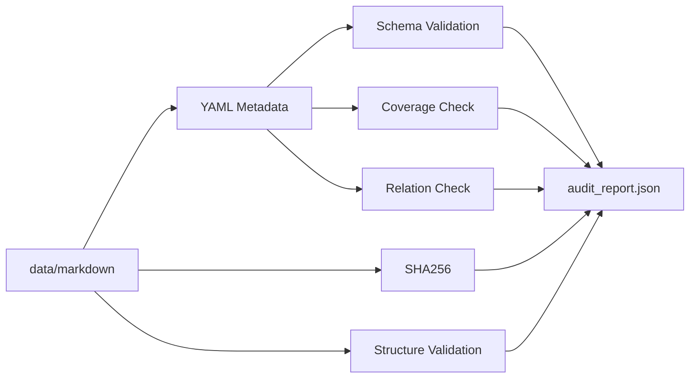

---

# 24. Những validation bắt buộc

## Document

```text
[ ] document_id unique
[ ] so_ky_hieu tồn tại
[ ] loai_van_ban tồn tại
[ ] ngay_ban_hanh parse được
[ ] ngay_co_hieu_luc parse được
[ ] issue_date <= effective_date
[ ] source Markdown tồn tại
[ ] source raw mapping được
```

---

## Structure

```text
[ ] Có Điều nếu metadata nói so_dieu > 0
[ ] Số Điều parse được gần với metadata
[ ] Không duplicate Điều
[ ] Không mất đoạn lớn
[ ] Không còn page number rác
[ ] Không còn OCR garbage nghiêm trọng
```

---

## Relation

```text
[ ] Document target có trong registry
[ ] AMENDS phải có target
[ ] REPLACES phải có target
[ ] relation date hợp lệ
```

---

## Coverage

```text
[ ] Phụ lục trong metadata thực sự xuất hiện
[ ] Phụ lục thiếu được đánh dấu
[ ] Không đánh COMPLETE nếu source thiếu phụ lục quan trọng
```

---

# 25. Metadata normalizer

Hiện metadata rất giàu thông tin nhưng field chưa hoàn toàn đồng nhất.

Không sửa mất metadata gốc.

Nên tạo:

```text
raw_metadata
+
canonical_metadata
```

Ví dụ:

```json
{
  "raw_metadata": {
    "van_ban_bi_sua_doi": [...]
  },

  "canonical": {
    "relations": [
      {
        "type": "AMENDS",
        "target": "..."
      }
    ]
  }
}
```

---

# 26. Document ID

Không dùng filename trực tiếp làm document ID.

Quy tắc:

```text
LUAT_35_2024_QH15
LUAT_36_2024_QH15
ND_168_2024
ND_238_2026
TT_65_2024_BCA
TT_105_2026_BCA
```

Ổn định qua các lần rename file.

---

# 27. Quan hệ văn bản quan trọng trong corpus

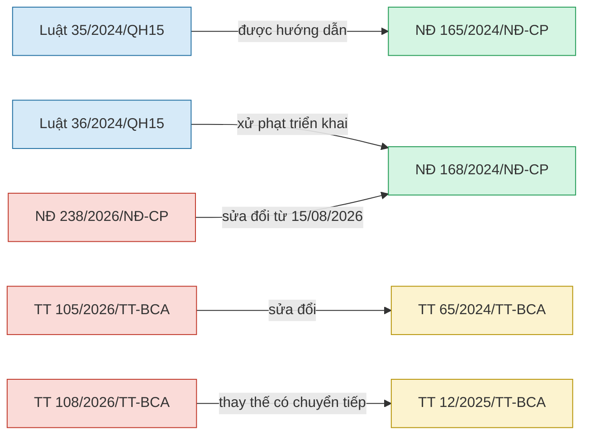

Đây chỉ là một phần graph cần build từ metadata.

---

# 28. Amendment resolver

Không để LLM tự suy luận:

> văn bản A sửa văn bản B nên nội dung hiện tại là gì.

Resolver phải xử lý trước LLM.

---

## 28.1. MVP level 1

Retrieve:

```text
base provision
+
amendment provision
```

đưa cả hai cho LLM, nhưng temporal filter phải đúng.

---

## 28.2. Level 2

Parse amendment:

```json
{
  "target_document": "ND_168_2024",
  "target_article": "6",
  "target_clause": "9",
  "change_type": "REPLACE",
  "new_text": "...",
  "valid_from": "2026-08-15"
}
```

---

## 28.3. Level 3

Precompute effective provision:

```text
effective_version(provision, date)
```

Đây là hướng tốt nhất khi project hoàn thiện.

---

# 29. Temporal resolver

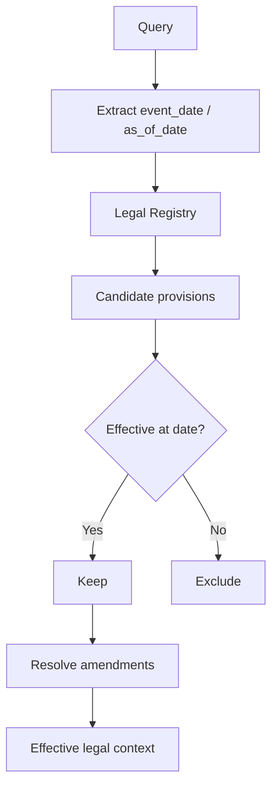

---

# 30. Query parser

Không cần LLM cho mọi query.

Dùng hybrid:

```text
Regex/rules
+
optional LLM structured extraction
```

---

## 30.1. Các field

```json
{
  "intent": "penalty_lookup",

  "vehicle_type": "motorcycle",
  "violation": "traffic_light",

  "document_number": null,
  "article": null,
  "clause": null,
  "point": null,

  "event_date": null,
  "as_of_date": null,

  "keywords": []
}
```

---

# 31. Intent taxonomy

```text
ARTICLE_LOOKUP
PENALTY_LOOKUP
DRIVER_LICENSE
REGISTRATION
SPEED_RULE
LOAD_RULE
ROAD_SIGN
FEE_LOOKUP
INSPECTION
TRANSPORT
PROCEDURE
AMENDMENT_COMPARE
GENERAL_LEGAL_QA
OUT_OF_SCOPE
```

---

# 32. Query routing

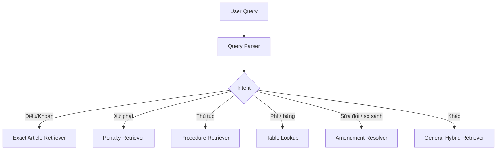

Router ở đây không phải multi-agent.

Nó chỉ giúp chọn search strategy.

---

# 33. Query normalization

Giữ nguyên query gốc.

Tạo thêm normalized query.

Ví dụ:

```text
"bằng lái"
→
"giấy phép lái xe GPLX"
```

```text
"xe hơi"
→
"ô tô"
```

```text
"vượt đèn đỏ"
→
"không chấp hành hiệu lệnh của đèn tín hiệu giao thông"
```

Search:

```text
original query
+
normalized query
```

Không thay thế hoàn toàn query gốc.

---

# 34. BM25 tokenizer

Không cần NLP tokenizer quá phức tạp ở bản đầu.

Quan trọng là giữ legal identifiers:

```text
168/2024/NĐ-CP
36/2024/QH15
QCVN 41:2024/BGTVT
```

Tokenizer custom nên:

1. Unicode normalize;
2. lowercase;
3. giữ `/`, `-`, `:` trong identifier;
4. tokenize phần text còn lại;
5. không bỏ số.

---

# 35. Dense indexing

Mỗi chunk:

```text
chunk.retrieval_text
    ↓
BGE-M3
    ↓
dense vector
    ↓
Qdrant
```

Qdrant payload:

```json
{
  "chunk_id": "...",
  "document_id": "...",
  "document_number": "...",
  "article": "...",
  "clause": "...",
  "point": "...",
  "valid_from": "...",
  "valid_to": null,
  "coverage_status": "COMPLETE"
}
```

---

# 36. Hybrid retrieval

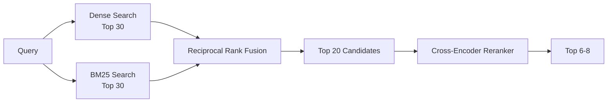

---

# 37. Reciprocal Rank Fusion

RRF phù hợp vì dense score và BM25 score khác scale.

Khái niệm:

```text
rank cao ở nhiều retriever
→ score fusion cao
```

Không cần normalize score phức tạp ở MVP.

---

# 38. Exact lookup shortcut

Nếu query chứa:

```text
Nghị định 168
Điều 6
Khoản 9
```

không cần phụ thuộc semantic search hoàn toàn.

Có thể direct-filter:

```text
document_number = 168/2024/NĐ-CP
article = 6
clause = 9
```

sau đó retrieve trong vùng này.

Đây là optimization rất quan trọng cho Legal RAG.

---

# 39. Neighbor expansion

Nếu retrieve:

```text
Điều 6
Khoản 9
Điểm a
```

có thể cần:

```text
Khoản 9 heading
Điểm b
Điểm c
```

hoặc quy định bổ sung phía dưới.

Do đó sau rerank:

```text
leaf chunk
→ parent
→ previous/next sibling khi cần
```

rồi mới context building.

---

# 40. Context builder

Không gửi thẳng list chunk lộn xộn vào LLM.

Format:

```text
[SOURCE 1]
Document: ...
Status: ...
Effective range: ...
Article: ...
Clause: ...
Point: ...
Relationship: BASE
Content:
...

[SOURCE 2]
Document: ...
Status: ...
Effective range: ...
Relationship: AMENDS SOURCE 1
Content:
...
```

---

# 41. Context budget

Ưu tiên:

```text
Top evidence
> supporting evidence
> parent context
> background law
```

Không đưa 20 chunks vào LLM chỉ vì đã retrieve 20.

Thông thường:

```text
6-8 evidence chunks
```

là điểm bắt đầu hợp lý.

Tune bằng evaluation.

---

# 42. LLM layer

Tạo interface:

```python
class LLMProvider:
    async def generate(self, request):
        ...
```

Adapter:

```text
OpenAIProvider
GeminiProvider
ClaudeProvider
LocalProvider
```

Core RAG không phụ thuộc provider.

---

# 43. Không cho LLM tự tìm luật bằng kiến thức mô hình

System prompt cần ghi rõ:

```text
Chỉ sử dụng LEGAL_CONTEXT.

Không tự bổ sung:
- số văn bản;
- số điều;
- số khoản;
- mức phạt;
- ngày hiệu lực;
- điều kiện pháp lý.

Nếu dữ liệu không đủ:
- nói rõ chưa đủ căn cứ.
```

---

# 44. Structured output

LLM nên trả JSON/Pydantic:

```json
{
  "answer": "...",

  "citations": [
    {
      "chunk_id": "ND168_D6_K9_A",
      "document_number": "168/2024/NĐ-CP",
      "article": "6",
      "clause": "9",
      "point": "a"
    }
  ],

  "warnings": [],

  "answerable": true
}
```

---

# 45. Citation verifier

Sau LLM phải verify.

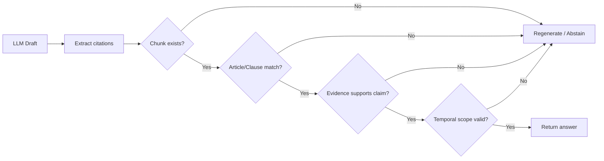

---

# 46. Citation phải lấy từ metadata của chunk

Không cho LLM invent:

```text
Điều 7
Khoản 3
```

Căn cứ hiển thị phải được build từ:

```text
chunk metadata
```

---

# 47. Answer format cho người dùng

Ví dụ:

```markdown
### Trả lời

...

### Căn cứ pháp lý

1. **Nghị định ...**
   - Điều ...
   - Khoản ...
   - Điểm ...

### Thời điểm áp dụng

Quy định trên được xác định theo thời điểm ...

### Lưu ý

...
```

---

# 48. Confidence không nên chỉ là score LLM

Tính từ nhiều tín hiệu:

```text
retrieval confidence
+
reranker relevance
+
citation validity
+
temporal consistency
+
coverage completeness
```

---

# 49. Abstention policy

Chatbot phải từ chối kết luận khi:

```text
Top-K relevance quá thấp
OR
citation không validate
OR
source thiếu phụ lục cần thiết
OR
hai nguồn mâu thuẫn chưa resolve
OR
không xác định được loại phương tiện
```

Ví dụ:

> Tôi chưa đủ căn cứ trong bộ dữ liệu hiện tại để xác định chính xác nội dung này.

---

# 50. FastAPI

Endpoints đề xuất.

## Health

```text
GET /api/v1/health
```

---

## Chat

```text
POST /api/v1/chat
```

Request:

```json
{
  "query": "Xe máy vượt đèn đỏ bị phạt bao nhiêu?",
  "event_date": null,
  "conversation_id": null
}
```

---

## Documents

```text
GET /api/v1/documents
GET /api/v1/documents/{document_id}
```

---

## Source

```text
GET /api/v1/chunks/{chunk_id}
```

---

## Debug retrieval

Development only:

```text
POST /api/v1/retrieval/search
```

Trả:

```text
dense rank
bm25 rank
rrf rank
reranker score
metadata
```

Rất hữu ích khi debug.

---

# 51. RAG service

```python
class RAGService:

    async def answer(self, request):
        parsed = self.query_parser.parse(request)

        legal_scope = self.temporal_resolver.resolve(parsed)

        candidates = self.retriever.search(
            parsed,
            legal_scope
        )

        reranked = self.reranker.rerank(
            parsed.query,
            candidates
        )

        context = self.context_builder.build(
            parsed,
            reranked
        )

        draft = await self.generator.generate(
            parsed,
            context
        )

        return self.verifier.verify(
            draft,
            context
        )
```

---

# 52. UI MVP

Dùng Streamlit.

UI nên có:

```text
Sidebar
├── Phạm vi dữ liệu
├── Ngày áp dụng
├── Danh sách văn bản
└── Debug mode

Main
├── Chat messages
├── Answer
├── Citation cards
└── Source viewer
```

---

# 53. Citation card

Hiển thị:

```text
Nghị định 168/2024/NĐ-CP
Điều X - Khoản Y - Điểm Z

Hiệu lực:
01/01/2025 → ...

[Xem nguồn]
```

Nếu văn bản đã sửa:

```text
Badge: ĐÃ ĐƯỢC SỬA ĐỔI
```

Nếu chưa hiệu lực:

```text
Badge: CHƯA CÓ HIỆU LỰC
```

---

# 54. UI flow

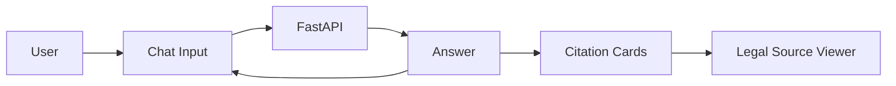

---

# 55. Deployment architecture MVP

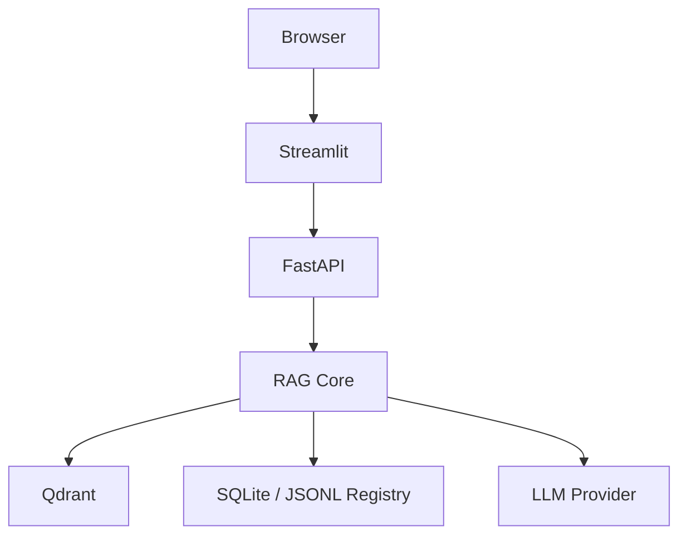

Không cần Redis/PostgreSQL ở bản đầu.

---

# 56. Docker Compose

Service:

```text
api
qdrant
ui
```

Sau này mới thêm:

```text
postgres
redis
```

---

# 57. Offline ingestion flow

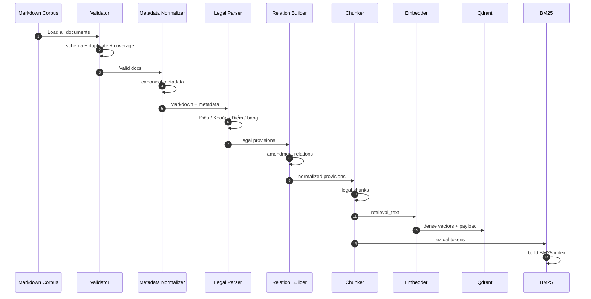

---

# 58. Plan triển khai chi tiết

---

## Phase 0 — Chốt repository structure

### Việc làm

- tạo `src/traffic_law_rag`;
- thêm `pyproject.toml`;
- thêm `.env.example`;
- thêm `README.md`;
- giữ `data/raw` và `data/markdown` gitignored;
- tạo `data/processed`;
- tạo `data/eval`;
- tạo `tests`.

### Output

```text
repo skeleton hoàn chỉnh
```

### Definition of Done

```text
python -m pytest
```

chạy được dù mới có smoke test.

---

# 59. Phase 1 — Audit toàn bộ corpus

Viết:

```text
scripts/audit_corpus.py
```

Kiểm tra:

```text
raw ↔ markdown
markdown ↔ metadata JSON
duplicates
missing markdown
missing appendix
article count
metadata completeness
```

---

## 59.1. Output

```text
data/processed/audit_report.json
```

Ví dụ:

```json
{
  "documents": 24,
  "errors": [],
  "warnings": [
    {
      "document": "TT_81_2024_BCA",
      "type": "MISSING_MARKDOWN"
    }
  ]
}
```

---

# 60. Phase 2 — Canonical metadata schema

Tạo:

```text
schemas/document.py
```

Dùng Pydantic.

Các field bắt buộc:

```text
document_id
document_number
document_type
title
issue_date
effective_from
issuing_authority
source_markdown
```

Các field optional:

```text
effective_to
signer
keywords
coverage_status
missing_sections
```

---

# 61. Phase 3 — Normalize relation fields

Map:

```text
van_ban_duoc_sua_doi
van_ban_bi_sua_doi
→ AMENDS
```

Tùy semantic của từng file phải kiểm tra cẩn thận.

Map:

```text
van_ban_bi_thay_the
→ REPLACES
```

```text
van_ban_bi_bai_bo
→ REPEALS
```

```text
van_ban_duoc_huong_dan
→ GUIDES
```

---

## 61.1. Output

```text
data/processed/documents.jsonl
data/processed/legal_relations.jsonl
```

---

# 62. Phase 4 — Merge multi-part document

Đặc biệt:

```text
36/2024/QH15
```

Tạo một logical document.

Không nhất thiết phải nối file vật lý.

Registry:

```json
{
  "document_id": "LUAT_36_2024_QH15",
  "parts": [
    "...Phan-1...",
    "...Phan-2..."
  ]
}
```

Parser load theo thứ tự.

---

# 63. Phase 5 — Legal parser

Viết:

```text
parsing/legal_parser.py
```

Output:

```text
data/processed/provisions.jsonl
```

Mỗi dòng một provision.

---

## 63.1. Test đầu tiên

Chọn các tài liệu đa dạng:

```text
35/2024/QH15
36/2024/QH15
168/2024/NĐ-CP
238/2026/NĐ-CP
38/2024/TT-BGTVT
53/2024/TT-BGTVT
```

---

# 64. Phase 6 — Parse tables và appendix

Ưu tiên:

```text
36/2024/TT-BYT
39/2024/TT-BGTVT
51/2024/TT-BGTVT
53/2024/TT-BGTVT
154/2025/TT-BTC
364/2025/NĐ-CP
```

Output:

```text
data/processed/tables.jsonl
```

---

# 65. Phase 7 — Provision-level temporal metadata

Tạo:

```text
valid_from
valid_to
```

cho provision.

Bản đầu có thể:

```text
inherit document effective date
```

sau đó override các điều khoản có hiệu lực riêng từ:

```text
ghi_chu_hieu_luc
dieu_khoan_chuyen_tiep
```

---

# 66. Phase 8 — Legal-aware chunking

Viết:

```text
chunking/legal_chunker.py
```

Output:

```text
data/processed/chunks.jsonl
```

Kiểm tra:

```text
chunk không cắt giữa điểm
chunk có heading path
chunk có source trace
chunk có valid_from
chunk có document_id
```

---

# 67. Phase 9 — Dense baseline

Cài:

```text
BGE-M3
Qdrant
```

Build dense index.

Test thủ công khoảng 30 query.

Chưa thêm LLM.

Mục tiêu:

> Retrieval đúng trước.

---

# 68. Phase 10 — Tạo evaluation retrieval set

Tạo:

```text
data/eval/questions.jsonl
```

Bắt đầu khoảng:

```text
100 câu
```

Mỗi câu có:

```text
expected_document
expected_article
expected_clause
```

---

# 69. Phase 11 — Đánh giá dense retrieval

Metrics:

```text
Recall@5
Recall@10
MRR@10
nDCG@10
```

Quan trọng nhất:

```text
Recall@10
```

Nếu evidence đúng không vào Top-10 thì LLM không cứu được.

---

# 70. Phase 12 — BM25

Build BM25 index.

Test exact terms:

```text
168/2024/NĐ-CP
Điều 6
QCVN 41:2024/BGTVT
IDP
GPLX
```

---

# 71. Phase 13 — Hybrid RRF

Combine:

```text
dense top 30
+
BM25 top 30
→ RRF
→ top 20
```

So sánh:

```text
dense
vs
BM25
vs
hybrid
```

---

# 72. Phase 14 — Reranker

Dùng multilingual reranker.

Pipeline:

```text
hybrid top 20
→ reranker
→ top 8
```

So sánh metrics.

---

# 73. Phase 15 — Exact legal routing

Implement shortcut:

```text
document number
article
clause
point
```

Nếu query chứa direct citation.

Ví dụ:

> Khoản 9 Điều 6 Nghị định 168 nói gì?

Hệ thống filter thẳng metadata trước.

---

# 74. Phase 16 — Temporal resolver

Viết test bắt buộc.

### Test A

```text
event_date = 2026-08-10
```

`238/2026/NĐ-CP` chưa được dùng như amendment có hiệu lực.

### Test B

```text
event_date = 2026-08-16
```

resolver phải xem xét `238/2026/NĐ-CP`.

### Test C

Các clause của `105/2026/TT-BCA` có mốc 2027 phải chưa được áp dụng trước mốc tương ứng.

### Test D

`108/2026/TT-BCA` có transitional rules với `12/2025/TT-BCA`.

---

# 75. Phase 17 — Amendment resolver

Level đầu:

```text
retrieve base
+
retrieve amendment
+
annotate relation
```

Không cần merge tự động mọi câu chữ ngay.

Sau khi evaluation ổn mới build provision patch.

---

# 76. Phase 18 — Query parser

Implement:

```text
intent
vehicle
violation
document
article
date
```

Rule-first.

LLM fallback cho query phức tạp.

---

# 77. Phase 19 — Context builder

Build context có structure.

Không truyền raw chunks trực tiếp.

Test:

```text
same article chunks merged đúng
amendment placed next to base
duplicate removed
context ordered logically
```

---

# 78. Phase 20 — LLM generator

Viết provider abstraction.

Prompt chỉ cho phép dùng context.

Structured output bằng Pydantic.

---

# 79. Phase 21 — Citation verifier

Verify:

```text
chunk_id
document
article
clause
point
valid date
```

Nếu fail:

```text
regenerate một lần
```

sau đó:

```text
abstain
```

---

# 80. Phase 22 — FastAPI

Build endpoints.

Viết integration test bằng FastAPI TestClient.

---

# 81. Phase 23 — Streamlit UI

Sau khi RAG core ổn.

Không làm UI quá sớm.

UI đẹp không bù được retrieval sai.

---

# 82. Phase 24 — Full RAG evaluation

Tăng golden set lên:

```text
150-250 câu
```

---

# 83. Phân nhóm evaluation set

## Exact citation

```text
Điều X quy định gì?
```

---

## Penalty

```text
hành vi + vehicle
```

---

## Vehicle disambiguation

Cùng hành vi nhưng:

```text
ô tô
xe máy
xe đạp
```

phải khác retrieval.

---

## Driver license

```text
trừ điểm
phục hồi điểm
sát hạch
cấp đổi
IDP
```

---

## Temporal

```text
trước amendment
sau amendment
transitional period
future provision
```

---

## Table lookup

```text
phí
tiêu chuẩn
tải trọng
```

---

## Missing source

Hỏi nội dung nằm trong phụ lục bị thiếu.

Expected:

```text
ABSTAIN
```

---

## Out of scope

Ví dụ:

> Mức phạt vi phạm giao thông hàng không?

Expected:

```text
OUT_OF_SCOPE
```

---

# 84. Evaluation schema

```json
{
  "id": "GT_001",

  "question": "Xe máy vượt đèn đỏ bị xử phạt thế nào?",

  "event_date": "2026-08-10",

  "expected_sources": [
    {
      "document_id": "...",
      "article": "...",
      "clause": "...",
      "point": "..."
    }
  ],

  "category": "PENALTY_LOOKUP",

  "answerable": true
}
```

---

# 85. Retrieval metrics

```text
Recall@5
Recall@10
MRR@10
nDCG@10
```

---

# 86. Legal answer metrics

Thêm metrics riêng:

```text
Document Accuracy
Article Accuracy
Clause Accuracy
Point Accuracy
Temporal Accuracy
Vehicle Accuracy
Penalty Accuracy
Citation Precision
Citation Recall
Abstention Accuracy
```

---

# 87. RAG evaluation flow

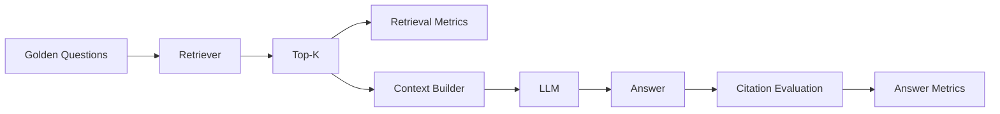

---

# 88. Debug logging

Mỗi query nên lưu:

```json
{
  "query": "...",

  "parsed_query": {},

  "temporal_scope": {},

  "dense_results": [],
  "bm25_results": [],

  "rrf_results": [],
  "reranker_results": [],

  "selected_context": [],

  "answer_citations": [],

  "latency": {}
}
```

Khi chatbot trả sai, nhìn log sẽ biết sai ở:

```text
parser?
retrieval?
reranker?
temporal resolver?
context?
LLM?
citation?
```

---

# 89. Không debug RAG chỉ bằng nhìn câu trả lời

Ví dụ answer sai.

Phải kiểm tra theo thứ tự:

```text
1. Golden evidence là gì?
2. Evidence có trong corpus không?
3. Retriever có lấy ra không?
4. Reranker có đẩy lên không?
5. Context có đưa vào LLM không?
6. Temporal resolver có loại nhầm không?
7. LLM có đọc đúng không?
8. Citation verifier có phát hiện không?
```

---

# 90. Test pyramid

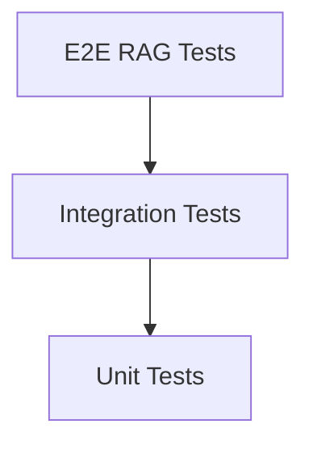

Unit tests nhiều nhất.

---

# 91. Unit tests quan trọng

```text
test_metadata_normalizer.py
test_legal_parser.py
test_article_parser.py
test_clause_parser.py
test_relation_builder.py
test_temporal_resolver.py
test_chunker.py
test_query_parser.py
test_rrf.py
test_citation.py
```

---

# 92. Regression tests

Mỗi khi thêm văn bản mới:

```text
ingest
→ rebuild affected index
→ run golden tests
→ compare
```

Đặc biệt các query:

```text
vượt đèn đỏ
nồng độ cồn
tốc độ
trừ điểm GPLX
phục hồi GPLX
cấp đổi GPLX
```

---

# 93. Data update pipeline

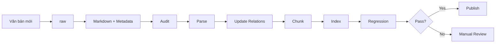

---

# 94. Incremental indexing

Corpus nhỏ nên giai đoạn đầu có thể:

```text
rebuild toàn bộ
```

cho đơn giản và reproducible.

Khi corpus lớn hơn mới:

```text
incremental update
```

---

# 95. Source versioning

Mỗi document nên lưu:

```text
content_hash
metadata_hash
parser_version
chunker_version
embedding_model
embedding_version
indexed_at
```

Nếu chunker đổi:

```text
rebuild index
```

---

# 96. Index manifest

Ví dụ:

```json
{
  "index_version": "v1",

  "created_at": "...",

  "documents": 24,

  "embedding_model": "BAAI/bge-m3",

  "chunker_version": "legal-v1",

  "dense_collection": "traffic_law_dense",

  "bm25_version": "bm25-v1"
}
```

---

# 97. requirements / dependency groups

Nên dùng `pyproject.toml`.

Ví dụ nhóm:

```text
core
embedding
api
ui
dev
```

Không cài mọi dependency vào một file lộn xộn.

---

# 98. `.env.example`

```env
APP_ENV=development

DATA_DIR=data

QDRANT_URL=http://localhost:6333
QDRANT_COLLECTION=traffic_law

EMBEDDING_MODEL=BAAI/bge-m3
RERANKER_MODEL=BAAI/bge-reranker-v2-m3

LLM_PROVIDER=
LLM_MODEL=
LLM_API_KEY=
```

Không commit `.env`.

---

# 99. Docker Compose roadmap

### MVP

```text
qdrant
api
ui
```

### Production later

```text
qdrant
api
frontend
postgres
redis
observability
```

---

# 100. README cần bổ sung ngay

Repo hiện chưa có README.

README nên gồm:

```text
Project overview
Dataset scope
Architecture
Setup
Environment
Build data
Build index
Run API
Run UI
Evaluation
Docker
Project structure
Limitations
Disclaimer
```

---

# 101. Disclaimer pháp lý

UI nên hiển thị:

> Hệ thống hỗ trợ tra cứu thông tin pháp luật từ bộ dữ liệu đã thu thập, không thay thế tư vấn pháp lý chuyên nghiệp. Người dùng nên kiểm tra văn bản chính thức khi áp dụng vào trường hợp cụ thể.

---

# 102. Security cơ bản

Không log:

```text
API key
secret
sensitive user data
```

Nếu lưu chat history:

```text
tách user data khỏi retrieval logs
```

---

# 103. Các lỗi dễ mắc khi triển khai project này

## Lỗi 1

```text
RecursiveCharacterTextSplitter
chunk_size=1000
chunk_overlap=200
```

áp dụng thẳng cho mọi luật.

**Không nên.**

---

## Lỗi 2

Chỉ dùng vector search.

**Không nên.**

---

## Lỗi 3

Đưa tất cả metadata vào embedding text.

Một số metadata kỹ thuật làm nhiễu.

Chỉ đưa retrieval-relevant metadata.

---

## Lỗi 4

Cho LLM quyết định văn bản nào còn hiệu lực.

**Không nên.**

Temporal resolver phải deterministic.

---

## Lỗi 5

Đánh dấu toàn document có hiệu lực và bỏ qua clause-level date.

Corpus hiện tại đã cho thấy điều này không đủ.

---

## Lỗi 6

Không detect appendix missing.

Dễ hallucination.

---

## Lỗi 7

Không phân biệt:

```text
event_date
as_of_date
```

đặc biệt trong xử phạt.

---

## Lỗi 8

Dùng LLM để parse Điều/Khoản dù regex có thể làm chính xác hơn.

---

## Lỗi 9

Xây Agentic RAG ngay từ đầu.

Không cần.

---

# 104. Có nên dùng LangChain/LlamaIndex không?

Không bắt buộc.

Với project báo cáo/thực tập, viết core RAG tương đối explicit giúp:

```text
dễ hiểu
dễ debug
dễ đánh giá
dễ trình bày kiến trúc
```

Có thể dùng thư viện cho:

```text
model client
vector store adapter
```

nhưng business logic pháp luật nên do project tự kiểm soát.

---

# 105. Có cần Agentic RAG không?

## MVP

```text
KHÔNG
```

Deterministic Legal RAG đủ tốt.

---

## Sau MVP

Có thể thêm tool:

```text
search_legal_text
lookup_provision
resolve_effective_version
compare_amendments
lookup_structured_table
```

Sau đó một orchestrator quyết định gọi tool.

---

# 106. Kiến trúc Agentic mở rộng

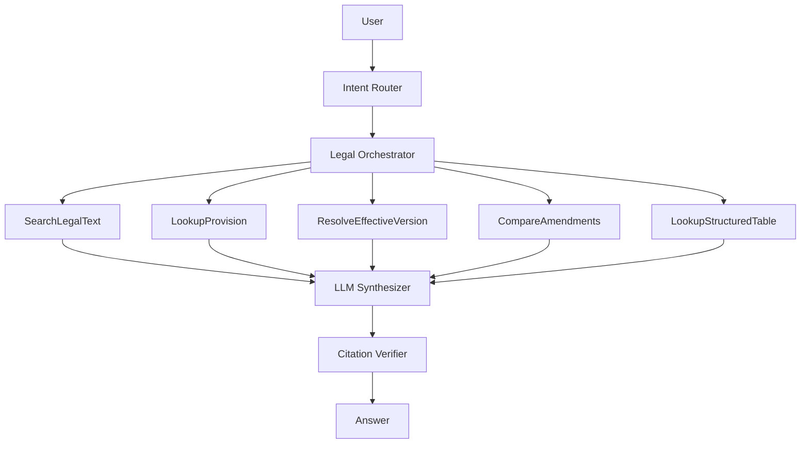

Chỉ làm sau khi từng tool đã có test.

---

# 107. Roadmap rút gọn

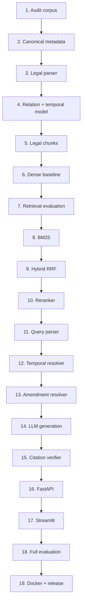

---

# 108. Milestone 1 — Data Ready

Hoàn thành khi:

```text
[ ] audit report sạch lỗi critical
[ ] document registry chuẩn hóa
[ ] relation registry tồn tại
[ ] 36/2024/QH15 merge logic
[ ] duplicate đã xử lý
[ ] missing appendices có flag
[ ] TT81 được include/exclude rõ
```

---

# 109. Milestone 2 — Retrieval Ready

Hoàn thành khi:

```text
[ ] legal parser ổn
[ ] chunks có trace
[ ] BGE-M3 index
[ ] BM25 index
[ ] hybrid retrieval
[ ] reranker
[ ] golden retrieval set
[ ] Recall@10 đo được
```

---

# 110. Milestone 3 — Legal Reasoning Ready

Hoàn thành khi:

```text
[ ] event_date
[ ] as_of_date
[ ] provision-level validity
[ ] amendment relation
[ ] temporal tests
[ ] coverage guard
```

---

# 111. Milestone 4 — Chatbot Ready

Hoàn thành khi:

```text
[ ] LLM structured answer
[ ] citation verifier
[ ] abstention
[ ] FastAPI
[ ] Streamlit
[ ] logging
```

---

# 112. Milestone 5 — Demo/Report Ready

Hoàn thành khi:

```text
[ ] 150-250 evaluation questions
[ ] retrieval metrics
[ ] answer metrics
[ ] temporal evaluation
[ ] error analysis
[ ] Docker
[ ] README
[ ] architecture diagrams
[ ] demo scenarios
```

---

# 113. Các demo case nên chuẩn bị

## Demo 1 — Xử phạt cơ bản

```text
Xe máy vượt đèn đỏ bị phạt thế nào?
```

---

## Demo 2 — Phân biệt phương tiện

```text
Ô tô vượt đèn đỏ...
vs
Xe máy vượt đèn đỏ...
```

---

## Demo 3 — Temporal query

```text
Quy định ngày 10/08/2026?
```

và:

```text
Quy định ngày 16/08/2026?
```

Cho thấy resolver xử lý `238/2026/NĐ-CP`.

---

## Demo 4 — GPLX amendment

```text
Phục hồi điểm GPLX hiện nay thực hiện thế nào?
```

Dùng:

```text
65/2024/TT-BCA
+
105/2026/TT-BCA
```

---

## Demo 5 — Transition

```text
Sát hạch GPLX trong giai đoạn chuyển tiếp của 108/2026/TT-BCA thế nào?
```

---

## Demo 6 — Exact citation

```text
Khoản X Điều Y của văn bản Z quy định gì?
```

---

## Demo 7 — Missing appendix

Query vào phụ lục chưa có.

Expected:

```text
không hallucinate
```

---

# 114. Definition of Done cuối project

## Data

```text
[ ] 100% document trong scope có canonical metadata
[ ] 100% chunks trace về source
[ ] duplicate được xử lý
[ ] missing coverage được flag
[ ] relations chính được normalize
```

---

## Retrieval

```text
[ ] dense
[ ] BM25
[ ] hybrid
[ ] reranker
[ ] exact lookup
[ ] Recall@10 đạt target đã đặt
```

Không đặt con số target tùy ý trước khi có baseline.

Sau baseline mới đặt target dựa trên kết quả thực tế.

---

## Legal correctness

```text
[ ] temporal resolver
[ ] event_date
[ ] as_of_date
[ ] amendment resolver
[ ] provision validity
[ ] coverage guard
```

---

## Generation

```text
[ ] structured output
[ ] grounded response
[ ] verified citations
[ ] abstention
```

---

## Product

```text
[ ] FastAPI
[ ] Streamlit hoặc frontend
[ ] source viewer
[ ] Docker Compose
[ ] logs
[ ] tests
[ ] README
```

---

## Evaluation

```text
[ ] golden set
[ ] retrieval metrics
[ ] legal answer metrics
[ ] regression tests
[ ] error analysis
```

---

# 115. Thứ tự công việc nên làm ngay từ repo hiện tại

Không bắt đầu bằng UI.

Không bắt đầu bằng LLM.

Thứ tự cụ thể:

```text
1. Tạo project skeleton
2. Viết corpus audit
3. Chuẩn hóa metadata
4. Chuẩn hóa legal relations
5. Xử lý multi-part Luật 36
6. Xử lý missing/duplicate data
7. Viết legal parser
8. Viết parser tests
9. Sinh provisions.jsonl
10. Viết legal chunker
11. Sinh chunks.jsonl
12. Tạo 100 golden retrieval queries
13. Build BGE-M3 dense baseline
14. Đo Recall@K
15. Build BM25
16. Hybrid bằng RRF
17. Thêm reranker
18. Viết temporal resolver
19. Viết amendment resolver
20. Viết query parser
21. Context builder
22. LLM generator
23. Citation verifier
24. Full RAG evaluation
25. FastAPI
26. Streamlit
27. Docker
28. README + report
```

---

# 116. Kiến trúc cuối cùng khuyến nghị

```text
PDF / DOC
    ↓
Canonical Markdown + YAML Metadata
    ↓
Corpus Audit
    ↓
Canonical Document Registry
    ↓
Legal Relation Registry
    ↓
Parse
Chương → Mục → Điều → Khoản → Điểm → Bảng → Phụ lục
    ↓
Provision-level Validity
    ↓
Legal-aware Parent/Child Chunks
    ↓
┌────────────────────┬────────────────────┐
│ BGE-M3 Dense       │ BM25 Lexical       │
│ Qdrant             │ Exact legal terms  │
└──────────┬─────────┴──────────┬─────────┘
           │                    │
           └─────────┬──────────┘
                     ↓
                 RRF Fusion
                     ↓
             Multilingual Reranker
                     ↓
             Parent/Neighbor Expansion
                     ↓
          Temporal + Amendment Resolver
                     ↓
               Legal Context Builder
                     ↓
                     LLM
                     ↓
              Citation Verifier
                     ↓
        Answer + Văn bản/Điều/Khoản/Điểm
```

---

# 117. Kết luận

Với repo hiện tại, phần **thu thập → Markdown → metadata** đã tạo được nền tảng tốt.

Bước tiếp theo không nên là:

```text
embedding ngay tất cả Markdown
```

mà nên là:

```text
Audit
→ normalize metadata
→ legal structure parsing
→ legal relations
→ provision-level temporal model
→ legal chunking
→ retrieval evaluation
```

sau đó mới:

```text
BGE-M3
+
BM25
+
RRF
+
Reranker
+
LLM
```

Điểm khác biệt quan trọng nhất của project này so với một RAG chatbot thông thường là:

> **Hệ thống phải biết “quy định nào áp dụng tại thời điểm nào”, không chỉ biết “đoạn văn nào giống câu hỏi nhất”.**

Do corpus hiện đã có văn bản sửa đổi, văn bản có nhiều mốc hiệu lực, quy định chuyển tiếp và phụ lục thiếu, đây cũng chính là phần kỹ thuật có giá trị nhất để trình bày trong báo cáo/project.
