# GUIDE — Xây dựng hệ thống RAG Chatbot hỏi đáp Luật Giao thông đường bộ

> **Project:** RAG Luật Giao thông  
> **Data root:** `d:\RAG_luat_giao_thong\data`  
> **Mục tiêu:** Xây dựng chatbot RAG tiếng Việt có khả năng tra cứu, tổng hợp và trả lời câu hỏi về pháp luật giao thông đường bộ, đồng thời dẫn chiếu rõ **Văn bản → Điều → Khoản → Điểm**, xử lý được văn bản sửa đổi/bổ sung và hạn chế tối đa hallucination.

---

# 1. Mục tiêu hệ thống

Hệ thống cần trả lời được các nhóm câu hỏi như:

- “Vượt đèn đỏ bằng ô tô bị phạt bao nhiêu?”
- “Xe máy chạy quá tốc độ 15 km/h bị xử phạt thế nào?”
- “GPLX bị trừ bao nhiêu điểm khi vi phạm nồng độ cồn?”
- “Điều kiện để phục hồi điểm giấy phép lái xe là gì?”
- “Tốc độ tối đa trong khu vực đông dân cư là bao nhiêu?”
- “Xe tải được phép chở quá tải bao nhiêu phần trăm?”
- “Thủ tục đăng ký xe hiện nay như thế nào?”
- “Quy định mới năm 2026 đã sửa Nghị định 168/2024/NĐ-CP ở những nội dung nào?”
- “Quy định này có còn hiệu lực tại ngày X hay không?”

Một câu trả lời tốt phải có:

1. **Câu trả lời trực tiếp.**
2. **Căn cứ pháp lý chính xác.**
3. **Số hiệu văn bản.**
4. **Điều/Khoản/Điểm liên quan.**
5. **Trạng thái hiệu lực hoặc quan hệ sửa đổi nếu có.**
6. **Không tự suy diễn khi dữ liệu không đủ.**
7. Có thể trích dẫn đoạn nguồn để người dùng kiểm tra.

---

# 2. Hiện trạng dữ liệu

Cấu trúc hiện tại:

```text
d:\RAG_luat_giao_thong\data
├── markdown
│   ├── *.md
└── raw
    ├── <tên văn bản>
    │   ├── *.pdf
    │   └── *.doc
```

Đây là cấu trúc tốt để tiếp tục xây pipeline vì đã tách:

- `raw/`: nguồn gốc để audit.
- `markdown/`: dữ liệu canonical dùng cho parsing, chunking và indexing.

## 2.1. Một số điểm nên kiểm tra trước khi index

Từ danh sách hiện tại, nên đặc biệt kiểm tra:

### 2.1.1. Thông tư 81/2024/TT-BCA

Trong `raw/` có:

```text
Thông tư số 81-2024-TT-BCA
├── 2024_1343 + 1344_81-2024-TT-BCA.doc
└── ~$24_1343 + 1344_81-2024-TT-BCA.doc
```

nhưng trong danh sách `markdown/` chưa thấy file tương ứng.

Cần:

- bỏ file tạm Word bắt đầu bằng `~$`;
- chuyển tài liệu chính sang Markdown;
- thêm metadata;
- kiểm tra xem văn bản có thuộc phạm vi chatbot hay không trước khi index.

### 2.1.2. Thông tư 53/2024/TT-BGTVT có nhiều phụ lục

Raw gồm nhiều file:

```text
53-bgtvt.pdf
pl1...
pl2...
...
pl11...
```

nhưng mới thấy một Markdown:

```text
53-2024-TT-BGTVT_Phan-loai-phuong-tien.md
```

Nếu các phụ lục chứa bảng phân loại phương tiện, công thức hoặc tiêu chí kỹ thuật thì **không nên bỏ qua**.

Nên tạo:

```text
53-2024-TT-BGTVT_Phan-loai-phuong-tien.md
53-2024-TT-BGTVT_PL01.md
53-2024-TT-BGTVT_PL02.md
...
53-2024-TT-BGTVT_PL11.md
```

hoặc gộp phụ lục vào cùng tài liệu nhưng phải giữ cấu trúc:

```markdown
# PHỤ LỤC I
...
# PHỤ LỤC II
...
```

### 2.1.3. Thông tư 73/2024/TT-BCA có hai PDF

```text
73-bca.pdf
73bca.pdf
```

Cần hash file để xác định:

- trùng hoàn toàn;
- hai phiên bản khác nhau;
- một file chính và một file phụ lục.

Không index hai bản giống nhau vì sẽ làm tăng điểm retrieval giả tạo.

### 2.1.4. Luật 36/2024/QH15 đang được chia nhiều phần

Hiện có:

```text
36-2024-QH15_Phan-1_Dieu-1-23.md
36-2024-QH15_Phan-2_Dieu-24-89.md
```

Nên gắn cùng một:

```yaml
document_id: LUAT_36_2024_QH15
```

và khác:

```yaml
part_id: 1
article_start: 1
article_end: 23
```

để hệ thống hiểu đây là **một văn bản pháp luật**, không phải hai văn bản độc lập.

### 2.1.5. Văn bản sửa đổi/bổ sung

Ví dụ:

- `238-2026-ND-CP` sửa đổi `168-2024-ND-CP`.
- `105-2026-TT-BCA` sửa đổi `65-2024-TT-BCA`.

Đây là phần rất quan trọng với Legal RAG.

Không nên chỉ index hai văn bản độc lập rồi để LLM tự suy luận.

Cần lưu quan hệ pháp lý rõ ràng trong metadata hoặc một bảng quan hệ riêng.

---

# 3. Kiến trúc tổng thể

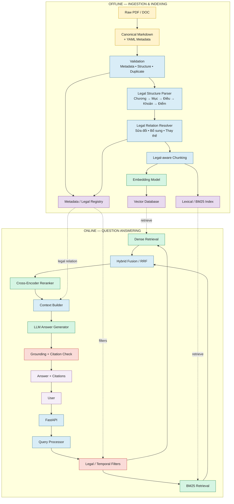

---

# 4. Vì sao Legal RAG cần kiến trúc khác RAG thông thường?

RAG thông thường:

```text
Document
→ Chunk
→ Embedding
→ Vector Search
→ LLM
```

chưa đủ cho luật.

Ví dụ người dùng hỏi:

> “Vượt đèn đỏ hiện nay bị phạt bao nhiêu?”

Nếu chỉ semantic search, hệ thống có thể retrieve:

- Nghị định 168/2024/NĐ-CP;
- một điều đã bị sửa năm 2026;
- Nghị định 238/2026/NĐ-CP;
- một đoạn liên quan đến xe máy;
- một đoạn liên quan đến ô tô.

Nếu LLM tự ghép, xác suất trả sai mức phạt sẽ tăng.

Legal RAG nên bổ sung:

```text
Query
→ Intent
→ Loại phương tiện
→ Hành vi
→ Thời điểm áp dụng
→ Văn bản đang có hiệu lực
→ Điều/Khoản/Điểm
→ Retrieval
→ Rerank
→ Legal context resolution
→ Answer
```

---

# 5. Luồng hoạt động khi người dùng đặt câu hỏi

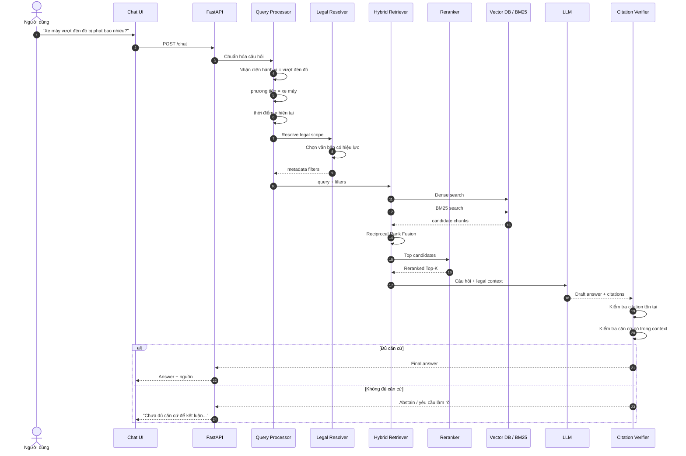

---

# 6. Tech stack đề xuất

## 6.1. Stack khuyến nghị cho MVP

| Layer | Công nghệ | Vai trò |
|---|---|---|
| Language | Python | Toàn bộ backend/RAG |
| API | FastAPI | REST API, streaming |
| Data validation | Pydantic | Schema query, chunk, response |
| Markdown parsing | Python + regex / markdown parser | Parse cấu trúc pháp luật |
| NLP VN | underthesea hoặc pyvi | Tokenization cho lexical search |
| Dense embedding | BGE-M3 | Embedding đa ngôn ngữ, phù hợp tiếng Việt |
| Vector DB | Qdrant | Vector search + metadata filter |
| Lexical retrieval | BM25 | Match chính xác số điều, từ khóa pháp lý |
| Reranker | multilingual reranker | Rerank candidate chunks |
| LLM | Provider abstraction | API hoặc local model hỗ trợ tiếng Việt |
| Relational DB | PostgreSQL | document registry, legal relations, logs |
| Cache | Redis — optional | Cache query/retrieval |
| UI MVP | Streamlit | Demo nhanh |
| UI Production | Next.js/React | Chat UI đẹp, citation viewer |
| Observability | Langfuse/OpenTelemetry — optional | Trace RAG |
| Container | Docker Compose | Chạy đồng bộ các service |
| Testing | pytest | Unit/integration tests |

## 6.2. Vì sao chọn BGE-M3?

Đây là lựa chọn hợp lý cho corpus pháp luật tiếng Việt vì:

- multilingual;
- semantic retrieval tốt;
- phù hợp cả câu hỏi ngắn và đoạn luật dài;
- có thể mở rộng sang hybrid/multi-vector nếu cần;
- dễ self-host.

Không nhất thiết phải dùng model embedding cực lớn ngay từ đầu.

Với corpus vài chục đến vài trăm văn bản, chất lượng pipeline:

> parsing + metadata + chunking + reranking

thường quan trọng hơn việc đổi liên tục embedding model.

## 6.3. LLM

Nên tạo abstraction:

```python
class LLMProvider:
    def generate(self, messages, context):
        ...
```

để có thể thay đổi:

```text
OpenAI API
Gemini API
Claude API
OpenRouter
vLLM local
Ollama local
```

mà không sửa core RAG.

MVP nên ưu tiên một model:

- hiểu tiếng Việt tốt;
- instruction following tốt;
- hỗ trợ structured output;
- có context window đủ lớn;
- không cần reasoning quá nặng cho mỗi query.

---

# 7. Cấu trúc thư mục project đề xuất

```text
RAG_luat_giao_thong/
│
├── app/
│   ├── api/
│   │   ├── routes_chat.py
│   │   ├── routes_health.py
│   │   └── schemas.py
│   │
│   ├── core/
│   │   ├── config.py
│   │   └── logging.py
│   │
│   ├── ingestion/
│   │   ├── metadata_loader.py
│   │   ├── markdown_loader.py
│   │   ├── legal_parser.py
│   │   ├── table_parser.py
│   │   ├── validator.py
│   │   └── deduplicator.py
│   │
│   ├── chunking/
│   │   ├── legal_chunker.py
│   │   └── schemas.py
│   │
│   ├── indexing/
│   │   ├── embedding.py
│   │   ├── qdrant_index.py
│   │   ├── bm25_index.py
│   │   └── build_index.py
│   │
│   ├── retrieval/
│   │   ├── query_parser.py
│   │   ├── dense_retriever.py
│   │   ├── sparse_retriever.py
│   │   ├── hybrid_fusion.py
│   │   ├── reranker.py
│   │   └── context_builder.py
│   │
│   ├── legal/
│   │   ├── legal_registry.py
│   │   ├── temporal_resolver.py
│   │   ├── amendment_resolver.py
│   │   └── citation_builder.py
│   │
│   ├── generation/
│   │   ├── prompts.py
│   │   ├── llm.py
│   │   ├── answer_generator.py
│   │   └── verifier.py
│   │
│   └── services/
│       └── rag_service.py
│
├── data/
│   ├── raw/
│   ├── markdown/
│   ├── processed/
│   │   ├── documents.jsonl
│   │   ├── chunks.jsonl
│   │   └── legal_relations.jsonl
│   └── evaluation/
│       ├── questions.jsonl
│       └── golden_answers.jsonl
│
├── indexes/
│   ├── bm25/
│   └── manifests/
│
├── scripts/
│   ├── validate_data.py
│   ├── parse_documents.py
│   ├── build_chunks.py
│   ├── build_index.py
│   ├── evaluate_retrieval.py
│   └── evaluate_rag.py
│
├── frontend/
│
├── tests/
│   ├── test_parser.py
│   ├── test_chunker.py
│   ├── test_retrieval.py
│   ├── test_temporal.py
│   └── test_citations.py
│
├── .env
├── .env.example
├── docker-compose.yml
├── requirements.txt
└── README.md
```

---

# 8. Thiết kế metadata

Metadata là một trong những phần quan trọng nhất.

Khuyến nghị metadata đầu Markdown dùng YAML Front Matter.

Ví dụ:

```yaml
---
document_id: ND_168_2024
title: "Nghị định 168/2024/NĐ-CP"
document_number: "168/2024/NĐ-CP"
document_type: "Nghị định"
issuing_authority: "Chính phủ"

issue_date: "2024-12-26"
effective_date: "2025-01-01"
expiry_date: null
legal_status: "amended"

source_file: "168-nd-cp.signed.pdf"
source_url: null

domain:
  - "trật tự an toàn giao thông"
  - "xử phạt vi phạm"

amended_by:
  - "238/2026/NĐ-CP"

amends: []
replaces: []
replaced_by: []

language: "vi"
---
```

## 8.1. Metadata tối thiểu bắt buộc

```text
document_id
title
document_number
document_type
issuing_authority
issue_date
effective_date
legal_status
source_file
```

## 8.2. Metadata nên có

```text
expiry_date
source_url
amends
amended_by
replaces
replaced_by
topic
language
checksum
```

---

# 9. Legal Registry

Không nên chỉ lưu metadata trong vector database.

Nên xây một bảng registry riêng.

Ví dụ PostgreSQL:

```sql
documents
---------
document_id
document_number
title
document_type
issuing_authority
issue_date
effective_date
expiry_date
legal_status
source_file
source_url
checksum
```

Quan hệ pháp luật:

```sql
legal_relations
---------------
source_document_id
relation_type
target_document_id
effective_date
note
```

`relation_type` có thể gồm:

```text
AMENDS
AMENDED_BY
SUPPLEMENTS
REPLACES
REPLACED_BY
GUIDES
REFERENCES
```

---

# 10. Sơ đồ quan hệ văn bản pháp luật

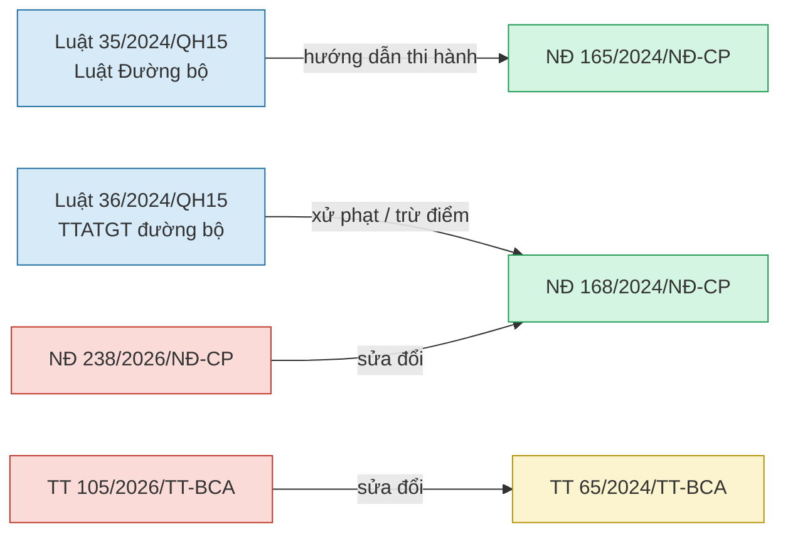

Quan hệ trên cần được lưu bằng dữ liệu, không chỉ nằm trong prompt.

---

# 11. Parse cấu trúc pháp luật

## 11.1. Không chunk theo số token một cách mù quáng

Sai:

```text
1000 tokens
1000 tokens
1000 tokens
...
```

vì có thể cắt giữa:

```text
Điều 6
Khoản 9
Điểm a
```

làm mất căn cứ pháp lý.

## 11.2. Cấu trúc parser nên nhận biết

```text
PHẦN
CHƯƠNG
MỤC
TIỂU MỤC
ĐIỀU
KHOẢN
ĐIỂM
PHỤ LỤC
BẢNG
```

Ví dụ:

```markdown
# Chương II

## Điều 6. Xử phạt người điều khiển xe ô tô...

### Khoản 9

a) ...

b) ...
```

Parser tạo object:

```json
{
  "document_id": "ND_168_2024",
  "chapter": "II",
  "article": "6",
  "article_title": "...",
  "clause": "9",
  "point": "a",
  "text": "..."
}
```

---

# 12. Chunking strategy

## 12.1. Đơn vị chunk ưu tiên

Thứ tự:

```text
Điều
  ↓
Khoản
  ↓
Nhóm điểm a/b/c...
```

Không tách một `Điểm` thành nhiều chunk trừ khi quá dài.

## 12.2. Quy tắc gợi ý

### Trường hợp Điều ngắn

```text
1 Điều = 1 chunk
```

### Trường hợp Điều dài

```text
Điều
├── chunk khoản 1–2
├── chunk khoản 3–4
└── chunk khoản 5
```

### Mức phạt

Mỗi chunk phải giữ đủ:

```text
hành vi
+
đối tượng/phương tiện
+
mức phạt
+
hình thức bổ sung
+
điều/khoản/điểm
```

## 12.3. Context header

Mỗi chunk nên prepend context:

```text
Văn bản: Nghị định 168/2024/NĐ-CP
Chương: II
Điều: 6
Khoản: 9
Điểm: a
```

sau đó mới tới nội dung.

## 12.4. Chunk schema

```json
{
  "chunk_id": "ND_168_2024__D6_K9_A",
  "document_id": "ND_168_2024",

  "document_number": "168/2024/NĐ-CP",
  "document_type": "Nghị định",

  "chapter": "II",
  "article": "6",
  "clause": "9",
  "point": "a",

  "heading_path": [
    "Chương II",
    "Điều 6",
    "Khoản 9",
    "Điểm a"
  ],

  "text": "...",

  "effective_date": "2025-01-01",
  "expiry_date": null,
  "legal_status": "amended",

  "topics": [
    "xử phạt",
    "ô tô",
    "tín hiệu giao thông"
  ]
}
```

---

# 13. Xử lý bảng và phụ lục

Các văn bản giao thông có nhiều:

- bảng tải trọng;
- bảng phí;
- bảng phân loại xe;
- bảng tiêu chuẩn sức khỏe;
- phụ lục kỹ thuật.

Không nên flatten bảng thành text mất cấu trúc.

## 13.1. Lưu song song hai biểu diễn

Ví dụ bảng:

| Loại phương tiện | Mức phí |
|---|---:|
| Xe A | X |
| Xe B | Y |

Lưu:

### Representation 1 — Markdown

```markdown
| Loại phương tiện | Mức phí |
|---|---:|
| Xe A | X |
| Xe B | Y |
```

### Representation 2 — Structured JSON

```json
{
  "table_id": "...",
  "columns": [
    "Loại phương tiện",
    "Mức phí"
  ],
  "rows": [
    ["Xe A", "X"],
    ["Xe B", "Y"]
  ]
}
```

Embedding dùng bản text có ngữ cảnh.

Khi cần tính toán hoặc lookup chính xác, dùng bản structured.

---

# 14. Pipeline tiền xử lý

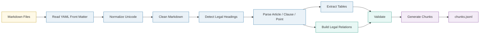

---

# 15. Data validation trước khi embedding

Chạy validation trước mỗi lần build index.

## 15.1. Metadata validation

Kiểm tra:

```text
[ ] document_id unique
[ ] document_number không rỗng
[ ] issue_date hợp lệ
[ ] effective_date hợp lệ
[ ] issue_date <= effective_date
[ ] source_file tồn tại
[ ] legal_status thuộc enum
```

## 15.2. Structure validation

```text
[ ] Có ít nhất một Điều
[ ] Không có Điều bị duplicate
[ ] Thứ tự Điều hợp lý
[ ] Không mất heading
[ ] Không có text OCR rác
[ ] Không có header/footer lặp
```

## 15.3. Duplicate validation

Dùng:

```text
SHA256 file
+
normalized text hash
```

phát hiện duplicate.

## 15.4. Amendment validation

Nếu:

```yaml
amended_by:
  - 238/2026/NĐ-CP
```

thì registry phải tồn tại document tương ứng.

---

# 16. Indexing pipeline

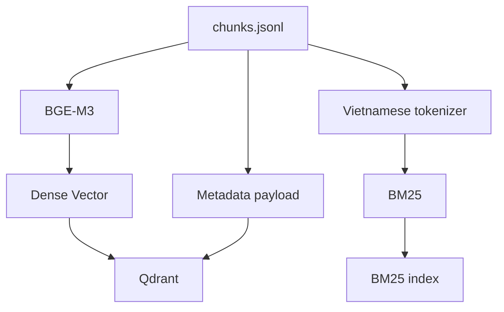

---

# 17. Vì sao phải Hybrid Retrieval?

Vector search tốt với:

> “không chấp hành đèn tín hiệu”

và có thể tìm được:

> “không chấp hành hiệu lệnh của đèn tín hiệu giao thông”

Nhưng pháp luật còn rất nhiều query exact-match:

```text
Điều 6
Khoản 9
Nghị định 168
GPLX
QCVN 41
38/2024/TT-BGTVT
```

BM25 thường mạnh hơn vector cho các token chính xác này.

Vì vậy:

```text
Dense Search
+
BM25 Search
↓
Fusion
```

sẽ ổn định hơn chỉ vector search.

---

# 18. Hybrid Retrieval

Ví dụ:

```text
Dense top 30
BM25 top 30
        ↓
Reciprocal Rank Fusion
        ↓
Top 20
        ↓
Reranker
        ↓
Top 6–10
```

## 18.1. RRF

Công thức:

\[
RRF(d) = \sum_r \frac{1}{k + rank_r(d)}
\]

Trong đó:

- `d`: document/chunk;
- `r`: retriever;
- `k`: hằng số smoothing.

Không cần tune phức tạp ở MVP.

---

# 19. Reranker

Reranker rất quan trọng vì:

```text
Retriever:
  lấy candidate rộng

Reranker:
  đọc Query + Chunk
  → đánh giá relevance trực tiếp
```

Ví dụ vector search có thể trả:

```text
1. mức phạt ô tô
2. mức phạt xe máy
3. phục hồi điểm GPLX
4. đăng ký xe
```

Nếu query là:

> “xe máy vượt đèn đỏ”

reranker giúp đẩy chunk đúng phương tiện và đúng hành vi lên trên.

---

# 20. Query Processing

Trước retrieval nên trích xuất thông tin cấu trúc.

Ví dụ query:

> “Ô tô chạy quá tốc độ 15 km/h hiện nay bị phạt bao nhiêu?”

Parser:

```json
{
  "intent": "penalty_lookup",
  "vehicle_type": "oto",
  "violation": "speeding",
  "speed_over": 15,
  "effective_at": "CURRENT_DATE",
  "document_hint": null
}
```

Ví dụ:

> “Điều 6 Nghị định 168 quy định gì?”

```json
{
  "intent": "article_lookup",
  "document_number": "168/2024/NĐ-CP",
  "article": "6"
}
```

---

# 21. Query Router

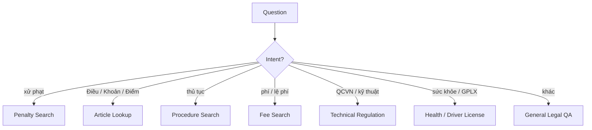

Không cần nhiều agent.

Chỉ cần router có cấu trúc để cải thiện filter và retrieval.

---

# 22. Temporal Legal Resolver

Legal chatbot phải hiểu:

> “hiện nay”

khác với:

> “tại thời điểm tháng 3/2025”.

## 22.1. Quy tắc filter

Với `effective_at = T`, văn bản/chunk hợp lệ nếu:

```text
effective_date <= T
AND
(
    expiry_date is null
    OR
    expiry_date > T
)
```

Nhưng văn bản `amended` cần xử lý sâu hơn.

## 22.2. Văn bản bị sửa đổi

Ví dụ:

```text
NĐ 168/2024
    ↑
sửa bởi
    |
NĐ 238/2026
```

Nếu query ở năm 2026:

1. retrieve điều gốc;
2. retrieve điều sửa đổi;
3. resolver xác định phần nào đã thay đổi;
4. context builder đưa cả căn cứ gốc + căn cứ sửa đổi cho LLM;
5. câu trả lời phải nói rõ đang áp dụng nội dung sau sửa đổi.

---

# 23. Amendment Resolution

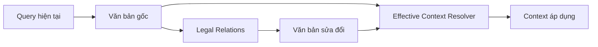

Ở MVP chưa cần tự động tạo “văn bản hợp nhất” hoàn hảo.

Có thể làm theo mức:

### Level 1

Retrieve văn bản gốc + văn bản sửa đổi.

### Level 2

Gắn metadata:

```text
affected_article
affected_clause
change_type
new_text
effective_date
```

### Level 3

Sinh effective consolidated view theo thời điểm.

Nên bắt đầu từ Level 1 → Level 2.

---

# 24. Context Builder

Không gửi raw Top-K chunks trực tiếp vào LLM.

Nên build context:

```text
[Source 1]
Văn bản:
Điều:
Khoản:
Điểm:
Hiệu lực:
Nội dung:

[Source 2]
...
```

Nếu nhiều chunk cùng Điều, có thể merge.

Nếu chunk sửa đổi liên quan chunk gốc, đặt cạnh nhau.

Ví dụ:

```text
SOURCE A — Văn bản gốc
SOURCE B — Văn bản sửa đổi SOURCE A
```

---

# 25. Prompt cho LLM

System prompt gợi ý:

```text
Bạn là trợ lý tra cứu pháp luật giao thông đường bộ Việt Nam.

Chỉ sử dụng thông tin trong LEGAL CONTEXT để trả lời.

Yêu cầu:
1. Trả lời trực tiếp câu hỏi.
2. Không tự tạo mức phạt, số điều, số khoản hoặc số hiệu văn bản.
3. Khi nêu quy định, phải dẫn Văn bản → Điều → Khoản → Điểm nếu context có.
4. Nếu văn bản đã được sửa đổi, phải ưu tiên nội dung có hiệu lực tại thời điểm được hỏi.
5. Nếu context không đủ để kết luận, nói rõ chưa đủ căn cứ.
6. Phân biệt rõ ô tô, mô tô, xe gắn máy, xe tải và các loại phương tiện khác.
7. Không suy diễn đối tượng áp dụng.
```

Response nên yêu cầu structured output:

```json
{
  "answer": "...",
  "citations": [
    {
      "document_number": "...",
      "article": "...",
      "clause": "...",
      "point": "...",
      "chunk_id": "..."
    }
  ],
  "confidence": "high"
}
```

---

# 26. Citation Verifier

Sau khi LLM trả lời:

```text
citation.document_number
citation.article
citation.clause
citation.point
```

phải được kiểm tra với context.

Nếu LLM tạo:

```text
Điều 999
```

nhưng Điều 999 không có trong context:

```text
→ reject citation
→ regenerate hoặc trả lời không đủ căn cứ
```

Đây là guardrail quan trọng.

---

# 27. Confidence / Abstention

Không nên luôn trả lời.

Ví dụ retrieval yếu:

```text
Top reranker score thấp
+
không tìm được chunk cùng hành vi
+
citation không match
```

thì:

> “Tôi chưa tìm được đủ căn cứ trong bộ dữ liệu hiện tại để kết luận chính xác.”

Tốt hơn hallucination.

---

# 28. API design

## POST `/chat`

Request:

```json
{
  "query": "Xe máy vượt đèn đỏ bị phạt bao nhiêu?",
  "effective_at": null,
  "conversation_id": "abc"
}
```

Response:

```json
{
  "answer": "...",
  "citations": [
    {
      "document_number": "168/2024/NĐ-CP",
      "article": "...",
      "clause": "...",
      "point": "...",
      "text": "..."
    }
  ],
  "retrieval": {
    "candidate_count": 40,
    "reranked_count": 8
  }
}
```

## GET `/documents`

Xem danh sách văn bản.

## GET `/documents/{document_id}`

Xem metadata.

## GET `/sources/{chunk_id}`

Hiển thị đoạn nguồn đầy đủ.

## GET `/health`

Health check.

---

# 29. UI chatbot

MVP Streamlit:

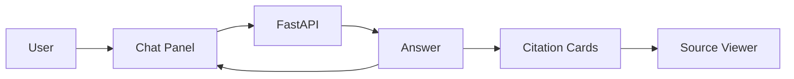

UI nên có:

- chat history;
- câu trả lời;
- citation dạng card;
- click citation để mở đoạn luật;
- tên văn bản;
- Điều/Khoản/Điểm;
- ngày hiệu lực;
- badge:
  - `Còn hiệu lực`
  - `Đã sửa đổi`
  - `Hết hiệu lực`;
- nút “Xem nguồn”.

---

# 30. Kiến trúc triển khai

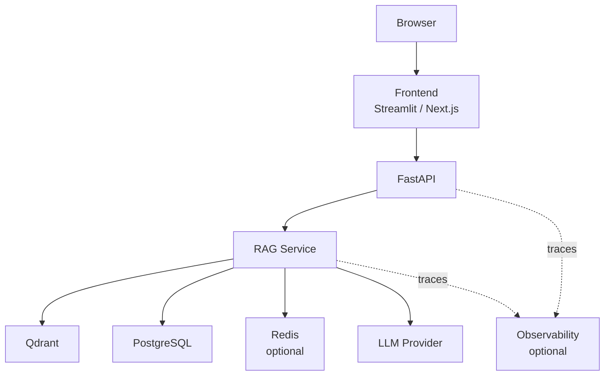

---

# 31. Docker Compose

Các service chính:

```text
frontend
backend
qdrant
postgres
redis     optional
```

MVP có thể bỏ Redis.

```text
Browser
  ↓
Streamlit
  ↓
FastAPI
  ├── Qdrant
  ├── PostgreSQL
  └── LLM API
```

---

# 32. Plan xây dựng chi tiết

---

## Phase 0 — Audit dataset

### Công việc

- [ ] Lập registry toàn bộ Markdown.
- [ ] So sánh `raw/` và `markdown/`.
- [ ] Phát hiện raw chưa convert.
- [ ] Phát hiện Markdown không có source.
- [ ] Hash duplicate.
- [ ] Kiểm tra metadata.
- [ ] Kiểm tra văn bản sửa đổi.
- [ ] Kiểm tra phụ lục.
- [ ] Kiểm tra ngày hiệu lực.
- [ ] Kiểm tra coverage Điều.

### Output

```text
data/processed/document_registry.jsonl
data/processed/data_quality_report.json
```

---

## Phase 1 — Chuẩn hóa metadata

### Công việc

1. Định nghĩa schema Pydantic `DocumentMetadata`.
2. Parse YAML front matter.
3. Normalize:
   - document number;
   - date;
   - authority;
   - document type.
4. Gắn `document_id`.
5. Gắn legal status.
6. Gắn amendment relation.

### Output

```text
documents.jsonl
legal_relations.jsonl
```

---

## Phase 2 — Legal parser

### Công việc

Nhận Markdown:

```markdown
# Chương
## Điều
### Khoản
```

hoặc text không chuẩn.

Parser phải detect bằng regex:

```text
^Chương\s+
^Mục\s+
^Điều\s+\d+
^\d+\.
^[a-zđ]\)
```

Sau đó tạo tree:

```text
Document
└── Chapter
    └── Article
        └── Clause
            └── Point
```

### Unit test

Test ít nhất:

```text
Luật 35
Luật 36
NĐ 168
NĐ 238
TT 38
TT 53
```

---

## Phase 3 — Table parser

Ưu tiên:

```text
TT 36/2024/TT-BYT
TT 39/2024/TT-BGTVT
TT 53/2024/TT-BGTVT
TT 154/2025/TT-BTC
NĐ 364/2025/NĐ-CP
```

Vì các tài liệu dạng tiêu chuẩn/phí/phân loại thường có bảng.

### Output

```text
tables.jsonl
```

---

## Phase 4 — Chunking

### Công việc

- [ ] Article-aware chunk.
- [ ] Clause-aware split.
- [ ] Preserve points.
- [ ] Preserve heading path.
- [ ] Preserve tables.
- [ ] Add metadata.
- [ ] Add parent/child IDs.

### Output

```text
chunks.jsonl
```

Mỗi chunk phải trace ngược được về:

```text
raw source
→ Markdown
→ Document
→ Article
→ Clause
→ Point
```

---

## Phase 5 — Baseline dense retrieval

Trước tiên chỉ làm:

```text
BGE-M3
+
Qdrant
```

### Kiểm tra bằng query

```text
"vượt đèn đỏ"
"trừ điểm GPLX"
"phục hồi điểm"
"tốc độ tối đa"
"đăng ký biển số"
"tiêu chuẩn sức khỏe người lái xe"
```

Đo Recall@K thủ công.

---

## Phase 6 — BM25

Build lexical index từ chunk.

Tokenize tiếng Việt.

Test exact query:

```text
"168/2024/NĐ-CP"
"Điều 6"
"QCVN 41:2024"
"65/2024/TT-BCA"
```

---

## Phase 7 — Hybrid Retrieval

Implement:

```text
Dense top 30
+
BM25 top 30
→ RRF
→ top 20
```

Lưu debug information:

```json
{
  "dense_rank": 4,
  "bm25_rank": 1,
  "rrf_score": 0.031
}
```

---

## Phase 8 — Reranker

Rerank top 20.

Chỉ gửi top 6–10 vào LLM.

Đánh giá:

```text
hybrid
vs
hybrid + reranker
```

---

## Phase 9 — Legal Resolver

Implement lần lượt:

### 9.1. Effective date filter

### 9.2. Document status filter

### 9.3. Amendment relation

### 9.4. Base + amendment context

### 9.5. Historical query

Ví dụ test:

```text
Quy định vào 01/01/2025?
Quy định hiện nay?
NĐ 238/2026 đã sửa nội dung nào?
```

---

## Phase 10 — Generation

Tạo:

```text
prompts.py
answer_generator.py
```

Output JSON.

Không cho LLM trả tự do.

---

## Phase 11 — Citation verifier

Kiểm tra:

```text
document exists?
article exists?
clause exists?
point exists?
chunk contains evidence?
```

Nếu không:

```text
regenerate
hoặc
abstain
```

---

## Phase 12 — FastAPI

Endpoints:

```text
POST /chat
GET /documents
GET /documents/{id}
GET /sources/{chunk_id}
GET /health
```

Thêm streaming sau.

---

## Phase 13 — UI

MVP dùng Streamlit.

Sau khi RAG ổn mới làm Next.js nếu cần demo đẹp.

Không nên tốn nhiều thời gian UI trước khi retrieval chính xác.

---

## Phase 14 — Evaluation dataset

Tạo khoảng:

```text
150–300 câu hỏi
```

chia nhóm.

### Nhóm A — Exact legal lookup

```text
Điều X quy định gì?
```

### Nhóm B — Vi phạm / xử phạt

```text
Hành vi A phạt bao nhiêu?
```

### Nhóm C — GPLX

```text
Trừ điểm?
Phục hồi?
Sát hạch?
```

### Nhóm D — Tốc độ / kỹ thuật

### Nhóm E — Đăng ký xe

### Nhóm F — Vận tải

### Nhóm G — Phí

### Nhóm H — Temporal / amendment

### Nhóm I — Out-of-scope

Ví dụ:

```text
Luật hàng không quy định thế nào?
```

Chatbot phải biết từ chối vì corpus không có.

---

# 33. Metrics đánh giá

## Retrieval

```text
Recall@5
Recall@10
MRR
nDCG@10
```

Quan trọng nhất ban đầu:

```text
Recall@10
```

Nếu chunk đúng không nằm trong top 10 thì LLM gần như không thể trả lời đúng.

## Generation

Đánh giá:

```text
Answer correctness
Groundedness
Citation precision
Citation recall
Legal reference accuracy
Temporal accuracy
Abstention accuracy
```

## Legal-specific

Nên thêm:

```text
Article Accuracy
Clause Accuracy
Document Accuracy
Vehicle-class Accuracy
Penalty Accuracy
Effective-date Accuracy
```

---

# 34. Evaluation pipeline

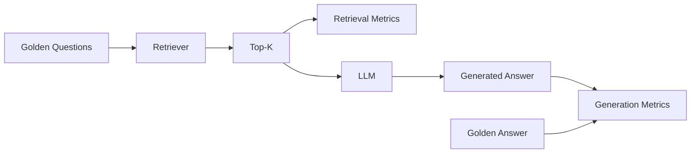

---

# 35. Golden dataset schema

```json
{
  "id": "GT_001",
  "question": "Xe máy vượt đèn đỏ bị xử phạt như thế nào?",
  "effective_at": "2026-08-10",

  "expected_sources": [
    {
      "document_number": "...",
      "article": "...",
      "clause": "...",
      "point": "..."
    }
  ],

  "answer_notes": "...",
  "category": "penalty"
}
```

Không cần golden answer văn xuôi quá dài.

Quan trọng hơn là golden citation.

---

# 36. Logging và observability

Mỗi request nên log:

```json
{
  "query": "...",
  "intent": "...",
  "filters": {},
  "dense_candidates": [],
  "bm25_candidates": [],
  "reranked": [],
  "selected_context": [],
  "citations": [],
  "latency_ms": 0
}
```

Điều này cực kỳ hữu ích khi debug câu trả lời sai.

---

# 37. Cache

Chưa cần Redis ở giai đoạn đầu.

Khi cần có thể cache:

```text
embedding(query)
retrieval result
document metadata
```

Không cache final answer quá lâu nếu corpus có cập nhật pháp luật.

---

# 38. Cập nhật dữ liệu khi có văn bản mới

Pipeline update:

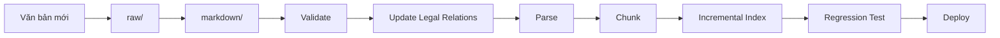

Không rebuild toàn bộ index nếu chỉ có một văn bản mới, trừ khi corpus còn nhỏ và muốn đơn giản hóa MVP.

---

# 39. Regression test khi cập nhật pháp luật

Nếu thêm:

```text
NĐ mới sửa NĐ cũ
```

thì các câu hỏi cũ có thể đổi đáp án.

Do đó cần tập:

```text
regression_questions.jsonl
```

Ví dụ:

```text
mức phạt vượt đèn đỏ
nồng độ cồn
trừ điểm GPLX
phục hồi điểm
```

Sau mỗi ingestion:

```text
build index
→ run regression
→ compare
→ deploy
```

---

# 40. Cách trả lời nên hiển thị cho người dùng

Format đề xuất:

```markdown
### Trả lời

...

### Căn cứ pháp lý

- **Nghị định ...**
  - Điều ...
  - Khoản ...
  - Điểm ...

### Lưu ý

Quy định trên áp dụng tại thời điểm ...
```

Nếu có sửa đổi:

```markdown
Nội dung trên được áp dụng theo Nghị định A sau khi được sửa đổi bởi Nghị định B.
```

---

# 41. Guardrails

## Không cho model:

- tự tạo số Điều;
- tự tạo mức phạt;
- tự tạo ngày hiệu lực;
- tự kết luận văn bản còn hiệu lực nếu registry không xác nhận;
- trộn quy định ô tô với xe máy;
- dùng kiến thức ngoài context để thay thế nguồn luật.

## Cho phép model:

- diễn giải dễ hiểu;
- tóm tắt;
- so sánh;
- nêu các bước thủ tục;
- tổng hợp nhiều điều nếu citation rõ.

---

# 42. Các lỗi RAG cần tránh

## 42.1. Chunk theo 1000 tokens cố định

Có thể cắt ngang Điều/Khoản.

## 42.2. Chỉ vector search

Dễ miss số văn bản/số điều.

## 42.3. Không rerank

Top-K nhiều chunk gần nghĩa nhưng sai đối tượng.

## 42.4. Không lưu effective date

Rất nguy hiểm với dữ liệu pháp luật.

## 42.5. Không quản lý amendment

Model có thể dùng quy định đã bị sửa.

## 42.6. Chỉ đánh giá câu trả lời

Phải đánh giá retrieval riêng.

## 42.7. Không lưu raw source

Mất khả năng audit.

## 42.8. Cho LLM tự cite

Citation phải dựa trên chunk metadata.

---

# 43. Roadmap MVP

## MVP 1 — Baseline

```text
Markdown
→ parse
→ legal chunks
→ BGE-M3
→ Qdrant
→ top-k
→ LLM
→ citation
```

Mục tiêu:

- chatbot chạy end-to-end;
- trả nguồn đúng.

---

## MVP 2 — Hybrid

```text
Dense
+
BM25
+
RRF
+
Reranker
```

Mục tiêu:

- tăng Recall@K;
- tăng độ chính xác Điều/Khoản.

---

## MVP 3 — Legal-aware

```text
Temporal filter
+
Amendment resolver
+
Citation verifier
```

Mục tiêu:

- trả đúng quy định hiện hành;
- không dùng văn bản cũ sai thời điểm.

---

## MVP 4 — Production

```text
FastAPI
+
Next.js
+
PostgreSQL
+
Qdrant
+
Observability
+
Evaluation CI
```

---

# 44. Thứ tự triển khai khuyến nghị

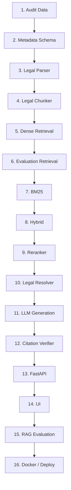

---

# 45. Không nên làm ngay từ đầu

Chưa cần:

```text
Multi-Agent
GraphRAG
Knowledge Graph lớn
Fine-tune LLM
Fine-tune embedding
Redis cluster
Kubernetes
Microservices phức tạp
```

Dataset hiện tại chưa đủ lớn để cần các thành phần này.

Nên ưu tiên:

```text
Data quality
→ Legal parsing
→ Retrieval quality
→ Temporal correctness
→ Citation accuracy
```

---

# 46. Có cần Agentic RAG không?

Ban đầu: **không**.

Một deterministic pipeline dễ:

- debug;
- benchmark;
- reproduce;
- kiểm soát nguồn.

Sau này có thể thêm các tool:

```text
SearchLegalDocument
LookupArticle
ResolveEffectiveVersion
CompareRegulations
CalculatePenalty
```

và một router/agent gọi tool.

Nhưng agent chỉ nên được thêm sau khi từng tool đã được test độc lập.

---

# 47. Kiến trúc mở rộng thành Agentic Legal RAG

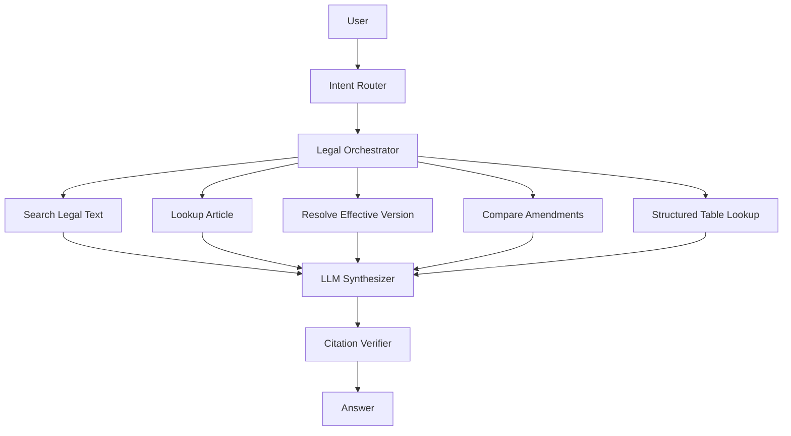

---

# 48. Ưu tiên riêng cho dataset hiện tại

Từ bộ tài liệu đang có, nên ưu tiên test retrieval theo các nhóm:

## Nhóm 1 — Xử phạt

```text
168/2024/NĐ-CP
238/2026/NĐ-CP
```

Đây là nhóm quan trọng nhất để test amendment + temporal retrieval.

## Nhóm 2 — GPLX

```text
12/2025/TT-BCA
65/2024/TT-BCA
105/2026/TT-BCA
108/2026/TT-BCA
```

Test:

```text
sát hạch
cấp GPLX
phục hồi điểm
IDP
```

## Nhóm 3 — Tốc độ / tải trọng / kỹ thuật

```text
38/2024/TT-BGTVT
39/2024/TT-BGTVT
51/2024/TT-BGTVT
53/2024/TT-BGTVT
```

Đặc biệt kiểm tra bảng và phụ lục.

## Nhóm 4 — Đăng ký / kiểm soát

```text
67/2024/TT-BCA
73/2024/TT-BCA
79/2024/TT-BCA
```

## Nhóm 5 — Phí / kiểm định

```text
154/2025/TT-BTC
364/2025/NĐ-CP
89/2026/NĐ-CP
```

## Nhóm 6 — Luật nền

```text
35/2024/QH15
36/2024/QH15
165/2024/NĐ-CP
158/2024/NĐ-CP
```

---

# 49. Definition of Done

Hệ thống được xem là hoàn thiện ở mức project tốt khi:

## Data

- [ ] 100% Markdown có metadata hợp lệ.
- [ ] 100% Markdown trace được về raw.
- [ ] Duplicate đã xử lý.
- [ ] Phụ lục quan trọng đã index.
- [ ] Quan hệ amendment chính đã lưu.
- [ ] Có legal status/effective date.

## Retrieval

- [ ] Dense chạy ổn.
- [ ] BM25 chạy ổn.
- [ ] Hybrid chạy ổn.
- [ ] Reranker chạy ổn.
- [ ] Recall@10 đạt ngưỡng mục tiêu trên golden set.

## Generation

- [ ] Không cite tài liệu ngoài context.
- [ ] Citation đúng document.
- [ ] Citation đúng Điều/Khoản.
- [ ] Có abstain.
- [ ] Có temporal handling.

## Product

- [ ] FastAPI.
- [ ] UI chat.
- [ ] Source viewer.
- [ ] Docker Compose.
- [ ] Logging.
- [ ] Evaluation script.
- [ ] README hướng dẫn chạy.

---

# 50. Kết luận kiến trúc

Kiến trúc phù hợp nhất cho bộ dữ liệu hiện tại là:

```text
Raw PDF/DOC
    ↓
Canonical Markdown + Metadata
    ↓
Legal Validation
    ↓
Parse Chương / Điều / Khoản / Điểm
    ↓
Legal-aware Chunking
    ↓
┌─────────────────┬─────────────────┐
│ Dense Embedding │ BM25            │
│ BGE-M3          │ Vietnamese text │
└────────┬────────┴────────┬────────┘
         ↓                 ↓
          Hybrid Retrieval
                 ↓
              Reranker
                 ↓
      Temporal / Amendment Resolver
                 ↓
          Legal Context Builder
                 ↓
                 LLM
                 ↓
          Citation Verifier
                 ↓
       Answer + Điều/Khoản/Điểm
```

Trọng tâm của project không nên là “dùng model nào mạnh nhất”, mà là:

> **Dữ liệu pháp luật có cấu trúc đúng → retrieval đúng → hiệu lực đúng → citation đúng → LLM mới tổng hợp câu trả lời.**

Nếu bốn tầng đầu đúng, chatbot có thể đạt chất lượng rất tốt ngay cả với một LLM không quá lớn.
