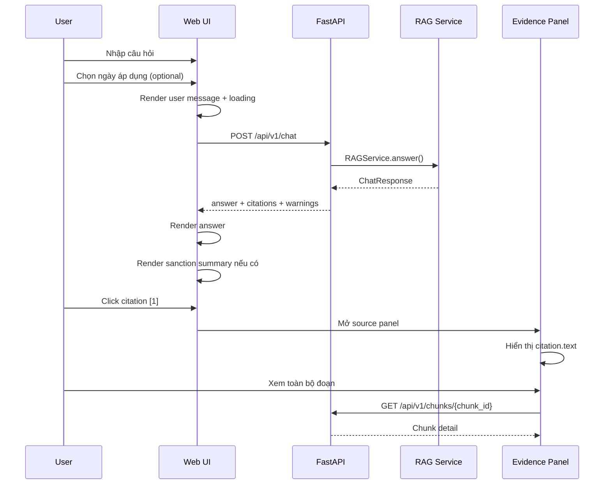
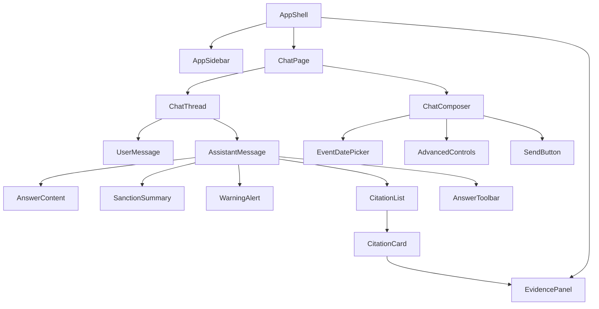

# UI/UX DESIGN SPEC — RAG Chatbot Luật Giao thông Đường bộ

> **Repository:** `lemanhcuong6904/RAG-Chatbot-Luat-giao-thong-duong-bo`  
> **Mục tiêu:** Thiết kế giao diện web hiện đại cho hệ thống hỏi đáp luật giao thông đường bộ Việt Nam  
> **UI stack đề xuất:** React/Next.js + TypeScript + Tailwind CSS + shadcn/ui + Lucide Icons  
> **Phong cách:** Light theme, neutral, sạch, đáng tin cậy, hiện đại, mượt mà  
> **Ngày thiết kế:** 12/08/2026

---

# 1. Mục tiêu thiết kế

Giao diện của hệ thống không nên mang cảm giác của một demo RAG kỹ thuật. Người dùng cuối không cần biết BM25, Qdrant, BGE-M3 hay reranker đang chạy như thế nào để đặt một câu hỏi pháp luật.

Giao diện nên tạo cảm giác giống một **trợ lý pháp lý chuyên về giao thông**:

- dễ hỏi;
- dễ đọc câu trả lời dài;
- nhìn ngay được kết luận quan trọng;
- kiểm tra được căn cứ pháp lý;
- phân biệt rõ mức phạt, trừ điểm, hình phạt bổ sung và biện pháp khắc phục;
- hiểu được quy định đang áp dụng ở thời điểm nào;
- cảnh báo rõ khi dữ liệu chưa đủ hoặc câu trả lời không chắc chắn;
- không làm người dùng bị ngợp bởi thông tin kỹ thuật của pipeline RAG.

Ba nguyên tắc cốt lõi:

1. **Answer first** — kết luận phải xuất hiện trước.
2. **Evidence always visible** — căn cứ pháp lý phải dễ kiểm tra.
3. **Technical complexity stays out of the way** — debug, Top-K, health, retrieval score chỉ xuất hiện trong chế độ nâng cao.

---

# 2. Những gì repo hiện tại đã có và ảnh hưởng tới UI

Repo hiện tại đã có đầy đủ nền backend để xây một frontend web riêng thay cho Streamlit.

## 2.1. Luồng hỏi đáp hiện tại

Backend đã có:

```text
User query
   ↓
Query parsing / query transform
   ↓
Intent routing
   ├─ Structured Sanction Layer
   │    ├─ single violation
   │    └─ multiple violations + composition
   │
   └─ Hybrid RAG
        ├─ BM25
        ├─ BGE-M3 + Qdrant
        └─ optional reranker
   ↓
Evidence / legal context
   ↓
LLM answer
   ↓
ChatResponse
```

Đây là cơ sở để UI có thể hiển thị khác nhau giữa:

- câu hỏi pháp luật thông thường;
- câu hỏi mức xử phạt;
- câu hỏi có nhiều hành vi vi phạm;
- câu hỏi có mốc thời gian;
- câu hỏi có cảnh báo hiệu lực;
- câu hỏi không đủ căn cứ để trả lời.

---

## 2.2. API hiện có

Frontend có thể gọi trực tiếp FastAPI.

### Health

```http
GET /api/v1/health
```

Có thể dùng cho trang Developer/System status.

### Chat

```http
POST /api/v1/chat
```

Payload hiện tại:

```json
{
  "query": "Xe máy vượt đèn đỏ bị phạt bao nhiêu và trừ mấy điểm?",
  "event_date": "2026-08-12",
  "as_of_date": "2026-08-12",
  "top_k": 8,
  "debug": false
}
```

### Documents

```http
GET /api/v1/documents
GET /api/v1/documents/{document_id}
```

### Chunk

```http
GET /api/v1/chunks/{chunk_id}
```

### Retrieval debug

```http
POST /api/v1/retrieval/search
```

---

## 2.3. Chat response hiện tại

Response hiện có cấu trúc chính:

```ts
type ChatResponse = {
  answer: string
  citations: Citation[]
  warnings: string[]
  answerable: boolean
  debug?: Record<string, unknown> | null
}
```

Citation đã có các thông tin rất phù hợp để xây giao diện evidence:

```ts
type Citation = {
  chunk_id: string
  chunk_type: string
  rule_id?: string | null

  document_number?: string | null
  document_title?: string | null

  article?: string | null
  article_title?: string | null
  clause?: string | null
  point?: string | null

  parent_id?: string | null
  sibling_group_id?: string | null

  source_file: string
  text: string

  rule_function: string
  coverage_status: string
  source_quality: string

  score?: number | null
}
```

UI nên tận dụng các field này thay vì chỉ render một khối Markdown giống Streamlit hiện tại.

---

# 3. Định hướng sản phẩm

Tên giao diện có thể dùng:

> **Luật Giao Thông AI**

Tagline:

> Tra cứu quy định, mức phạt và căn cứ pháp lý từ hệ thống văn bản giao thông đường bộ.

Không nên đặt tiêu đề quá kỹ thuật như:

> RAG Chatbot Luật giao thông đường bộ

vì “RAG” là thuật ngữ triển khai, không phải giá trị người dùng nhận được.

---

# 4. Ngôn ngữ thiết kế

## 4.1. Cảm giác tổng thể

Phong cách nên là:

- light;
- neutral;
- spacious;
- professional;
- calm;
- trustworthy;
- minimal nhưng không đơn điệu.

Tránh:

- gradient rực;
- glassmorphism quá mạnh;
- nền xanh toàn màn hình;
- màu đỏ dùng khắp giao diện;
- shadow dày;
- border đen;
- quá nhiều card nằm trong card;
- sidebar kiểu admin dashboard;
- icon giao thông nhiều màu theo phong cách minh họa trẻ em.

---

# 5. Color system

## 5.1. Neutral foundation

Nền chính:

```text
Page background       #FAFAFA
Surface / Card         #FFFFFF
Subtle surface         #F7F7F8
Hover surface          #F4F4F5
Border                 #E4E4E7
Border strong          #D4D4D8
Primary text           #18181B
Secondary text         #52525B
Muted text             #71717A
Disabled text          #A1A1AA
```

Base palette có thể lấy từ `zinc`.

---

## 5.2. Primary accent

Dùng xanh blue/navy ở mức vừa phải:

```text
Primary               #2563EB
Primary hover         #1D4ED8
Primary soft          #EFF6FF
Primary border        #BFDBFE
Primary text soft     #1E40AF
```

Màu xanh chỉ nên xuất hiện ở:

- nút gửi;
- active navigation;
- citation đang được chọn;
- link;
- trạng thái thông tin;
- focus ring.

---

## 5.3. Semantic colors

### Success

```text
Background            #F0FDF4
Border                #BBF7D0
Text                  #166534
Icon                  #16A34A
```

### Warning

```text
Background            #FFFBEB
Border                #FDE68A
Text                  #92400E
Icon                  #D97706
```

### Destructive / penalty

```text
Background            #FEF2F2
Border                #FECACA
Text                  #991B1B
Icon                  #DC2626
```

Không dùng đỏ làm màu thương hiệu. Đỏ chỉ biểu diễn:

- phạt tiền;
- lỗi;
- nội dung pháp lý cần chú ý;
- trạng thái không thể trả lời.

---

# 6. Tailwind CSS theme

Nên dùng semantic design token thay vì hard-code màu trực tiếp trong component.

Ví dụ:

```css
@import "tailwindcss";

:root {
  --background: oklch(0.985 0 0);
  --foreground: oklch(0.205 0 0);

  --card: oklch(1 0 0);
  --card-foreground: oklch(0.205 0 0);

  --popover: oklch(1 0 0);
  --popover-foreground: oklch(0.205 0 0);

  --primary: oklch(0.546 0.245 262.881);
  --primary-foreground: oklch(0.985 0 0);

  --secondary: oklch(0.97 0 0);
  --secondary-foreground: oklch(0.269 0 0);

  --muted: oklch(0.97 0 0);
  --muted-foreground: oklch(0.556 0 0);

  --accent: oklch(0.97 0 0);
  --accent-foreground: oklch(0.269 0 0);

  --destructive: oklch(0.577 0.245 27.325);
  --destructive-foreground: oklch(0.985 0 0);

  --border: oklch(0.922 0 0);
  --input: oklch(0.922 0 0);
  --ring: oklch(0.623 0.214 259.815);

  --radius: 0.75rem;
}

@theme inline {
  --color-background: var(--background);
  --color-foreground: var(--foreground);

  --color-card: var(--card);
  --color-card-foreground: var(--card-foreground);

  --color-popover: var(--popover);
  --color-popover-foreground: var(--popover-foreground);

  --color-primary: var(--primary);
  --color-primary-foreground: var(--primary-foreground);

  --color-secondary: var(--secondary);
  --color-secondary-foreground: var(--secondary-foreground);

  --color-muted: var(--muted);
  --color-muted-foreground: var(--muted-foreground);

  --color-accent: var(--accent);
  --color-accent-foreground: var(--accent-foreground);

  --color-destructive: var(--destructive);
  --color-destructive-foreground: var(--destructive-foreground);

  --color-border: var(--border);
  --color-input: var(--input);
  --color-ring: var(--ring);

  --radius-sm: calc(var(--radius) - 4px);
  --radius-md: calc(var(--radius) - 2px);
  --radius-lg: var(--radius);
  --radius-xl: calc(var(--radius) + 4px);
}
```

---

# 7. Typography

## 7.1. Font

Khuyến nghị:

```text
Primary: Inter
Fallback: ui-sans-serif, system-ui, sans-serif
```

Hoặc nếu muốn giao diện mang cảm giác Việt Nam hơn:

```text
Be Vietnam Pro
```

Tuy nhiên Inter đơn giản, rõ và dễ triển khai hơn.

---

## 7.2. Type scale

```text
App logo                  16px / 600
Page hero title           30–36px / 650
Section title             18px / 600
Answer heading            17–18px / 600
Body                      15px / 400
Legal answer body         15.5–16px / 400
Metadata                  13px / 400
Badge                     12px / 500
Code / document id        12px mono
```

Line-height câu trả lời:

```text
1.65 – 1.75
```

Câu trả lời pháp luật thường dài, vì vậy không nên dùng `leading-normal` quá chặt.

---

# 8. Border radius và shadow

## 8.1. Radius

```text
Button                    10px
Input                     12px
Card                      14px
Composer                  18px
Modal / Sheet             16px
Tag / Badge               full
```

---

## 8.2. Shadow

Dùng rất nhẹ.

```css
shadow-sm
```

hoặc:

```css
box-shadow:
  0 1px 2px rgb(0 0 0 / 0.04),
  0 4px 16px rgb(0 0 0 / 0.03);
```

Không dùng shadow lớn cho từng citation card.

---

# 9. Information architecture

Đề xuất app gồm 4 khu vực:

```text
Luật Giao Thông AI
│
├── Hỏi đáp
│   ├── Cuộc trò chuyện mới
│   ├── Lịch sử gần đây
│   └── Answer + Sources
│
├── Văn bản pháp luật
│   ├── Danh sách văn bản
│   ├── Tìm kiếm
│   └── Chi tiết văn bản
│
├── Cài đặt
│   ├── Ngày áp dụng mặc định
│   └── Tùy chọn giao diện
│
└── Developer
    ├── Pipeline status
    ├── Top-K
    ├── Debug
    └── Retrieval inspector
```

`Developer` chỉ xuất hiện khi:

```text
NEXT_PUBLIC_DEV_MODE=true
```

hoặc khi người dùng mở “Advanced mode”.

---

# 10. Layout desktop

Desktop ≥ 1280px:

```text
┌──────────────────────────────────────────────────────────────────────────────┐
│ Sidebar 260px │                  Main Chat                  │ Evidence 360px │
│               │                                             │ optional       │
│ Logo          │                                             │                │
│ New chat      │        Conversation / Empty State           │ Legal source   │
│               │                                             │ viewer         │
│ Recent        │                                             │                │
│ chats         │                                             │                │
│               │                                             │                │
│               │                                             │                │
│ Settings      │        Sticky Chat Composer                 │                │
└──────────────────────────────────────────────────────────────────────────────┘
```

Evidence panel không cần mở mặc định.

Khi chưa chọn source:

```text
main width ≈ 820–920px
```

Khi source panel mở:

```text
main co lại mềm mại
right panel ≈ 360–420px
```

---

# 11. Sidebar

Sử dụng shadcn/ui:

```text
Sidebar
SidebarHeader
SidebarContent
SidebarGroup
SidebarMenu
SidebarMenuItem
SidebarFooter
```

## 11.1. Header

Logo tối giản:

```text
[traffic-sign icon] Luật Giao Thông AI
```

Không cần quốc huy hay biểu tượng nhà nước nếu hệ thống không phải cổng thông tin chính thức.

---

## 11.2. New Chat

Button:

```text
+ Cuộc trò chuyện mới
```

Style:

```text
h-10
w-full
justify-start
rounded-xl
bg-primary
text-primary-foreground
```

---

## 11.3. History

Nhóm:

```text
Gần đây
```

Mỗi item:

```text
Xe máy vượt đèn đỏ...
Không đội mũ bảo hiểm...
GPLX có bao nhiêu điểm?
```

Hover hiện:

```text
...
```

menu:

- Đổi tên;
- Xóa.

### Lưu ý backend

Repo hiện chưa có API lưu conversation history.

MVP có thể dùng:

```text
localStorage / IndexedDB
```

Nếu muốn đồng bộ nhiều thiết bị thì cần thêm backend conversation store.

---

## 11.4. Footer

```text
[BookOpen] Văn bản pháp luật
[Settings] Cài đặt
[CircleHelp] Hướng dẫn
```

Developer mode:

```text
[Activity] Hệ thống
```

---

# 12. Mobile navigation

Trên mobile không giữ sidebar cố định.

Dùng:

```text
Sheet
```

Header mobile:

```text
┌────────────────────────────────────┐
│ ☰  Luật Giao Thông AI          ⋯   │
└────────────────────────────────────┘
```

Click hamburger:

```text
Sheet side="left"
```

Source viewer nên dùng:

```text
Drawer
```

từ dưới lên thay vì right panel.

---

# 13. Empty state — màn hình đầu tiên

Đây là một màn hình rất quan trọng.

Không nên chỉ có:

```text
Chatbot hỏi đáp Luật giao thông đường bộ
[________________]
```

Nên tạo một hero nhỏ.

---

## 13.1. Wireframe

```text
                ┌───────────────┐
                │   icon logo   │
                └───────────────┘

        Hỏi luật giao thông, dễ hiểu hơn.

 Tra cứu quy định, mức phạt, điểm GPLX và căn cứ
 pháp lý từ hệ thống văn bản giao thông đường bộ.

 ┌────────────────────────────────────────────┐
 │ Hỏi về luật giao thông...                  │
 │                                            │
 │ [Ngày áp dụng: Hiện tại]              [➜] │
 └────────────────────────────────────────────┘

 Gợi ý câu hỏi

 ┌────────────────────┐ ┌────────────────────┐
 │ 🚦 Vượt đèn đỏ     │ │ 🪖 Không đội mũ    │
 │ bị phạt bao nhiêu? │ │ bảo hiểm bị phạt? │
 └────────────────────┘ └────────────────────┘

 ┌────────────────────┐ ┌────────────────────┐
 │ 🪪 GPLX có bao     │ │ 🚘 Nồng độ cồn     │
 │ nhiêu điểm?        │ │ bị xử lý thế nào? │
 └────────────────────┘ └────────────────────┘
```

---

## 13.2. Suggestion prompts

Dùng `Button variant="outline"` hoặc card button.

Các prompt gợi ý nên phủ nhiều intent:

### Mức phạt

> Xe máy vượt đèn đỏ bị phạt bao nhiêu và trừ mấy điểm?

### Multi violation

> Đi xe máy vượt đèn đỏ, không đội mũ bảo hiểm và không có GPLX thì bị xử lý thế nào?

### Quy định chung

> Một giấy phép lái xe có bao nhiêu điểm?

### Điều khoản cụ thể

> Điều 7 Luật 36/2024/QH15 quy định gì?

### Temporal

> Quy định về vượt đèn đỏ ngày 16/08/2026 có gì thay đổi?

---

# 14. Chat composer

Composer là thành phần quan trọng nhất.

## 14.1. Shape

```text
rounded-2xl
border
bg-white
shadow-sm
```

Không dùng một input mỏng như search bar.

Dùng:

```text
Textarea
```

auto-resize:

```text
min-height: 48px
max-height: 180px
```

---

## 14.2. Layout

```text
┌─────────────────────────────────────────────────────────┐
│ Hỏi về mức phạt, quy định, GPLX, biển báo...            │
│                                                         │
│ [Calendar  Hiện tại ▾]   [Advanced]             [Send] │
└─────────────────────────────────────────────────────────┘
```

---

## 14.3. Event date

Không để checkbox + date input giống UI Streamlit.

Thay bằng một chip:

```text
[ Calendar  Hiện tại ▾ ]
```

Click mở `Popover` chứa `Calendar`.

Options nhanh:

```text
● Hiện tại
○ Chọn ngày xảy ra vi phạm
```

Khi chọn ngày:

```text
[ Calendar  16/08/2026 × ]
```

Tooltip:

> Dùng ngày này để xác định quy định pháp luật có hiệu lực tại thời điểm xảy ra sự việc.

Đây là chi tiết rất quan trọng với repo hiện tại vì backend đã hỗ trợ `event_date`, `as_of_date` và xử lý temporal.

---

## 14.4. Send button

Icon:

```text
ArrowUp
```

Không cần chữ “Gửi” trên desktop.

Style:

```text
size-9
rounded-xl
bg-zinc-900
text-white
hover:bg-zinc-800
```

Có thể dùng đen/zinc thay vì primary blue để giao diện trung tính hơn.

---

## 14.5. Keyboard

```text
Enter          gửi
Shift + Enter  xuống dòng
```

Tooltip trên nút gửi:

```text
Gửi · Enter
```

---

# 15. User message

Không cần avatar tròn kiểu chatbot cũ.

Căn phải:

```text
max-w-[75%]
bg-zinc-100
rounded-2xl
rounded-br-md
px-4
py-2.5
```

Ví dụ:

```text
Xe máy vượt đèn đỏ bị phạt bao nhiêu và trừ mấy điểm?
```

Dưới message có thể hiện:

```text
12/08/2026 • Ngày áp dụng: hiện tại
```

nhưng chỉ khi user đã chọn ngày custom.

---

# 16. Assistant answer

Không nên render toàn bộ answer trong một “chat bubble”.

Assistant answer nên nằm trực tiếp trên canvas.

```text
[small AI/legal icon] Luật Giao Thông AI

Theo quy định hiện hành, ...

...
```

Width:

```text
max-w-[820px]
```

Text:

```text
text-[15.5px]
leading-7
```

---

# 17. Answer toolbar

Dưới câu trả lời:

```text
[Copy] [Helpful] [Not helpful]          [3 nguồn]
```

shadcn components:

- `Button variant="ghost" size="sm"`;
- `Tooltip`;
- `Separator`.

Icons:

```text
Copy
ThumbsUp
ThumbsDown
BookOpenText
```

Click `3 nguồn` mở Evidence panel.

---

# 18. Citation UX

Citations là điểm cần làm tốt nhất của Legal RAG.

Không nên chỉ render:

```text
Nguồn
[expander 1]
[expander 2]
...
```

như Streamlit hiện tại.

---

## 18.1. Inline citation

Nếu backend/answerer có thể sinh marker, dùng:

```text
... theo khoản 4 Điều 7.[1]
```

`[1]` là button nhỏ:

```text
inline-flex
h-5
min-w-5
items-center
justify-center
rounded-md
bg-blue-50
text-blue-700
text-[11px]
font-medium
hover:bg-blue-100
```

Click:

- mở right evidence panel;
- scroll tới source tương ứng;
- source được highlight.

---

## 18.2. Nếu answer chưa có inline marker

MVP vẫn hiển thị:

```text
Căn cứ pháp lý
[1] Nghị định 168/2024/NĐ-CP · Điều 7 · Khoản 4 · Điểm c
[2] Luật 36/2024/QH15 · Điều ...
```

ở cuối answer.

---

# 19. Evidence panel

Desktop dùng panel bên phải.

Có thể implement bằng custom panel hoặc `Sheet side="right"`.

Header:

```text
Căn cứ pháp lý                     [×]
3 nguồn được sử dụng
```

Tabs:

```text
[Nguồn] [Chi tiết]
```

MVP có thể chỉ cần `Nguồn`.

---

## 19.1. Source card

```text
┌───────────────────────────────────────────┐
│ [1] Nghị định 168/2024/NĐ-CP             │
│                                           │
│ Điều 7 · Khoản 4 · Điểm c                 │
│ Quy tắc xử phạt ...                       │
│                                           │
│ “...”                                     │
│                                           │
│ [Đang áp dụng]  [Nguồn tốt]               │
│                                           │
│ Xem toàn bộ đoạn                       →  │
└───────────────────────────────────────────┘
```

---

## 19.2. Metadata hierarchy

Ưu tiên hiển thị:

```text
document_number
article
clause
point
article_title
```

Không hiển thị ngay:

```text
chunk_id
parent_id
sibling_group_id
score
rule_id
```

Các field kỹ thuật chuyển vào:

```text
Collapsible → Chi tiết kỹ thuật
```

---

## 19.3. Evidence quote

```text
bg-zinc-50
border-l-2 border-blue-400
rounded-r-lg
px-3 py-3
text-sm
leading-6
```

Không italic toàn bộ text luật.

---

# 20. Legal reference chip

Tạo component dùng lại:

```tsx
<LegalReference
  document="168/2024/NĐ-CP"
  article="7"
  clause="4"
  point="c"
/>
```

Render:

```text
NĐ 168/2024 · Đ.7 · K.4 · Điểm c
```

Trên màn hình rộng có thể đầy đủ:

```text
Nghị định 168/2024/NĐ-CP · Điều 7 · Khoản 4 · Điểm c
```

---

# 21. Thiết kế câu trả lời mức phạt

Đây nên là trải nghiệm đặc biệt vì repo đã có Structured Sanction Layer.

Ví dụ query:

> Xe máy vượt đèn đỏ bị phạt bao nhiêu và trừ mấy điểm?

Không nên trả về chỉ một đoạn Markdown dài.

Nên có một `SanctionSummary`.

---

## 21.1. Layout

```text
Kết quả xử lý

┌──────────────────────┬──────────────────────┐
│ Phạt tiền            │ Điểm GPLX            │
│                      │                      │
│ 4–6 triệu đồng       │ Trừ 4 điểm           │
│                      │                      │
└──────────────────────┴──────────────────────┘

Hình phạt bổ sung
Không có / ...

Biện pháp khắc phục
...

Áp dụng tại
12/08/2026

Căn cứ
Nghị định ... · Điều ... · Khoản ... · Điểm ...
```

Sau card mới đến phần giải thích bằng ngôn ngữ tự nhiên.

---

## 21.2. Color

Phạt tiền:

```text
text-red-700
bg-red-50
```

Trừ điểm:

```text
text-amber-700
bg-amber-50
```

Không nên tô đỏ toàn card.

---

# 22. Câu hỏi nhiều hành vi vi phạm

Repo đã có composition engine cho nhiều hành vi.

Ví dụ:

> Vượt đèn đỏ + không đội mũ + không có GPLX thì tổng mức phạt thế nào?

UI nên render từng violation riêng.

---

## 22.1. Multi-sanction layout

```text
3 hành vi được nhận diện

1. Vượt đèn đỏ
   4–6 triệu đồng
   Trừ 4 điểm
   [Xem căn cứ]

2. Không đội mũ bảo hiểm
   400.000–600.000 đồng
   [Xem căn cứ]

3. Không có GPLX
   ...
   [Xem căn cứ]

─────────────────────────

Tổng hợp
Tổng tiền dự kiến: ...
Điểm GPLX: ...
```

Nếu composition có branch:

```text
Trường hợp A
Trường hợp B
```

thì hiển thị các branch bằng `Tabs` hoặc `Accordion`.

---

# 23. Structured Sanction API nên mở rộng

UI đẹp cho mức phạt không nên parse lại Markdown answer.

Repo hiện đã có structured data nội bộ nhưng `ChatResponse` chỉ expose:

```text
answer
citations
warnings
answerable
debug
```

Nên mở rộng response:

```ts
type ChatResponse = {
  answer: string
  citations: Citation[]
  warnings: string[]
  answerable: boolean

  response_type?:
    | "GENERAL"
    | "SANCTION_SINGLE"
    | "SANCTION_MULTI"

  sanction_summary?: {
    status: string

    fine?: {
      min?: number
      max?: number
      currency: "VND"
    }

    license_points?: number | null

    additional_sanctions?: string[]
    remedial_measures?: string[]

    valid_from?: string | null
    valid_to?: string | null

    rules?: SanctionUIRule[]
  }

  sanction_composition?: {
    money?: {
      min_total?: number
      max_total?: number
    }

    points?: {
      deducted?: number
      strategy?: string
    }

    violations?: ViolationUI[]
    branches?: MoneyBranchUI[]
  }

  debug?: Record<string, unknown> | null
}
```

Lợi ích:

- frontend không phải hiểu text do LLM sinh;
- format tiền chính xác;
- dễ viết test;
- dễ đổi UI;
- tránh regex parse câu trả lời pháp luật;
- giữ Structured Sanction Layer thực sự “structured” đến tận UI.

---

# 24. Warning state

Repo đã có:

```text
warnings[]
```

Không hiển thị từng warning thành một khối vàng lớn như Streamlit.

Dùng `Alert` compact.

Ví dụ:

```text
⚠ Quy định này có thay đổi hiệu lực theo thời gian.
Kết quả đang được xác định theo ngày 12/08/2026.
```

Style:

```text
border-amber-200
bg-amber-50/70
text-amber-950
```

---

# 25. `answerable = false`

Đây là state riêng.

Không nên cố làm answer card giống thành công.

Render:

```text
[CircleAlert]

Chưa đủ căn cứ để trả lời chắc chắn

Hệ thống không tìm thấy đủ thông tin pháp lý phù hợp
để kết luận cho câu hỏi này.

Bạn có thể:
• nêu rõ loại phương tiện;
• nêu thời điểm xảy ra hành vi;
• mô tả cụ thể hành vi.
```

CTA:

```text
[Chỉnh sửa câu hỏi]
```

Nếu có source gần đúng:

```text
Nguồn gần nhất
```

nhưng phải ghi rõ đây không phải căn cứ đủ để kết luận.

---

# 26. Loading state

Tránh spinner quay trống.

Dùng một assistant placeholder:

```text
[icon] Đang tra cứu căn cứ pháp lý...
       ▒▒▒▒▒▒▒▒▒▒▒▒▒▒▒▒
       ▒▒▒▒▒▒▒▒▒▒
```

Nếu API chưa streaming, có thể chạy text status tuần tự ở client:

```text
Đang phân tích câu hỏi...
Đang tìm văn bản liên quan...
Đang kiểm tra hiệu lực...
Đang tổng hợp câu trả lời...
```

Đây chỉ là animation trạng thái, không được giả vờ rằng backend đang gửi chính xác từng progress event.

Nếu sau này có SSE/WebSocket, các trạng thái có thể phản ánh pipeline thực.

---

# 27. Skeleton

Sử dụng `Skeleton` cho:

- answer title;
- 3 dòng body;
- source cards;
- document list.

Không skeleton quá dài.

---

# 28. Error state

Ví dụ API lỗi:

```text
Không thể xử lý câu hỏi

Máy chủ hiện không phản hồi.
Hãy thử lại sau vài giây.

[Thử lại]
```

Button:

```text
variant="outline"
```

Toast (`Sonner`) chỉ nên dùng cho lỗi phụ như:

- copy thành công;
- không tải được history;
- lưu settings thất bại.

Lỗi chính của chat phải hiển thị inline trong conversation.

---

# 29. Temporal UX

Repo có xử lý:

```text
event_date
as_of_date
legal_effective_date
query_reference_date
temporal_intent
```

Do đó UI phải làm mốc thời gian rõ.

---

## 29.1. Default

Nếu user không chọn:

```text
Ngày áp dụng: Hiện tại
```

Không gửi `event_date`.

---

## 29.2. Custom date

Khi user chọn:

```text
Ngày xảy ra sự việc: 16/08/2026
```

Query message hiển thị nhỏ:

```text
Áp dụng quy định tại 16/08/2026
```

---

## 29.3. Temporal warning

Nếu backend cảnh báo văn bản sửa đổi:

```text
Quy định thay đổi theo thời gian
```

Click có thể mở detail:

```text
Quy định đang áp dụng
Văn bản sửa đổi
Ngày bắt đầu hiệu lực
```

---

# 30. Trang Văn bản pháp luật

Repo có `/api/v1/documents`.

Nên tận dụng để xây trang:

```text
/documents
```

---

## 30.1. Header

```text
Văn bản pháp luật

Tra cứu các văn bản đang được hệ thống sử dụng làm nguồn.
```

Search:

```text
Tìm theo số hiệu hoặc tên văn bản...
```

---

## 30.2. Filter

Dùng `Popover + Command` hoặc `Select`.

Filters:

```text
Loại văn bản
Cơ quan ban hành
Trạng thái hiệu lực
Chất lượng nguồn
```

MVP chỉ cần:

```text
Loại văn bản
```

---

## 30.3. Document row

```text
┌─────────────────────────────────────────────────────────┐
│ Nghị định 168/2024/NĐ-CP                  [Đang hiệu lực]│
│ Quy định xử phạt vi phạm hành chính về ...             │
│                                                         │
│ Chính phủ • Hiệu lực 01/01/2025                         │
└─────────────────────────────────────────────────────────┘
```

Không cần card grid 3 cột vì title văn bản rất dài.

List 1 cột dễ đọc hơn.

---

# 31. Trang chi tiết văn bản

Route:

```text
/documents/[documentId]
```

Header:

```text
Nghị định 168/2024/NĐ-CP

Quy định xử phạt vi phạm hành chính...
```

Metadata:

```text
Loại: Nghị định
Cơ quan: Chính phủ
Ngày ban hành: ...
Có hiệu lực từ: ...
Coverage: ...
Source quality: ...
```

Phần nội dung:

Nếu API mới chỉ trả metadata document, có thể:

- hiển thị metadata ở MVP;
- thêm endpoint article/chunks cho document ở giai đoạn sau.

---

# 32. Search văn bản bằng Command palette

Keyboard:

```text
Ctrl / Cmd + K
```

Mở `CommandDialog`.

Options:

```text
Hỏi câu mới
Văn bản pháp luật
Tìm Nghị định 168/2024
Tìm Luật 36/2024
```

Sau này có thể search documents trực tiếp.

---

# 33. Cài đặt

Không cần một trang settings phức tạp.

Có thể dùng `Dialog` desktop + `Drawer` mobile.

Nhóm:

### Hỏi đáp

```text
Ngày áp dụng mặc định
[Hiện tại]
```

### Giao diện

```text
Cỡ chữ
Compact / Comfortable
```

### Dữ liệu cục bộ

```text
Xóa lịch sử trò chuyện
```

---

# 34. Developer mode

Các thành phần Streamlit sau không nên để trong UI chính:

```text
Direct / FastAPI mode
API base
Top K
Debug
Dense active
Warm-up status
```

Đưa vào `/developer`.

---

# 35. Developer — System status

API:

```text
GET /api/v1/health
```

Render:

```text
Pipeline status

BM25          ● Active
Dense         ● Active
Reranker      ● Active
Warm-up       ● Ready

Structured Sanction
Database      ● Available
```

Màu:

```text
green = active
amber = degraded
red = unavailable
```

---

# 36. Developer — Retrieval inspector

Form:

```text
Query
Top K
Date
Debug
```

Button:

```text
Run retrieval
```

Kết quả:

```text
Rank
Document
Article / Clause / Point
Chunk type
Score
Coverage
Source quality
```

Dùng `Table`.

Click row mở `Sheet` chứa full chunk.

Đây là nơi phù hợp để hiển thị:

```text
chunk_id
parent_id
sibling_group_id
rule_id
score
```

Không hiển thị chúng trong giao diện người dùng bình thường.

---

# 37. shadcn/ui component map

| Nhu cầu | shadcn/ui |
|---|---|
| Sidebar desktop | `Sidebar` |
| Mobile navigation | `Sheet` |
| Mobile evidence | `Drawer` |
| Composer | `Textarea`, `Button` |
| Date selection | `Popover`, `Calendar` |
| Source metadata | `Badge` |
| Source expansion | `Collapsible` / `Accordion` |
| Warning | `Alert` |
| Loading | `Skeleton` |
| Settings | `Dialog` |
| Search palette | `Command` |
| Tooltips | `Tooltip` |
| Toast | `Sonner` |
| Developer table | `Table` |
| Branch result | `Tabs` |
| Scrolling panel | `ScrollArea` |
| Destructive delete | `AlertDialog` |
| Toggle advanced mode | `Switch` |
| Top-K | `Slider` |

---

# 38. Icon system

Dùng `lucide-react`.

Mapping:

```text
Logo / legal            Scale hoặc ShieldCheck
Traffic                 TrafficCone
New chat                SquarePen
Send                    ArrowUp
Source                   BookOpenText
Citation                 Quote
Calendar                 CalendarDays
Warning                  TriangleAlert
Success                  CircleCheck
Penalty                  Banknote
License points           BadgeMinus
Document                 FileText
Search                   Search
Settings                 Settings2
Developer                Activity
Copy                     Copy
Feedback                 ThumbsUp / ThumbsDown
Expand                   ChevronDown
```

Dùng stroke `1.75–2`.

Không trộn nhiều icon library.

---

# 39. Animation và motion

Mục tiêu là mượt nhưng không “bay nhảy”.

## 39.1. Duration

```text
hover         120–160ms
panel         180–240ms
dialog        180–220ms
message       160–220ms
```

---

## 39.2. Easing

```css
cubic-bezier(0.2, 0.8, 0.2, 1)
```

---

## 39.3. Message enter

```text
opacity 0 → 1
translateY 4px → 0
```

Không slide 20–30px.

---

## 39.4. Evidence panel

```text
opacity + translateX 8px
```

Nếu dùng `Sheet`, animation mặc định của component là đủ.

---

## 39.5. Respect reduced motion

```css
@media (prefers-reduced-motion: reduce) {
  *,
  *::before,
  *::after {
    animation-duration: 0.01ms !important;
    transition-duration: 0.01ms !important;
  }
}
```

---

# 40. Responsive design

## Mobile < 640px

```text
Top header
Chat full width
Composer fixed bottom
Sidebar → Sheet
Evidence → Drawer
```

Padding:

```text
px-4
```

Answer:

```text
max-w-none
```

---

## Tablet 640–1024px

```text
Sidebar collapsible/icon mode
Main 100%
Evidence → Sheet
```

---

## Desktop 1024–1440px

```text
Sidebar 240–260px
Main centered
Evidence optional 360px
```

---

## Large ≥ 1440px

Giữ content answer tối đa khoảng:

```text
860px
```

Không kéo answer rộng toàn màn hình.

---

# 41. Chat composer trên mobile

Dùng sticky/fixed bottom:

```text
bottom-0
bg-background/95
backdrop-blur
border-t
```

Nhưng tránh che nội dung bằng cách thêm:

```text
pb-[composer-height]
```

Safe area iOS:

```css
padding-bottom: max(12px, env(safe-area-inset-bottom));
```

---

# 42. Accessibility

Đây là sản phẩm pháp lý nên accessibility cần nghiêm túc.

## 42.1. Contrast

- body text ≥ WCAG AA;
- không dùng gray quá nhạt cho nội dung luật;
- `text-zinc-500` chỉ dùng metadata.

---

## 42.2. Focus

Tất cả button/link:

```text
focus-visible:outline-none
focus-visible:ring-2
focus-visible:ring-ring
focus-visible:ring-offset-2
```

---

## 42.3. Keyboard

Phải dùng được bằng:

```text
Tab
Shift + Tab
Enter
Escape
Arrow keys
```

---

## 42.4. Semantics

Answer:

```html
<article>
```

Citation source:

```html
<aside>
```

Navigation:

```html
<nav>
```

Main:

```html
<main>
```

---

## 42.5. Screen reader

Icon-only button phải có:

```tsx
aria-label="Gửi câu hỏi"
```

Citation button:

```tsx
aria-label="Mở nguồn số 1"
```

---

# 43. Không phụ thuộc màu để truyền đạt trạng thái

Không chỉ:

```text
green
yellow
red
```

Phải có text:

```text
Đang hiệu lực
Cần kiểm tra
Không đủ căn cứ
```

---

# 44. Content design — cách viết microcopy

## Không nên

```text
Query
Retrieval
Hybrid
Dense
Reranking
Top K
Temporal resolver
```

## Người dùng nên thấy

```text
Câu hỏi
Đang tra cứu
Nguồn pháp lý
Ngày áp dụng
Căn cứ pháp lý
```

Chỉ Developer mode mới dùng thuật ngữ kỹ thuật.

---

# 45. Mẫu giao diện hoàn chỉnh — Empty State

```text
┌────────────────────────────────────────────────────────────────────────────┐
│ ┌───────────────┐                                                          │
│ │ ⚖ Luật GT AI  │                                                          │
│ │               │                                                          │
│ │ + Chat mới    │                                                          │
│ │               │                                                          │
│ │ Gần đây       │                                                          │
│ │ Vượt đèn đỏ…  │          Hỏi luật giao thông, dễ hiểu hơn.               │
│ │ Điểm GPLX…    │                                                          │
│ │               │     Tra cứu quy định, mức phạt và căn cứ pháp lý.        │
│ │               │                                                          │
│ │               │     ┌──────────────────────────────────────────────┐     │
│ │               │     │ Hỏi về luật giao thông...                   │     │
│ │               │     │                                              │     │
│ │               │     │ [Hiện tại ▾]                       [ ↑ ]     │     │
│ │               │     └──────────────────────────────────────────────┘     │
│ │               │                                                          │
│ │ Văn bản       │     Gợi ý                                                │
│ │ Cài đặt       │     [Vượt đèn đỏ?] [Điểm GPLX?] [Nồng độ cồn?]          │
│ └───────────────┘                                                          │
└────────────────────────────────────────────────────────────────────────────┘
```

---

# 46. Mẫu giao diện hoàn chỉnh — Conversation

```text
┌────────────────────────────────────────────────────────────────────────────┐
│ Sidebar       │                      Main                                   │
│               │                                                             │
│ Luật GT AI    │                    Bạn                                      │
│               │        ┌─────────────────────────────────────┐              │
│ + Chat mới    │        │ Xe máy vượt đèn đỏ bị phạt bao      │              │
│               │        │ nhiêu và trừ mấy điểm?              │              │
│ Gần đây       │        └─────────────────────────────────────┘              │
│ ...           │                                                             │
│               │        Luật Giao Thông AI                                  │
│               │                                                             │
│               │        ┌─────────────────────────────────────┐              │
│               │        │ Phạt tiền       │ Điểm GPLX         │              │
│               │        │ 4–6 triệu       │ Trừ 4 điểm        │              │
│               │        └─────────────────────────────────────┘              │
│               │                                                             │
│               │        Theo quy định ... [1]                               │
│               │                                                             │
│               │        Căn cứ pháp lý                                      │
│               │        [1] NĐ 168/2024 · Điều ...                          │
│               │                                                             │
│               │        [Copy] [👍] [👎]                    [1 nguồn]         │
│               │                                                             │
│               │    ┌─────────────────────────────────────────────────┐      │
│               │    │ Hỏi tiếp...                              [ ↑ ] │      │
│               │    └─────────────────────────────────────────────────┘      │
└────────────────────────────────────────────────────────────────────────────┘
```

---

# 47. Component architecture

Đề xuất:

```text
src/
├── app/
│   ├── layout.tsx
│   ├── page.tsx
│   │
│   ├── chat/
│   │   └── [conversationId]/
│   │       └── page.tsx
│   │
│   ├── documents/
│   │   ├── page.tsx
│   │   └── [documentId]/
│   │       └── page.tsx
│   │
│   └── developer/
│       └── page.tsx
│
├── components/
│   ├── app-shell/
│   │   ├── app-sidebar.tsx
│   │   ├── mobile-header.tsx
│   │   └── app-shell.tsx
│   │
│   ├── chat/
│   │   ├── chat-empty-state.tsx
│   │   ├── chat-thread.tsx
│   │   ├── chat-composer.tsx
│   │   ├── user-message.tsx
│   │   ├── assistant-message.tsx
│   │   ├── answer-toolbar.tsx
│   │   ├── answer-loading.tsx
│   │   └── answer-error.tsx
│   │
│   ├── sanctions/
│   │   ├── sanction-summary.tsx
│   │   ├── sanction-money-card.tsx
│   │   ├── license-point-card.tsx
│   │   ├── violation-list.tsx
│   │   └── sanction-branches.tsx
│   │
│   ├── evidence/
│   │   ├── evidence-panel.tsx
│   │   ├── evidence-drawer.tsx
│   │   ├── citation-button.tsx
│   │   ├── citation-card.tsx
│   │   ├── legal-reference.tsx
│   │   └── source-quality-badge.tsx
│   │
│   ├── documents/
│   │   ├── document-list.tsx
│   │   ├── document-list-item.tsx
│   │   ├── document-search.tsx
│   │   └── document-metadata.tsx
│   │
│   ├── settings/
│   │   └── settings-dialog.tsx
│   │
│   ├── developer/
│   │   ├── pipeline-status.tsx
│   │   ├── retrieval-form.tsx
│   │   └── retrieval-results.tsx
│   │
│   └── ui/
│       └── ... shadcn components
│
├── hooks/
│   ├── use-chat.ts
│   ├── use-conversation-history.ts
│   ├── use-evidence-panel.ts
│   └── use-auto-scroll.ts
│
├── lib/
│   ├── api.ts
│   ├── format.ts
│   ├── constants.ts
│   └── cn.ts
│
├── types/
│   ├── chat.ts
│   ├── citation.ts
│   ├── document.ts
│   └── sanction.ts
│
└── store/
    └── chat-store.ts
```

---

# 48. API client

Ví dụ:

```ts
const API_URL = process.env.NEXT_PUBLIC_API_URL

export async function askQuestion(
  request: ChatRequest
): Promise<ChatResponse> {
  const response = await fetch(`${API_URL}/api/v1/chat`, {
    method: "POST",
    headers: {
      "Content-Type": "application/json",
    },
    body: JSON.stringify(request),
  })

  if (!response.ok) {
    throw new Error("Không thể xử lý câu hỏi")
  }

  return response.json()
}
```

---

# 49. Chat state

MVP:

```ts
type ChatMessage =
  | {
      id: string
      role: "user"
      content: string
      eventDate?: string
      createdAt: string
    }
  | {
      id: string
      role: "assistant"
      response: ChatResponse
      createdAt: string
    }
```

Không lưu `answer` duy nhất vì assistant message cần:

```text
answer
citations
warnings
answerable
structured sanction
```

---

# 50. Conversation persistence

Giai đoạn 1:

```text
localStorage
```

Key:

```text
traffic-law-ai:conversations:v1
```

Limit:

```text
20–50 conversations gần nhất
```

Giai đoạn 2 mới thêm:

```text
User
Conversation
Message
Feedback
```

trong backend.

---

# 51. Markdown answer rendering

LLM trả answer Markdown.

Nên render bằng:

```text
react-markdown
remark-gfm
```

và custom component.

Ví dụ:

```tsx
<ReactMarkdown
  components={{
    h2: AnswerH2,
    h3: AnswerH3,
    ul: AnswerList,
    table: AnswerTable,
    blockquote: AnswerQuote,
  }}
>
  {answer}
</ReactMarkdown>
```

Không dùng `prose` mặc định hoàn toàn vì styling pháp lý cần kiểm soát.

---

# 52. Answer styles

```css
.answer-content {
  @apply text-[15.5px] leading-7 text-zinc-800;
}

.answer-content p {
  @apply my-3;
}

.answer-content h2 {
  @apply mt-6 mb-2 text-lg font-semibold text-zinc-950;
}

.answer-content h3 {
  @apply mt-5 mb-2 text-base font-semibold text-zinc-950;
}

.answer-content ul {
  @apply my-3 list-disc space-y-1.5 pl-5;
}

.answer-content strong {
  @apply font-semibold text-zinc-950;
}
```

---

# 53. Tables trong câu trả lời

Nếu answer chứa bảng mức phạt:

```text
overflow-x-auto
rounded-xl
border
```

Table header:

```text
bg-zinc-50
```

Không cố ép table vào mobile.

---

# 54. Money formatting

Không để LLM quyết định format UI.

Frontend:

```ts
export function formatVND(value?: number | null) {
  if (value == null) return "—"

  return new Intl.NumberFormat("vi-VN", {
    style: "currency",
    currency: "VND",
    maximumFractionDigits: 0,
  }).format(value)
}
```

Có thể hiển thị:

```text
4.000.000 – 6.000.000 ₫
```

hoặc friendly:

```text
4–6 triệu đồng
```

Trong card chính dùng friendly, tooltip/detail dùng số đầy đủ.

---

# 55. Source quality badge

Mapping:

```text
GOOD / HIGH
→ Nguồn tốt

PARTIAL
→ Nguồn một phần

UNKNOWN
→ Chưa đánh giá
```

Không expose raw enum nếu không cần.

---

# 56. Coverage badge

Mapping:

```text
FULL
→ Đầy đủ

PARTIAL
→ Một phần

UNKNOWN
→ Chưa xác định
```

Chỉ hiển thị ở evidence detail.

---

# 57. Document status

Nếu backend có đủ temporal metadata:

```text
Đang hiệu lực
Hết hiệu lực
Chưa có hiệu lực
Hiệu lực một phần
```

Badge:

```text
green
zinc
blue
amber
```

---

# 58. Feedback

Sau answer:

```text
Câu trả lời này có hữu ích không?
👍 👎
```

MVP lưu local.

Giai đoạn sau thêm endpoint:

```http
POST /api/v1/feedback
```

Payload:

```json
{
  "message_id": "...",
  "query": "...",
  "rating": "up",
  "reason": null
}
```

Feedback rất hữu ích để tạo evaluation set cho Legal RAG.

---

# 59. Copy answer

Click copy:

```text
Copy
```

Toast:

```text
Đã sao chép câu trả lời
```

Copy nên gồm answer text nhưng không cần copy debug metadata.

---

# 60. Share

Không cần ở MVP.

Nếu thêm:

```text
Tạo liên kết chia sẻ
```

thì phải có backend lưu conversation snapshot.

---

# 61. Security UX

Không cho render HTML trực tiếp từ answer.

Nếu dùng Markdown:

```text
skipHtml = true
```

hoặc sanitize bằng:

```text
rehype-sanitize
```

Không tin tưởng HTML do LLM sinh.

---

# 62. Disclaimer

Không đặt disclaimer đỏ dài dưới mọi answer.

Dùng một câu nhỏ ở footer composer:

> Nội dung do AI hỗ trợ tra cứu và có kèm căn cứ để kiểm chứng; không thay thế tư vấn pháp lý chuyên môn.

Style:

```text
text-xs
text-zinc-500
text-center
```

---

# 63. App header trên main content

Desktop có thể không cần header lớn.

Chỉ hiện:

```text
Conversation title                         [More]
```

khi đã có chat.

Title tự tạo từ câu hỏi đầu:

```text
Mức phạt xe máy vượt đèn đỏ
```

Không cần LLM cho MVP; truncate câu hỏi đầu.

---

# 64. Auto-scroll

Khi gửi:

1. append user message;
2. scroll user message lên gần top;
3. render assistant loading;
4. khi answer hoàn thành, không cưỡng ép scroll xuống cuối nếu user đã kéo lên đọc nguồn.

Logic:

```text
auto-scroll chỉ khi user đang gần bottom
```

---

# 65. Long answer UX

Answer pháp luật có thể rất dài.

Không nên collapse toàn bộ.

Có thể collapse riêng:

```text
Chi tiết căn cứ
Giải thích thêm
Thông tin kỹ thuật
```

Kết luận và mức phạt luôn mở.

---

# 66. Citation deep-link

URL:

```text
/chat/{id}?source={chunkId}
```

hoặc state local.

Click citation mở source.

Nếu source panel đã mở:

```text
scrollIntoView({
  behavior: "smooth",
  block: "start",
})
```

---

# 67. Loading source detail

Nếu citation chỉ có đoạn text đủ rồi thì không cần gọi API thêm.

Khi user click:

```text
Xem toàn bộ đoạn
```

mới gọi:

```http
GET /api/v1/chunks/{chunk_id}
```

Như vậy UI phản hồi nhanh hơn.

---

# 68. Documents loading

`GET /api/v1/documents` hiện trả toàn bộ list.

Nếu corpus tăng lớn, nên đổi backend thành:

```http
GET /api/v1/documents?q=&type=&page=1&page_size=20
```

MVP hiện tại vẫn có thể filter client-side.

---

# 69. System status badge

Developer mode có thể có nhỏ ở sidebar footer:

```text
● System ready
```

Normal user không cần thấy Dense/BM25.

Nếu API down:

```text
● Không kết nối
```

click mở detail.

---

# 70. Advanced chat controls

Normal:

```text
Date only
```

Developer:

```text
Top K
Debug
```

Mở qua:

```text
SlidersHorizontal
```

Popover:

```text
Truy xuất nâng cao

Top K
[------●---] 8

Debug
[Switch]
```

Không đặt trực tiếp bên cạnh composer trong normal mode.

---

# 71. UX cho câu hỏi explicit legal reference

Repo có strict fail-closed cho explicit legal reference không tồn tại.

Ví dụ user hỏi điều/khoản sai.

UI nên render:

```text
Không tìm thấy căn cứ được yêu cầu

Hệ thống không tìm thấy “Điểm x Khoản y Điều z”
trong văn bản bạn nêu.

[Kiểm tra lại số hiệu]
```

Không hiển thị error kỹ thuật.

---

# 72. UX cho source conflict

Nếu warnings thể hiện quy định mâu thuẫn/temporal:

```text
Có nhiều quy định cần phân biệt
```

dùng amber panel.

Bên trong:

```text
Trước 15/08/2026
...

Từ 15/08/2026
...
```

Nếu structured backend trả được version timeline, có thể xây `LegalTimeline`.

---

# 73. Legal timeline — giai đoạn nâng cao

```text
01/01/2025 ───────────── 14/08/2026
NĐ 168/2024

15/08/2026 ────────────────────────>
NĐ 168/2024 sau sửa đổi bởi NĐ 238/2026
```

Component:

```text
LegalTimeline
```

Chỉ render khi query thực sự liên quan hiệu lực.

---

# 74. Design states checklist

Mỗi component cần đủ state.

## Button

```text
default
hover
focus
active
disabled
loading
```

## Composer

```text
empty
typing
sending
error
disabled
```

## Answer

```text
loading
success
warning
unanswerable
error
```

## Citation

```text
default
hover
selected
unavailable
```

## Evidence panel

```text
closed
opening
open
loading chunk
chunk error
```

---

# 75. Empty history state

Sidebar:

```text
Chưa có cuộc trò chuyện nào.
```

Không cần illustration.

---

# 76. Empty documents state

```text
Không tìm thấy văn bản phù hợp

Thử tìm theo số hiệu như:
168/2024/NĐ-CP
```

---

# 77. Search debounce

Document search:

```text
200–300ms
```

Local list thì không thực sự cần debounce, nhưng vẫn giúp interaction ổn định.

---

# 78. Performance

## Frontend

- lazy-load Developer page;
- lazy-load large evidence detail;
- virtualize document list nếu corpus rất lớn;
- memoize Markdown renderer nếu answer dài;
- không animation mọi card.

## API

- giữ FastAPI riêng;
- browser gọi FastAPI qua `NEXT_PUBLIC_API_URL`;
- production cần CORS được cấu hình cụ thể.

---

# 79. CORS

Nếu frontend chạy:

```text
http://localhost:3000
```

FastAPI chạy:

```text
http://localhost:8010
```

cần CORS.

Ví dụ backend:

```py
from fastapi.middleware.cors import CORSMiddleware

app.add_middleware(
    CORSMiddleware,
    allow_origins=[
        "http://localhost:3000",
    ],
    allow_credentials=True,
    allow_methods=["*"],
    allow_headers=["*"],
)
```

Production không nên dùng:

```text
allow_origins=["*"]
```

nếu sau này có authentication/cookie.

---

# 80. Recommended frontend stack

```text
Next.js / React
TypeScript
Tailwind CSS
shadcn/ui
lucide-react
react-markdown
remark-gfm
rehype-sanitize
date-fns
Sonner
```

Optional:

```text
Zustand
```

cho state chat/evidence nếu component tree lớn.

Không bắt buộc dùng Redux.

---

# 81. shadcn setup — component list

Các component nên add ngay:

```bash
npx shadcn@latest add \
  button \
  textarea \
  sidebar \
  sheet \
  drawer \
  dialog \
  alert-dialog \
  popover \
  calendar \
  badge \
  alert \
  tooltip \
  command \
  accordion \
  collapsible \
  separator \
  skeleton \
  scroll-area \
  table \
  tabs \
  switch \
  slider \
  sonner
```

Tùy package manager có thể đổi lệnh tương ứng.

---

# 82. Route structure đề xuất

```text
/                         → redirect/new chat
/chat/new                 → empty chat
/chat/[conversationId]    → conversation
/documents                → legal documents
/documents/[documentId]   → document detail
/developer                → diagnostics
```

Nếu chưa cần URL history:

```text
/
```

có thể là chat duy nhất ở MVP.

---

# 83. MVP scope nên làm trước

## Phase 1 — Core chat

- App shell;
- sidebar;
- empty state;
- composer;
- date picker;
- call `/api/v1/chat`;
- render Markdown;
- loading/error;
- citations;
- evidence sheet;
- local conversation history.

## Phase 2 — Legal-aware answer UI

- sanction summary;
- multi-violation cards;
- warning states;
- answerable=false;
- source quality/coverage;
- temporal badge.

## Phase 3 — Documents

- document list;
- search/filter;
- detail page.

## Phase 4 — Developer

- health status;
- retrieval inspector;
- debug JSON;
- Top-K.

---

# 84. Backend changes nên làm song song

Ưu tiên:

### P0

Expose structured sanction data trong `ChatResponse`.

### P1

Thêm CORS.

### P1

Thêm optional conversation IDs nếu muốn lưu history server-side.

### P2

Thêm document pagination/search.

### P2

Thêm structured temporal timeline nếu muốn UI so sánh trước/sau sửa đổi.

### P3

Thêm streaming/SSE.

---

# 85. Streaming — không bắt buộc cho MVP

Hiện API `/chat` trả toàn response.

MVP vẫn có thể đẹp bằng skeleton.

Giai đoạn sau:

```http
POST /api/v1/chat/stream
```

SSE events:

```text
query_parsed
retrieving
checking_temporal
generating
citation
token
done
```

Lúc đó UI có thể hiển thị progress thật.

---

# 86. Interaction flow



---

# 87. Component tree



---

# 88. Desktop visual spacing

Global:

```text
Sidebar width       252px
Main max width      900px
Evidence width      380px

Page padding x      24–32px
Message gap         28–36px
Answer section gap  16–20px
Card padding        16px
```

---

# 89. Mobile spacing

```text
Page x              16px
Header height       56px
Composer outer      12px
Message gap         24px
```

Nút touch:

```text
min 40×40px
```

---

# 90. Design acceptance criteria

Giao diện được coi là đạt khi:

- người dùng mở app là biết ngay phải hỏi gì;
- có thể hỏi mà không thấy bất kỳ cấu hình RAG nào;
- ngày áp dụng có thể chọn trong tối đa 2 thao tác;
- mức phạt và trừ điểm nhìn thấy trong 1–2 giây đọc đầu tiên;
- căn cứ pháp lý mở được trong 1 click;
- source hiển thị rõ Điều/Khoản/Điểm;
- warnings không bị hòa lẫn với answer;
- `answerable=false` không bị trình bày như một kết luận chắc chắn;
- mobile dùng thoải mái bằng một tay;
- loading không làm layout nhảy;
- keyboard navigation đầy đủ;
- không phụ thuộc màu duy nhất để hiểu trạng thái;
- debug không xuất hiện với user bình thường;
- UI vẫn đẹp khi answer dài 1.000–2.000 từ;
- UI vẫn ổn khi citation có 8–12 nguồn;
- UI vẫn đọc được khi document title dài.

---

# 91. Các anti-pattern cần tránh

## Không làm

```text
Sidebar chứa 10 slider kỹ thuật
```

## Không làm

```text
Mỗi answer là một card có border + shadow dày
```

## Không làm

```text
Nguồn pháp lý nằm dưới cùng, phải scroll rất xa mới thấy
```

## Không làm

```text
Parse mức phạt từ Markdown bằng regex ở frontend
```

## Không làm

```text
Dùng màu đỏ làm primary branding
```

## Không làm

```text
Hiển thị chunk_id và retrieval score cho người dùng phổ thông
```

## Không làm

```text
Hiển thị “AI chắc chắn 95%”
```

nếu confidence đó không có semantics pháp lý rõ ràng.

---

# 92. Hướng thiết kế cuối cùng nên chọn

Nếu chỉ chọn một phương án để triển khai, nên dùng:

```text
ChatGPT-like shell
+
Legal evidence panel
+
Structured sanction cards
+
Neutral shadcn design system
```

Cấu trúc:

```text
Sidebar
   ↓
Conversation canvas
   ↓
Legal-aware assistant answer
   ↓
Sticky composer
   ↓
Right evidence panel on demand
```

Điểm khác biệt quan trọng so với một chatbot thông thường là:

```text
Chat UI
    +
Temporal legal context
    +
Structured penalties
    +
Verifiable legal evidence
```

Đây là phần UI cần phản ánh đúng thế mạnh của hệ thống hiện tại.

---

# 93. Phương án giao diện được khuyến nghị

## Main visual identity

```text
Background:       off-white
Cards:            white
Text:             zinc 900
Muted:            zinc 500
Border:           zinc 200
Accent:           blue 600
Warning:          amber
Penalty:          red
Success:          green
Radius:           12–18px
Shadow:           subtle
```

## Overall feeling

```text
Sạch
Hiện đại
Đáng tin
Không hành chính cứng nhắc
Không giống demo AI
Không quá nhiều màu
```

---

# 94. Kết luận

Repo hiện tại đã có backend đủ tốt để tách giao diện khỏi Streamlit và xây một frontend web thực sự bằng Tailwind CSS + shadcn/ui.

Thiết kế nên ưu tiên bốn tầng thông tin:

```text
1. Kết luận
2. Mức xử lý / nội dung pháp lý quan trọng
3. Giải thích
4. Căn cứ pháp lý có thể kiểm chứng
```

Với câu hỏi xử phạt:

```text
Mức phạt
+
Điểm GPLX
+
Hình phạt bổ sung
+
Biện pháp khắc phục
+
Ngày áp dụng
+
Điều/Khoản/Điểm
```

phải trở thành cấu trúc UI rõ ràng, thay vì chỉ nằm trong một đoạn text do LLM sinh.

Hướng triển khai tốt nhất là giữ FastAPI/RAG backend hiện tại, thêm một frontend React/Next.js riêng và coi Streamlit như công cụ internal/debug. Khi đó hệ thống vừa giữ được pipeline RAG đã xây, vừa có một giao diện đủ đẹp và chuyên nghiệp để demo, báo cáo hoặc phát triển thành sản phẩm thật.

---

# 95. Tài liệu tham chiếu kỹ thuật

- Repository: `https://github.com/lemanhcuong6904/RAG-Chatbot-Luat-giao-thong-duong-bo`
- shadcn/ui: `https://ui.shadcn.com/`
- Tailwind CSS: `https://tailwindcss.com/`
